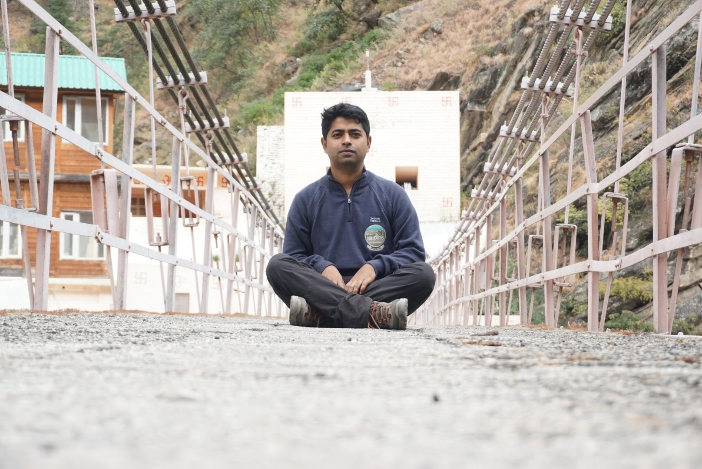

> All great men write logs. All logs are not written by great men.

This weblog is a record of my actions, observations, thoughts and opinions. It has its ethos rooted in the journaling habits of navigators and explorers, ever since the art of writing became a prominent medium of archiving ones thoughts for later consumption, replication and distribution.

In a way, it is a form of non-invasive voyeurism. Through these entries, I invite you—the reader—to peek into a fragment of my mind. While I am aware that video logging is the thing that has caught up and will become the preferred journaling medium of the future, I prefer chosen words and curated pictures to tell my story. (Also, the idea of a camera pointing constantly at my face is something that I am not comfortable with.)

I will buck the trend of splitting my interests into multiple blogs. While subject specific blogs are great, they are not for me. (I have tried.) In a sense, when you are reading through the entries, I don't want myself to split into the images of one isolated traveler, or that of a musician, or a person who enjoys cycling or that of a geek locked up in his den with comic books, but of a _person_ who enjoys all these things.

