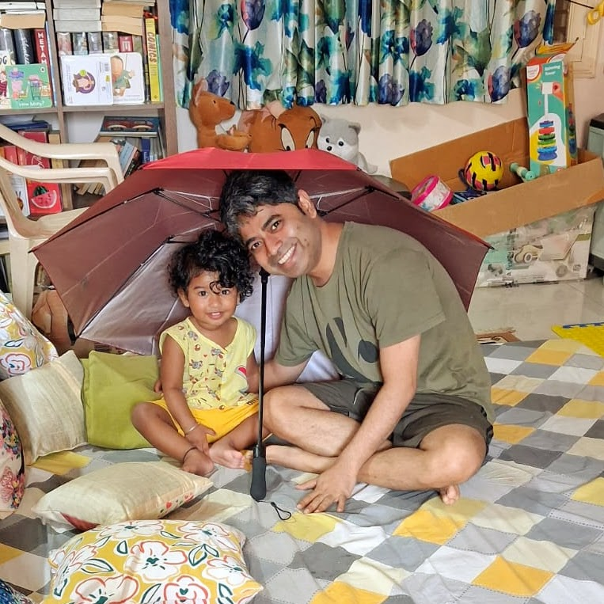

_Updated on 13th June, 2026_

## Reading List

- _[The Valmiki Ramayana](https://www.amazon.in/Valmiki-Ramayana-Box-Set/dp/0143441140)_ translated by **Bibek Debroy**. So far I am halfway-through Ayodhya Kanda (2nd of the 7 sections).

## Working as a Founding Engineer

I am one of the founding engineers of [Andromeda Security](https://www.andromedasecurity.com/): an ISPM solution that focuses on IAM, IGA, PAM, solutions via its SAAS offering. At present I am leading a small team of engineers who develop and maintain it's JML, UAR and JIT offering.

Working in a startup is technically very rewarding. It's still a double-edged sword. The work is very intense and can be draining at times.

## Raising a kid

About a year-and-a-half ago, we welcomed a boy and named him Abir. Parenthood is also very rewarding and is draining at times. That might give you a good idea why I haven't been actively posting on the blog.

