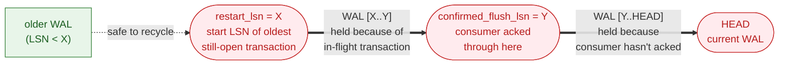
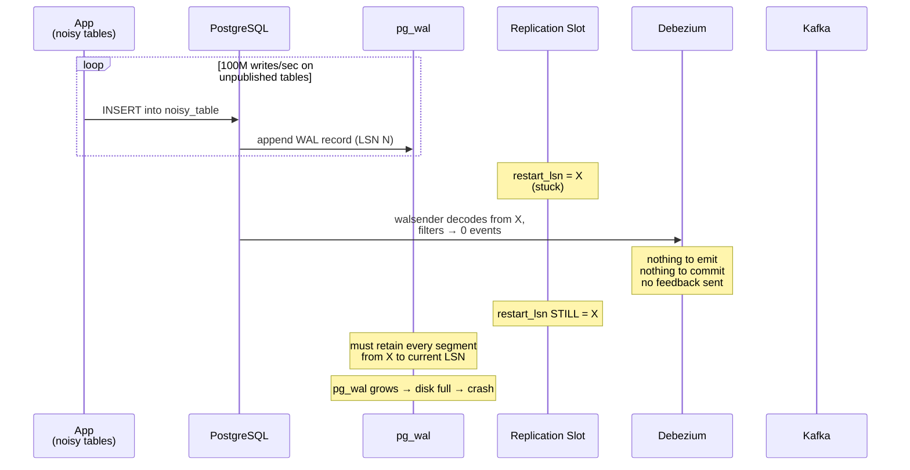
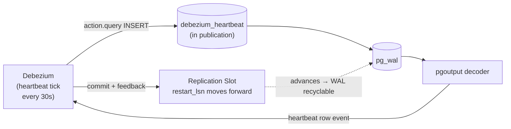
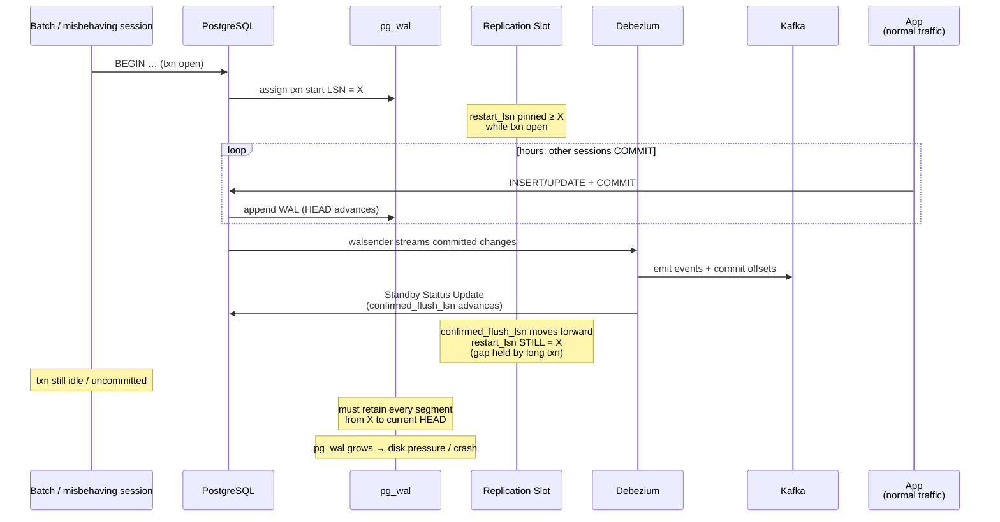

## A problem in production

A couple of days ago, our stack saw a massive rise in WAL. As a side effect, we weren't seeing Debezium emit CDC messages to Kafka, which in turn affected some critical workflows from advancing. This was not the first time this had happened. One idea that was thrown around was to limit the tables Debezium subscribes to. However, that doesn't help.

Limiting which tables Debezium subscribes to (via the Postgres `PUBLICATION`) reduces the **events Debezium emits**, but it does **not** reduce what Postgres has to **keep on disk**. WAL retention is governed by the *replication slot*, not by the publication. If the slot doesn't advance, `pg_wal` keeps growing, even if Debezium is "quiet."

On doing a bit of research, I came across another mode of failure. It was clear that even when Debezium is not "quite", `pg_wal` can keep growing if there are long running transactions.

### 1. Some PG concepts

#### Write-Ahead Log (WAL)

Postgres is a write-ahead-logged database: every change to any table (INSERT/UPDATE/DELETE/DDL/vacuum/etc.) is first appended as a record to the WAL, *then* applied to the heap. WAL is stored as 16 MB segment files in `$PGDATA/pg_wal/`.

WAL is used for:

- Crash recovery
- Physical replication (streaming standbys)
- **Logical replication / logical decoding** (what Debezium uses)
- Point-in-time recovery (PITR)

#### Log Sequence Number (LSN)

A monotonically increasing 64-bit pointer into the WAL stream (e.g. `1A/3F8B0190`). Every WAL record has an LSN. "How far has the consumer read?" is always answered as an LSN.

The WAL file corresponding to this LSN can be queried using the following and then looking up in `$PGDATA/pg_wal/`.

```sql
SELECT pg_walfile_name('1A/3F8B0190');
```

The `current_wal_lsn`, also known as HEAD, can be found out using

```sql
SELECT pg_current_wal_lsn();
```

#### Replication Slot

This is a persistent, named bookmark inside Postgres that says:

> "There is a consumer out there whose oldest still-needed LSN is X. Keep every WAL segment **from X up to HEAD**, even if checkpoints would normally let you recycle them. Anything older than X has already been consumed and is safe to remove."

A slot is the mechanism that *guarantees durability* for a logical or physical replication consumer. **It is the thing that pins WAL on disk.**

Think of the WAL as a tape that grows to the right. `restart_lsn = X` plants a flag at position X. Postgres can throw away tape to the **left** of the flag (older, already-consumed WAL) but must keep everything from the flag to the current write head. The flag only moves to the right when the consumer says "I'm done with X, you can move it forward." If the flag never moves, the retained region keeps growing as the write head races ahead.

A logical replication slot has two important LSN fields:

| Field                 | Meaning |
|-----------------------|---------|
| `restart_lsn`         | The oldest LSN Postgres must keep so the consumer can resume decoding. WAL files older than this can be recycled. |
| `confirmed_flush_lsn` | The LSN the *consumer* has acknowledged it has durably persisted. `restart_lsn` is computed from this. |

##### Relationship: `restart_lsn` ≤ `confirmed_flush_lsn`

The two LSNs are related but not identical. The invariant is:

```text
restart_lsn  ≤  confirmed_flush_lsn  ≤  current_wal_lsn (HEAD)
```

- `confirmed_flush_lsn` moves when the **consumer** sends a Standby Status Update saying "I have durably persisted everything up to LSN Y."
- `restart_lsn` is the **oldest LSN Postgres still needs on disk** so the walsender can resume decoding for this slot if it disconnects and reconnects.

They aren't equal because **logical decoding is transactional**. Postgres only emits a row change to the consumer when the transaction containing it COMMITs. So if at the moment Debezium acks `confirmed_flush_lsn = Y` there is still an **in-progress transaction** that *started* at some earlier LSN `X < Y`, Postgres cannot drop the WAL between `X` and `Y`. If the slot reconnects, the walsender has to re-read that transaction from its beginning to be able to emit it correctly when it eventually commits.

Roughly:

```text
restart_lsn  ≈  min(
    confirmed_flush_lsn,
    earliest start-LSN of any transaction still in progress
                       at the time confirmed_flush_lsn was advanced
)
```

When the oldest in-flight transaction commits or aborts, `restart_lsn` jumps forward and catches up toward `confirmed_flush_lsn`.

Picture:



You can see both in `pg_replication_slots`:

```sql
SELECT slot_name,
       active,
       restart_lsn,
       confirmed_flush_lsn,
       pg_size_pretty(
         pg_wal_lsn_diff(pg_current_wal_lsn(), restart_lsn)
       ) AS retained
FROM pg_replication_slots;
```

#### Publication

A `PUBLICATION` is just a **filter on what changes Debezium sees** when it calls the `pgoutput` decoder. It is a logical-layer concept:

```sql
CREATE PUBLICATION dbz_publication FOR TABLE t1, t2, t3, t4, t5;
```

The publication does **not**:

- Affect what gets written to WAL
- Affect what Postgres has to retain on disk
- Affect the slot's `restart_lsn`

It only affects which *decoded events* are streamed out to Debezium over the replication protocol.

You can view all publications in the catalog. `dbz_publication` should be visible.

```sql
SELECT * FROM pg_publication;
```

And then all tables that are contained in the publication. This is database-specific.

```sql
SELECT * FROM pg_publication_tables;
```

#### Debezium Standby Status / Feedback

The Postgres streaming-replication protocol expects the consumer to periodically send a **Standby Status Update** message back to the server saying "I have flushed up through LSN Y." Postgres uses this to advance `confirmed_flush_lsn` (and therefore `restart_lsn`).

By default, Debezium only sends these feedback messages **when it has processed an event**, i.e. when it commits an offset to Kafka after emitting a row change.

Two key things to notice:

1. **All writes** go into WAL, regardless of the publication.
2. The slot's `restart_lsn` only moves when Debezium **sends feedback**, which only happens when it **commits an offset**, which only happens when it **emits an event**.

### 3. The First Failure Mode: Debezium has nothing to process

Suppose your database has 105 tables. You publish only 5:

```sql
CREATE PUBLICATION dbz_publication FOR TABLE t1, t2, t3, t4, t5;
```

The **other 100 tables** are doing 100M inserts. The published 5 are idle.

This is what happens

First, all 100M writes still go into WAL. The publication does nothing here. Postgres must write every change to `pg_wal/` regardless of who subscribes. This is **across** the database cluster.

Next, the walsender process attached to the slot reads WAL forward, decodes each record using `pgoutput`, **filters out** records for tables not in the publication, and emits only records for `t1..t5`. So the walsender *does* process all 100M records: it just throws most of them away. The "savings" you got from filtering is bandwidth between Postgres and Debezium, **not** disk usage.

So, here's the killer:

1. Debezium gets **no change events** from the publication (your 5 tables are quiet).
2. With no events to emit, Debezium has nothing to commit to Kafka.
3. With nothing committed, by default Debezium sends **no feedback messages**.
4. `confirmed_flush_lsn` does not advance.
5. `restart_lsn` does not advance.
6. Postgres must retain **every WAL segment** from `restart_lsn` forward, which now includes all the WAL produced by the 100 noisy tables.
7. `pg_wal/` grows without bound. Eventually you run out of disk and Postgres crashes.

This is the classic "Debezium silently kills your database" failure mode, and it's well documented in production postmortems.

#### Sequence view



You need to make Debezium acknowledge an LSN even when your published tables are quiet.

#### Fixing this problem

Configure the connector to periodically send itself a heartbeat.

```properties
heartbeat.interval.ms=30000
```

Debezium will emit a heartbeat event every 30s and use it as an excuse to send a Standby Status Update back to Postgres. This advances `confirmed_flush_lsn` even when no real data flowed.

For Postgres, a plain heartbeat is sometimes not enough on its own, because the heartbeat LSN is the *current* WAL position, but Postgres won't actually advance the slot past records that the decoder hasn't "seen." This is necessary if the publication is not replicating changes `FOR ALL TABLES`.

The way to address this is to create a `debezium_heatbeat` table and configure Debezium to perform a small operation.

```properties
heartbeat.interval.ms=30000
heartbeat.action.query=INSERT INTO debezium_heartbeat(ts) VALUES (now()) ON CONFLICT (id) DO UPDATE SET ts = EXCLUDED.ts
```

This is the standard production pattern for Postgres + Debezium.



### 4. The Other Failure Mode: a Long-Running Transaction

Even with a perfectly healthy Debezium that acks every 30s, `pg_wal` can still grow without bound. The cause is the second clause in the `restart_lsn` formula from an **in-flight transaction** that started long ago and never committed.

If some tool or batch job opens a transaction at LSN `X` and then sits there for hours, then no matter how aggressively the consumer advances `confirmed_flush_lsn`, the slot's `restart_lsn` cannot move past `X`. Postgres must keep WAL `[X, HEAD]` on disk so it can re-decode that transaction if the slot restarts. As writes pile up, that retained region grows.

This is the same disk-bloat symptom as the Debezium-quiet failure, but the cause and the fix are completely different.

#### Sequence view



#### Diagnosing it

Compare `restart_lsn` and `confirmed_flush_lsn` on the slot, and cross-check with `pg_stat_activity`:

```sql
SELECT slot_name,
       restart_lsn,
       confirmed_flush_lsn,
       pg_size_pretty(
         pg_wal_lsn_diff(confirmed_flush_lsn, restart_lsn)
       ) AS gap_held_open_by_long_txn,
       pg_size_pretty(
         pg_wal_lsn_diff(pg_current_wal_lsn(), restart_lsn)
       ) AS total_pinned
FROM pg_replication_slots
WHERE slot_type = 'logical';

SELECT pid,
       xact_start,
       state,
       query
FROM pg_stat_activity
WHERE xact_start IS NOT NULL
ORDER BY xact_start;
```

- If `gap_held_open_by_long_txn` ≈ 0 → the consumer is the bottleneck (the first failure mode described earlier).
- If `gap_held_open_by_long_txn` is large → Debezium is fine; you have a long-running transaction surfaced by `pg_stat_activity`.

#### Fixing this problem

There is not much you can do on Postgres or Debezium side other than to find and kill / fix the offending transaction.

Once things are under control, you can do these but the fix is very product specific.
- Set `idle_in_transaction_session_timeout` to bound how long a session can sit `idle in transaction`.
- Set `statement_timeout` to bound individual statements.
- Audit application code for forgotten `BEGIN` without `COMMIT/ROLLBACK`.

#### Quick comparison with the first failure mode

| Symptom                                  | Debezium-quiet             | Long-running transaction.                      |
|------------------------------------------|----------------------------|------------------------------------------------|
| `pg_wal` growing                         | yes                        | yes                                            |
| Debezium lag growing                     | yes                        | usually no                                     |
| `confirmed_flush_lsn` moving forward     | no                         | yes                                            |
| `restart_lsn` moving forward             | no                         | no                                             |
| `restart_lsn` ≈ `confirmed_flush_lsn`?   | yes                        | no large gap                                   |
| Fix                                      | heartbeat + action query   | kill the txn / `idle_in_transaction_session_timeout` |

## In closure

If you have Debezium as your CDC, it is better to have databases with similar traffic in one cluster. If there is a massive discrepancy in traffic, it's better to have them in different instances. 

We ended up moving our high traffic database to a different instance. This safeguards us from both failure modes.

**Acknowledgement:** my colleagues [Monotosh](https://www.linkedin.com/in/dmonotosh/), who knows more about WAL than most of us, and [Sudipto](https://www.linkedin.com/in/sudipto-biswas-aa101611/), the architect of our platform. Together they had mitigated the production issues. I learned a bit more about these systems as an observer.

## References

- https://www.postgresql.org/docs/9.4/catalog-pg-replication-slots.html
- https://debezium.io/documentation/reference/3.4/connectors/postgresql.html#postgresql-wal-disk-space