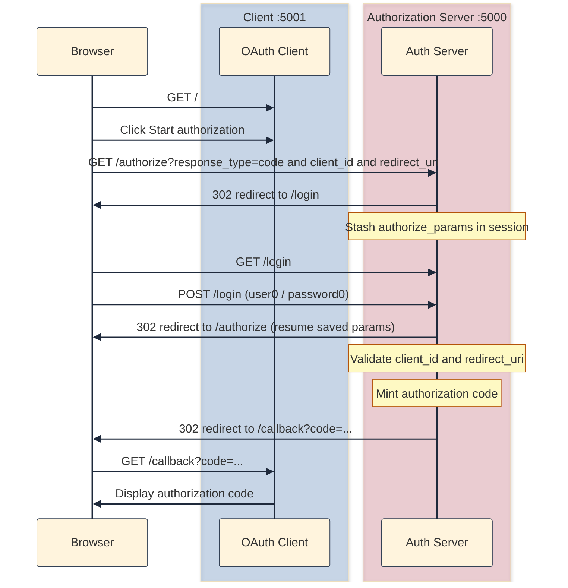

## A preamble

### What is my motivation behind this

[Andromeda](https://in.linkedin.com/company/andromeda-security) has been working on creating a comprehensive solution around Agents. If we look past the hype, the buzzword, and the scepticism, Agents and Agentic AI are here to stay and security is a real concern. Anthropic came up with an [initial specification for something called Model Context Protocol (MCP)](https://www.anthropic.com/news/model-context-protocol), which has eventually become a standard. The standard [specifies OAuth 2.1 as the authorization mechanism](https://modelcontextprotocol.io/specification/draft/basic/authorization).

I do not know what OAuth 2.1 is. Heck, I did not even know what OAuth 2.0 is. All I saw was a book ***OAuth 2.0 Simplified*** by ***Aaron Parecki*** lying around in my office. My good colleagues have been working hard to implement Observability and a PAM solution for Agents and I have heard enough about it that it piqued my interest.

To tell the truth, OAuth 2 is everywhere. "**Sign in with Google**" on landing pages, mobile apps opening a browser for login, CLI tools storing a refresh token; and yet it still feels like a protocol you are supposed to *already* understand. Read the RFC and you get roles, grants, endpoints, and a pile of parameters; read a library's docs and you get configuration keys that magically work until they do not. Somewhere in the middle is the actual flow: a browser redirect, a login form, a one-time code in the URL, and (eventually) an access token that proves who you are. 

This is my attempt to understand the mechanics from scratch, eventually building toward Authorization Code + PKCE, which is what OAuth 2.1 and MCP expect in practice.

### Disclaimer: Some help from Agents

I did not want to work on boilerplate code. So, like any modern developer, I asked a model in Cursor to generate all the boilerplate for me. It ended up creating two Flask apps: one for the server and the other for the client. I have even asked it to create a bit of CSS-styling so that it's visually easy on my eyes and I can clearly distinguish the server from client on my browser. You'll know it when you see it. The server uses red text for header, the client uses blue. While the boilerplate is generated, I intend to write the flow myself. (Duh! Else it defeats the purpose.)

### Why versioned snapshots?

Most OAuth tutorials I have seen jump straight to the finished product: state, PKCE, token endpoint, protected API, refresh tokens, error pages. That is the right end state, but it is a terrible *first* state. When everything is wired together, you cannot tell which piece solved which problem. So, I took an incremental approach. You can download the code (and all its future evolutions) from [github.com/sauvikbiswas/oauth-lab](https://github.com/sauvikbiswas/oauth-lab).

I intend to keep these versions in separate folders. Each folder under `versions/` is a **runnable** server + client pair.

## The dumbest flow that works

While implementing v01, I have intentionally left out most of the security machinery: no OAuth `state`, no PKCE, no token endpoint, no protected API.

What remains is the spine of the Authorization Code flow:

1. The client sends the user to `/authorize` with `response_type=code`, a `client_id`, and a `redirect_uri`.
2. If the user is not logged in, the server stashes the query params in the session and sends them to `/login`.
3. After a successful login, the server resumes `/authorize` with those saved params.
4. The server validates the client and redirect URI against a pre-seeded registry, mints a one-time authorization code, and redirects the browser to `{redirect_uri}?code=...`.
5. The client displays the code on its callback page.



That is it. It is ugly by production standards but is perfect for learning.

### How to run it

You will need to have two terminals open.

**Terminal 1 — authorization server:**

```bash
cd versions/v01-login-and-code/server
python3 -m venv .venv && source .venv/bin/activate
pip install -r requirements.txt
cp ../../../.env.example .env
python3 app.py
```

**Terminal 2 — client:**

```bash
cd versions/v01-login-and-code/client
python3 -m venv .venv && source .venv/bin/activate
pip install -r requirements.txt
cp ../../../.env.example .env
python3 app.py
```

Open `http://localhost:5001` (client) and click **Start authorization**. The browser would take you to `http://localhost:5000/login` (server). Use `user0` / `password0` as credentials. The browser should redirect back to `http://localhost:5001/callback?code=<random-string>`.

Notice what is **not** in that callback URL: there is no `state` parameter. That absence is deliberate for v01.

You can inspect what the server stored by going to `http://localhost:5000/debug/state` after the flow completes. You would see something like this (dev-only — it dumps plaintext passwords, which is fine for learning and never acceptable in production):

```json
{
  "request_args": {},
  "session": {
    "logged_in": true,
    "username": "user0"
  },
  "storage": {
    "authorization_codes": {
      "xK9mP2nQ7vR4sT8wY1zA3bC5dE6fG0h": {
        "client_id": "demo-client",
        "redirect_uri": "http://localhost:5001/callback",
        "code_challenge": null,
        "user_id": "user0",
        "expires_at": "2026-06-06T14:30:00",
        "used": false
      }
    },
    "access_tokens": {},
    "users": {
      "user0": {
        "password": "password0",
        "user_id": "user0"
      },
      "user1": {
        "password": "password1",
        "user_id": "user1"
      }
    },
    "clients": {
      "demo-client": {
        "client_secret": "demo-secret",
        "redirect_uris": [
          "http://localhost:5001/callback"
        ]
      }
    }
  }
}
```

The authorization code you received in the callback URL appears as a key under `authorization_codes`. You can also log in as `user1` / `password1` on a fresh run.

## Can I call this v01 version OAuth?

Not a complete OAuth 2.0 server, but not unrelated either. v01 is **OAuth-shaped**: it implements the first leg of the [Authorization Code grant](https://datatracker.ietf.org/doc/html/rfc6749#section-4.1) (authorize endpoint, login, code issuance) without the token exchange or the security extras the ecosystem expects today. I would not call it RFC-compliant yet; I *would* call it a honest step toward understanding OAuth.

OAuth names [four roles in its specification](https://datatracker.ietf.org/doc/html/rfc6749#section-1.1). In this version, they map to running processes like this:

| Role | In the lab |
|------|------------|
| **Resource owner** | Human, logging in as `user0` |
| **Client** | Flask app on `http://localhost:5001` |
| **Authorization server** | Flask app on `http://localhost:5000` |
| **Resource server** | Planned: same Flask app in later versions (`/api/me`) |

What v01 actually implements: the authorization endpoint, login, client registry, `redirect_uri` validation, and issuing a one-time `code`. What it does not: the token endpoint, usable access tokens, OAuth `state`, PKCE, or a protected API.

### What about security?

This stripped-down version is not completely security-blind.

The `server/storage` folder holds an in-memory store (`memory.py`): users, registered OAuth clients, issued authorization codes, and (empty for now) access tokens. Nothing fancy; data disappears on restart. But the **`clients` registry** is real OAuth client registration: the server will not redirect to a callback URL unless that `client_id` exists and the `redirect_uri` is on the client's allow list.

#### Param resume through login

The subtlest part was not the redirect. It was **surviving the login detour**.

When an unauthenticated user hits `/authorize`, the server saves `request.args` into `session["authorize_params"]` and redirects to `/login`. After credentials check out, login pops those params and redirects back to `/authorize` with them restored. Without that stash, I would log in successfully and land on a dead-end welcome page with no code issued.

#### Client registry validation

Even in v01, the server does not blindly redirect anywhere. It looks up `client_id` in the in-memory `clients` dict and checks that `redirect_uri` is in that client's allowed list. Wrong client or wrong URI → a 400 error page, not an open redirect.

## What next?

v01 is the "before" picture. The subsequent versions will only add more on top. I do not know what the breakdown of the versions would be but I intend to understand OAuth `state` and PKCE next.

Each version gets its own folder under `versions/` so that `diff`ing adjacent snapshots will show exactly what has been implemented.

## Further reading

- [RFC 6749: OAuth 2.0](https://datatracker.ietf.org/doc/html/rfc6749)
- [RFC 7636: PKCE](https://datatracker.ietf.org/doc/html/rfc7636)
- [OAuth 2.0 Simplified](https://www.oauth.com/) by Aaron Parecki (the book on my desk)