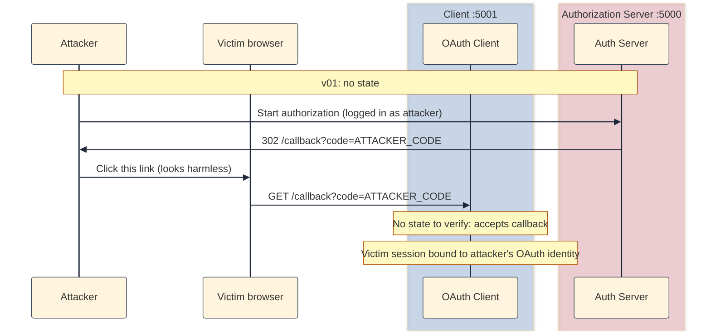
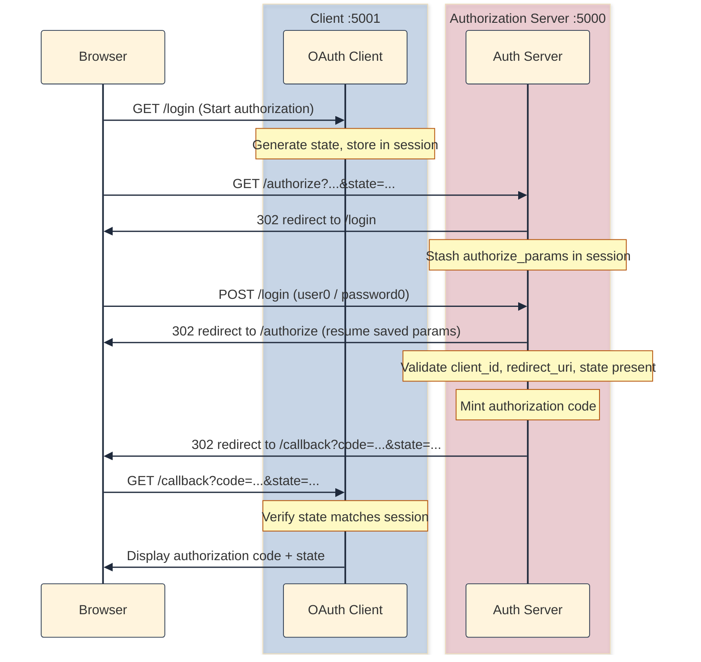

## Why v01 needed a fix

[v01]() got the Authorization Code redirect working, but it deliberately left out OAuth `state`. That absence is fine for learning the spine of the flow; it is not fine for anything you would ship.

The next piece to add is a mechanism to stop **CSRF** (Cross-Site Request Forgery). CSRF is when a site you are on tricks your browser into making a request you did not mean to make. The browser automatically sends along your cookies and session, so the server thinks you did it. [RFC 6749 §10.12](https://datatracker.ietf.org/doc/html/rfc6749#section-10.12) calls this out for the authorization endpoint.

Let us look at two ways the missing `state` can cause issues.

### Example 1: Login CSRF: "log the victim in as me"

This is the classic attack that OAuth `state` was designed to stop.

**Setup:** My client eventually treats "got a valid `code` on `/callback`" as "user is logged in" (v01 only displays the code; wiring that `code` into a session is a future version, but the risk is already real).

**Steps:**

1. Attacker opens the client and starts authorization. They are already logged into the auth server as `user0` (or worse, the attacker's own account).
2. Auth server redirects to: `http://localhost:5001/callback?code=ATTACKER_CODE`
3. Attacker copies that full URL (the code is tied to _their_ identity on the auth server).
4. Attacker tricks the victim into opening it: email, Slack, forum post, etc.
5. The victim's browser hits your client's callback. Without `state`, the client has no way to ask: "Was _I_ the one who started this login?"
6. The client accepts the callback and binds the victim's session in the client app to the attacker's OAuth account.

**What the attacker gains:**

- Victim uses the app thinking it is their account; activity and data may be stored under the attacker's linked identity.
- Or the victim sees the attacker's data (inbox, profile, etc.) and mistakenly treats it as their own. Weird, but this time the privacy leak runs the other way.
- In apps where login equates to trust, the victim may enter secrets (notes, API keys, PII) into what is effectively the attacker's account.

**What `state` fixes:** The client only accepts a callback if `state` matches the random value _it_ stored when _it_ sent the user to `/authorize`. The attacker's callback URL has no valid `state` for the victim's pending login (or carries the attacker's old `state`, which the victim's client never issued).

### Example 2: Confusion across tabs or sessions

The first example is malicious. This one is more common and needs no attacker.

**Tab A:**

1. You open `http://localhost:5001` and click **Start authorization**.
2. You land on the auth server login page.
3. Your phone rings. Tab A sits there half-finished.

**Tab B: a few minutes later**

4. You open the client again in a new tab and click **Start authorization** again (you forgot about tab A).
5. You log in as `user1` this time (or the same `user0`; does not matter).
6. Auth server redirects to: `http://localhost:5001/callback?code=CODE_FROM_TAB_B&state=STATE_FROM_TAB_B`
7. Tab B shows the callback page. Fine so far.

**Tab A: you come back**

8. You switch back to tab A, enter `user0` / `password0`, finish login.
9. Auth server redirects tab A to: `http://localhost:5001/callback?code=CODE_FROM_TAB_A&state=STATE_FROM_TAB_A`
10. Now you have two codes from two separate authorization attempts. Imagine where the client sets "logged in" in a session cookie shared across tabs.

**The confusion:**

- Your client session might reflect whichever callback was processed last.
- You thought you were completing the flow from tab A, but the app might have already bound itself to tab B's code (or vice versa).
- You believe you are completing "user0's login", but the stored OAuth result might be from the tab B attempt (different timing, different code, maybe different user if you logged in differently).
- Nothing malicious happened: just two in-flight logins, one client, no label on either attempt.

**Where an attacker fits (optional twist: same mechanics, slightly worse)**

- Tab A: you start login.
- Tab B (or a hidden redirect): opens `http://localhost:5001/callback?code=SOMEONE_ELSES_CODE&state=...` in the same browser profile (same cookies for `:5001`).

The client still cannot ask: "Was this for tab A's login?" It only sees a valid callback on a valid redirect URI.

Here is a diagram for Example 1 (v01: no `state`):



## How v02 adds `state`

In OAuth, the **client app** is the thing that must know: "This callback with `?code=...` belongs to the login I started."

Without `state` (v01):

1. The client sends the user to the auth server to log in.
2. An attacker tricks the victim into completing a flow (or reuses a redirect).
3. The victim's browser lands on your client's callback with a `code`.
4. The client cannot tell whether that callback matches _its_ pending login or some other, random flow.

With `state` (v02):

1. Before redirecting to `/authorize`, the client generates random `state` and stores it (in session).
2. It sends `state` to the auth server as a query parameter.
3. The auth server echoes the same `state` back on the redirect: `?code=...&state=...`.
4. On callback, the client checks: "Does this `state` match what I stored?" If not: reject.

The attacker cannot forge a valid callback unless they know (or can steal) the `state` your client generated for that specific attempt. (Stealing `state` is a separate problem: a topic for a future version.)

The client must play its part in the security game. [RFC 6749 §4.1.1](https://datatracker.ietf.org/doc/html/rfc6749#section-4.1.1) documents the authorization request; [§10.12](https://datatracker.ietf.org/doc/html/rfc6749#section-10.12) is the CSRF-specific guidance.



### What changed from v01

The server changes are minimal. It requires `state` on the authorization request and returns it unchanged as part of the callback redirect. The client does the heavy lifting: generate, store, verify.

The client still does not know who the user is: that is the auth server's job. What v02 adds is **flow-scoped** storage: a random `state` in the Flask session, plus an in-memory mirror of pending and completed flows for the dev-only debug endpoint.

You can inspect what the client has stored at any point by visiting `http://localhost:5001/debug/state`. After a successful single-tab flow, you would see something like this (dev-only):

```json
{
  "request_args": {},
  "session": {},
  "storage": {
    "pending_oauth_states": {
      "iQnJrcoFnKfwn1s_6wb7m97qws3a5jUHG0XPRzC3pKU": {
        "created_at": "2026-06-07T15:35:12.398542"
      }
    },
    "authorization_codes": {
      "avVK-k-2BzyzlrVxuCFzJbV-ILHnoOjjIvNxOqZJCZA": {
        "state": "iQnJrcoFnKfwn1s_6wb7m97qws3a5jUHG0XPRzC3pKU",
        "received_at": "2026-06-07T15:35:12.430872"
      }
    },
    "access_tokens": {}
  }
}
```

`session` is empty because the callback handler pops `oauth_state` after a successful match. `pending_oauth_states` still lists every state the client has ever generated, including completed flows. That is a debug convenience, not production hygiene.

### How to run it

Same two-terminal setup as v01, different folder (from [github.com/sauvikbiswas/oauth-lab](https://github.com/sauvikbiswas/oauth-lab)):

**Terminal 1: authorization server:**

```bash
cd versions/v02-state-csrf/server
python3 -m venv .venv && source .venv/bin/activate
pip install -r requirements.txt
cp ../../../.env.example .env
python3 app.py
```

**Terminal 2: client:**

```bash
cd versions/v02-state-csrf/client
python3 -m venv .venv && source .venv/bin/activate
pip install -r requirements.txt
cp ../../../.env.example .env
python3 app.py
```

Open `http://localhost:5001` and click **Start authorization**. After login, the callback URL should include both `code` and `state`. The client home page also links to a negative test: starting authorization without `state`, which the server rejects with a 400.

### Simulating the two-tab confusion

This is the "got distracted / started login twice" scenario from Example 2. Both tabs share one `oauth_state` slot in the client session cookie; the second **Start authorization** overwrites the first.

Steps:

1. Start server (`:5000`) and client (`:5001`).
2. Clear cookies for both `localhost:5000` and `localhost:5001` so the auth server forces a fresh login.
3. **Tab A:** open `http://localhost:5001` → click **Start authorization**.
4. You land on the auth server login page: stop there (do not submit yet).
5. **Tab B:** open `http://localhost:5001` again → click **Start authorization** again.
6. In tab B, log in as `user0` / `password0` and finish the flow.
   - Tab B succeeds: callback shows `code` + `state`.
7. Go back to **tab A**, log in and complete the flow.
   - Tab A lands on the auth server's welcome page, not the client callback.

**Why tab A fails:** When tab B logged in, it consumed the single `authorize_params` stash the auth server keeps in session. Tab A's stale login form has nothing left to resume, so login succeeds but redirects to `/welcome` instead of `/authorize`. Even if tab A did reach `/callback`, the client would reject it: session `oauth_state` was overwritten by tab B (or cleared when tab B's callback succeeded), so tab A's `state` would not match.

Inspect the debug dumps:

**Client** (`http://localhost:5001/debug/state`):

```json
{
  "request_args": {},
  "session": {},
  "storage": {
    "pending_oauth_states": {
      "r3vviFhbmwXCj6UhB9t219zACXQCBFHLGXe4bbhgPos": {
        "created_at": "2026-06-07T15:43:09.094286"
      },
      "vzp7nikF-RP0Qv71XfgLO00Az2FwosEkMAjjTN6Qkh4": {
        "created_at": "2026-06-07T15:43:17.681856"
      }
    },
    "authorization_codes": {
      "slQ6Zn9-s9VnI42v0Ypplp-3UhGnimbhTwJUMTXXf4Y": {
        "state": "vzp7nikF-RP0Qv71XfgLO00Az2FwosEkMAjjTN6Qkh4",
        "received_at": "2026-06-07T15:43:30.423610"
      }
    },
    "access_tokens": {}
  }
}
```

Two entries under `pending_oauth_states` (one per tab), one successful `authorization_codes` entry (tab B only).

**Server** (`http://localhost:5000/debug/state`):

```json
{
  "request_args": {},
  "session": {
    "logged_in": true,
    "username": "user0"
  },
  "storage": {
    "authorization_codes": {
      "slQ6Zn9-s9VnI42v0Ypplp-3UhGnimbhTwJUMTXXf4Y": {
        "client_id": "demo-client",
        "redirect_uri": "http://localhost:5001/callback",
        "code_challenge": null,
        "user_id": "user0",
        "expires_at": "2026-06-07T16:43:30.417677",
        "used": false
      }
    },
    "access_tokens": {},
    "users": {
      "user0": {
        "password": "password0",
        "user_id": "user0"
      },
      "user1": {
        "password": "password1",
        "user_id": "user1"
      }
    },
    "clients": {
      "demo-client": {
        "client_secret": "demo-secret",
        "redirect_uris": [
          "http://localhost:5001/callback"
        ]
      }
    }
  }
}
```

Only one authorization code was minted: the one tab B completed.

## What next?

v02 closes the CSRF hole for the authorization redirect. I will try to add **PKCE** in the next version, which addresses a different threat: an attacker intercepting or replaying the authorization code itself.

Since, each version stays in its own folder under `versions/` you can `diff` the adjacent snapshots shows exactly what changed:

```bash
diff -ru versions/v01-login-and-code versions/v02-state-csrf
```

## Further reading

- [RFC 6749 §10.12: CSRF](https://datatracker.ietf.org/doc/html/rfc6749#section-10.12)
- [RFC 6749 §4.1: Authorization Code Grant](https://datatracker.ietf.org/doc/html/rfc6749#section-4.1)
- [RFC 7636: PKCE](https://datatracker.ietf.org/doc/html/rfc7636) (coming in v03)
