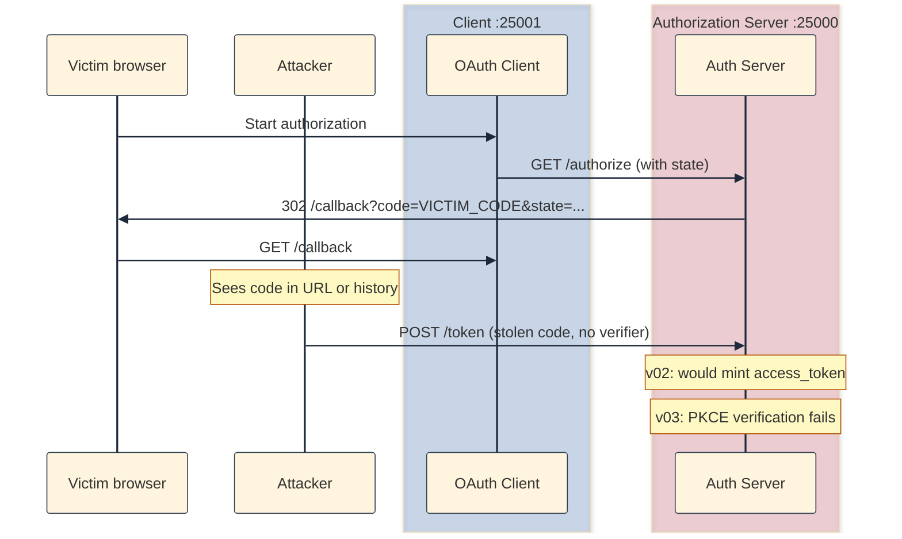
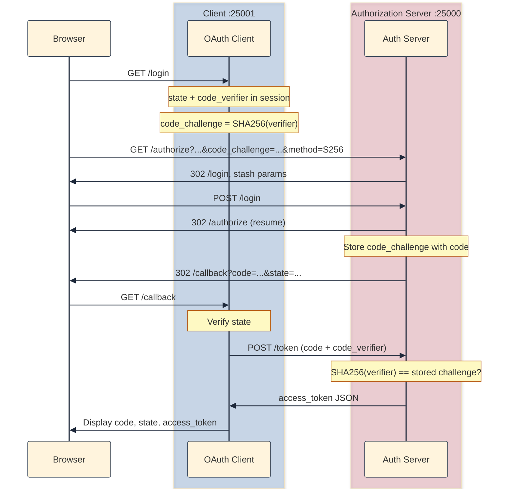

# Why v02 needed a fix

[v02]() closed the **login CSRF** hole. The client generates random `state`, the auth server echoes it on the callback, and the client rejects mismatches. That answers: "Did _I_ start this login?"

It does not answer a different question: "Is the person trying to **redeem this `code`** the same app that **requested** it?"

The authorization `code` itself is a secret, but for a short time. It travels in the browser redirect URL:

```
http://localhost:25001/callback?code=...&state=...
```

Anything that can see that URL can copy the `code`: browser history, a referrer header, a malicious app registered as a handler on mobile, a proxy, shoulder-surfing, server logs. Once v03 wires `POST /token`, the `code` becomes spendable currency. Without extra protection, whoever has the `code` (plus `client_id`, `redirect_uri`, and for confidential clients the `client_secret`) can exchange it for an `access_token`.

**PKCE** (Proof Key for Code Exchange, [RFC 7636](https://datatracker.ietf.org/doc/html/rfc7636)) fixes that. The client proves it is the same party that started the flow by presenting a `code_verifier` only it ever held. The auth server checks that verifier against a `code_challenge` it stored when the code was minted.

OAuth 2.1 and specs like MCP expect Authorization Code + PKCE for public clients. Even confidential clients benefit: PKCE is defense-in-depth if a `code` leaks.

## Example: Stolen authorization code

**Setup:** v03 treats a successful token exchange as "login complete." The callback page shows an `access_token`.

**Steps:**

1. Victim completes a normal login. Browser lands on `http://localhost:25001/callback?code=VICTIM_CODE&state=...`
2. Attacker copies `VICTIM_CODE` from the URL (history, screenshot, network log, etc.).
3. Attacker runs `POST /token` with the stolen `code`, correct `client_id`, `redirect_uri`, and `client_secret`.[^public-clients]
4. **Without PKCE:** server mints an `access_token` for the attacker. They are now authenticated as the victim.
5. **With PKCE:** server also requires `code_verifier`. Attacker never had it. It lived in the victim's client session and was sent server-to-server from `/callback`, never in the redirect URL.

**What PKCE fixes:** Redeeming the `code` requires the original `code_verifier`. Intercepting the callback URL is not enough.

Here is the attack without PKCE:



# How v03 adds PKCE

PKCE is a **two-leg** protocol. Both matter. Implementing only the first leg stores a challenge and never proves anything. (And thus, is no more secure than our v02.)

## Leg 1: Authorization request

Before redirecting to `/authorize`, the client:

1. Generates a random `code_verifier` (`secrets.token_urlsafe(32)`).
2. Derives `code_challenge = BASE64URL(SHA256(code_verifier))` with method `S256`.
3. Stores `code_verifier` in the Flask session (never in the redirect URL).
4. Sends `code_challenge` and `code_challenge_method=S256` as query parameters to `/authorize`.

The auth server requires those parameters, stores `code_challenge` alongside the minted authorization `code`, and still redirects with only `code` and `state`and **not** `code_challenge`. (That is correct per the spec; do not try to verify PKCE on the callback URL. See the section regarding my misstep below)

## Leg 2: Token request

On `/callback`, after `state` checks pass, the client:

1. Reads `code_verifier` from session.
2. `POST`s to `/token` **server-side** (`requests` from the Flask client app) with `code`, `code_verifier`, `client_id`, `client_secret`, and `redirect_uri`.
3. The auth server recomputes `BASE64URL(SHA256(code_verifier))` and compares it to the stored `code_challenge`. Match → mint `access_token`. Mismatch → `invalid_grant`.

The browser never sees `code_verifier` or `client_secret`. That is intentional.



## What changed from v02

| Piece | v02 | v03 |
|-------|-----|-----|
| Client `/login` | generates `state` | also generates `code_verifier` + `code_challenge` |
| `GET /authorize` | requires `state` | also requires `code_challenge` + `code_challenge_method=S256` |
| Server code storage | `code_challenge: null` | real challenge bound to each code |
| Client `/callback` | displays `code` | verifies `state`, then `POST /token`, displays `access_token` |
| Server | no token endpoint | `POST /token` with PKCE verification |

The server diff is still modest: stricter validation in `authorize.py`, new `token.py`. The client grows more, encryption, session handling, and a server-side HTTP call.

After a successful flow, server debug shows the binding:

**Server** (`http://localhost:25000/debug/state`):

```json
{
  "storage": {
    "authorization_codes": {
      "sjLy1BAP5taF16n5SPF27nKxGiVHx7WhZiYiaFmSrwQ": {
        "client_id": "demo-client",
        "redirect_uri": "http://localhost:25001/callback",
        "code_challenge": "E9XiWbkyvf...truncated",
        "code_challenge_method": "S256",
        "user_id": "user0",
        "used": true
      }
    },
    "access_tokens": {
      "wWJTjs-AZsxd5ugfb5uLr270Y-btFQw3ruBs5uV4GzM": {
        "user_id": "user0",
        "client_id": "demo-client"
      }
    }
  }
}
```


- `used: true` on the code ensures that replay attempts are rejected.
- Client debug (`http://localhost:25001/debug/state`) lists received codes and tokens
- `session` is empty after callback pops `oauth_state` and `code_verifier`. **Note:** You might still see session dict if you are using the same browser as they scope cookie by host and not port. These objects are actually from the server (check that debug state as well).

## How to run it

Two terminals (from [github.com/sauvikbiswas/oauth-lab](https://github.com/sauvikbiswas/oauth-lab)):

**Terminal 1: authorization server**

```bash
cd versions/v03-pkce/server
python3 -m venv .venv && source .venv/bin/activate
pip install -r requirements.txt
cp ../../../.env.example .env
python3 app.py
```

**Terminal 2: client**

```bash
cd versions/v03-pkce/client
python3 -m venv .venv && source .venv/bin/activate
pip install -r requirements.txt
cp ../../../.env.example .env
python3 app.py
```

Open `http://localhost:25001` and click **Start authorization**. After login, the callback should show `code`, `state`, and `access_token`.

The client home page links to **authorize negative tests** (missing `state`, missing PKCE, `plain` challenge method). Each should return 400 from the server.

## Simulating code interception

In production, an attacker might capture a `code` from browser history, a referrer header, or a network log. Here, the whole flow finishes in one browser hop, so pausing mid-redirect is awkward. We fake the theft instead: mint a real `code`, copy it from the callback URL, and `curl` the token endpoint as the attacker.

### Getting an unused code

The auth server issues a real `code`, but the client never runs `/callback` to exchange it. Demos 1 and 3 below need this.

1. Start **only** the auth server (`:25000`).
2. Start the client long enough to click **Start authorization**, then **stop the client** before submitting login.
3. On the auth server, log in as `user0` / `password0`.
4. The browser redirects to  
   `http://localhost:25001/callback?code=THE_CODE&state=...`  
   and shows "connection refused". That is fine: copy `THE_CODE` from the address bar.
5. Confirm on `http://localhost:25000/debug/state` that the entry shows `used: false`.

### Demo 1: wrong verifier (PKCE blocks the attacker)

**Attack:**

```bash
curl -s -X POST http://localhost:25000/token \
  -d grant_type=authorization_code \
  -d code=PASTE_STOLEN_CODE_HERE \
  -d redirect_uri=http://localhost:25001/callback \
  -d client_id=demo-client \
  -d client_secret=demo-secret \
  -d code_verifier=totally-wrong-verifier
```

**Expected:**

```json
{"error": "invalid_grant", "error_description": "PKCE verification failed"}
```

### Demo 2: replay (code is one-time use)

**Setup:** Start both apps and complete a normal **Start authorization** flow. The callback page shows an `access_token`. Copy the `code` from the URL: the server has already marked it `used: true`.

**Attack:** Run the same `curl` as Demo 1, but paste the **spent** code.

**Expected:**

```json
{"error": "invalid_grant", "error_description": "Authorization code already used"}
```

### Demo 3: missing verifier

**Attack:** Same `curl` as Demo 1, but omit the `code_verifier` line. Use a **fresh** unused code from **Getting an unused code** above: Demo 1 does not mark the code as used.

**Expected:**

```json
{"error": "invalid_request", "error_description": "Code verifier is required"}
```

Stealing the callback URL is not enough. Redeeming the `code` also requires the `code_verifier` that never left the legitimate client's session.

## A mistake I almost made

Early in v03 I tried to read `code_challenge` from the callback query string and compare it to a locally computed value. The auth server never puts `code_challenge` in that redirect; only `code` and `state`. PKCE verification belongs at `POST /token`, not on `/callback`. If you see "code challenge mismatch" on the callback page, you are checking the wrong leg.

# What next?

v03 completes Authorization Code + PKCE and a minimal token exchange. There is still no protected API (`GET /api/me`), no dedicated error routes, and no production-grade client session. Those are later versions.

Diff adjacent snapshots to see exactly what changed:

```bash
diff -ru versions/v02-state-csrf versions/v03-pkce
```

[^public-clients]: For **public clients** like SPAs, mobile apps, CLI tools, there is often no `client_secret` at all. The app binary or JavaScript is visible, so a secret cannot be kept. Those clients only have `client_id`. For them, stealing the `code` is especially dangerous without PKCE: an attacker needs only `code`, `client_id`, and `redirect_uri` to attempt redemption. Confidential clients (like this lab's one) also require `client_secret`, but that may be hardcoded in tutorials or leaked from a repo. PKCE protects both cases.

# Further reading

- [RFC 7636: PKCE](https://datatracker.ietf.org/doc/html/rfc7636)
- [RFC 6749 §4.1.3: Access Token Request](https://datatracker.ietf.org/doc/html/rfc6749#section-4.1.3)
- [RFC 6749 §10.12: CSRF](https://datatracker.ietf.org/doc/html/rfc6749#section-10.12) (v02's problem; PKCE does not replace `state`)
