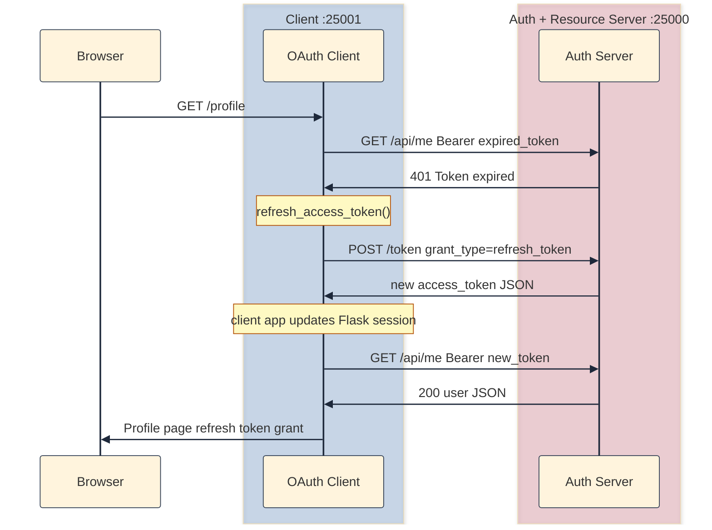
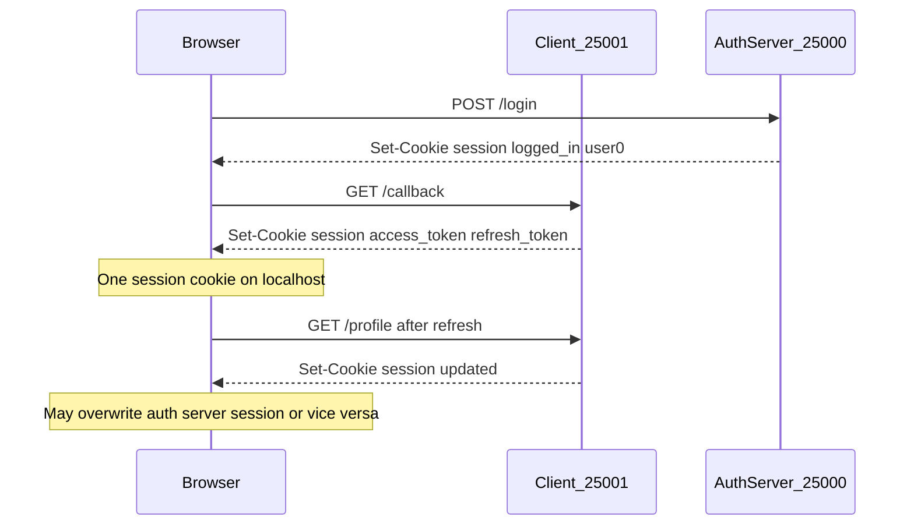

# Why v04 was not the finish line

[v04]() closed the loop through a protected API: the client app stores an `access_token`, calls `GET /api/me` with `Authorization: Bearer …`, and shows a profile page. Login means the token works and the resource server agrees.

That token has a TTL. v04 minted access tokens with `expires_in: 3600`. In production, short-lived access tokens are deliberate: if one leaks, damage is bounded. When it expires, `/api/me` returns **401** and the user would otherwise go through `/authorize` again: browser redirect, login form, callback.

Refresh tokens ([RFC 6749 §1.5](https://datatracker.ietf.org/doc/html/rfc6749#section-1.5), [§6](https://datatracker.ietf.org/doc/html/rfc6749#section-6)) fix that. After the initial code exchange, the auth server also issues a `refresh token`. The client app keeps it in its Flask session and exchanges it at `POST /token` with `grant_type=refresh_token` for a new `access token` without another browser login.

v04's cast-of-characters table already flagged refresh tokens as the next step. v05 implements them.

## Example: expired access token with no refresh path

**Setup:** v04 user logged in yesterday. `access_token` in the client app's session is past `expires_at`.

**What happens:**

1. User opens `/profile` on the client app.
2. Client app calls `GET /api/me` on the resource server with the stale Bearer token.
3. Resource server returns **401** (`Token expired`).
4. Client app has no recovery path. User must click **Start authorization** and log in again.

**What v05 fixes:** On **401**, the client app calls `POST /token` on the auth server with the refresh grant, gets a new access token, retries `/api/me`, and renders the profile. The browser never leaves the client app.

# How v05 adds refresh tokens

This lab runs three separate Flask programs. Names matter in the sections below:

| Program | Port | Role in v05 |
|---------|------|-------------|
| Client app | `:25001` | Your app: `/login`, `/callback`, `/profile`. Holds tokens in a Flask session cookie. Calls the auth server and resource server over HTTP. |
| Auth server | `:25000` | Issues codes and tokens: `/authorize`, `/login`, `POST /token`. Has its own Flask session for the login form (`logged_in`, `username`). |
| Resource server | `:25000` (same process in the lab) | Protects data: `GET /api/me`. Stateless for Bearer tokens; no user login session. |

In production these are often three deployments. In v05, auth and resource share one codebase on `:25000` for simplicity.

`POST /token` now accepts two grant types:

| Grant | When |
|-------|------|
| `authorization_code` | First login (with PKCE), same as v03/v04, but response also includes `refresh_token` |
| `refresh_token` | Access token expired; mint a new one silently |

Both grants return the same JSON shape:

```json
{
  "access_token": "...",
  "token_type": "Bearer",
  "expires_in": 10,
  "refresh_token": "..."
}
```

## Auth server: storage and token endpoint

**`server/storage/memory.py`** (auth server codebase) adds a third dict:

```python
# refresh_token -> {user_id, client_id, expires_at}
refresh_tokens: dict = {}
```

**`server/routes/token.py`** is refactored into grant-specific handlers:

1. **`grant_type=authorization_code`**: unchanged validation (PKCE, code reuse, etc.), but `_mint_token_pair()` writes both `access_tokens` and `refresh_tokens`, and the response includes `refresh_token`.
2. **`grant_type=refresh_token`**: validates `refresh_token`, `client_id`, and expiry; mints a new access token only; returns the same refresh token (reuse, not rotation; rotation is out of scope for this lab).

For the demo, access tokens use a short TTL (10 seconds in my current config; 60–90 seconds also works). Refresh tokens use a longer TTL (3600 seconds). You need access to expire before refresh so you can see silent refresh without waiting an hour.

You can test the refresh grant directly:

```bash
curl -s -X POST http://localhost:25000/token \
  -d grant_type=refresh_token \
  -d refresh_token=PASTE_REFRESH_TOKEN \
  -d client_id=demo-client \
  -d client_secret=demo-secret
```

Copy `refresh_token` from the client app's or auth server's `/debug/state` after login.

## Client app: store, refresh, retry

Three additions on top of v04 in the client app (`client/app.py`):

**1. Callback (`/callback`)**: after successful code exchange, also stores `session["refresh_token"]` and `session["token_grant"] = "authorization_code"`.

**2. `refresh_access_token()`**: the client app backend calls `POST /token` on the auth server with the refresh grant (via `requests.post`, not from the browser). On success, it updates the client app's Flask session (`session["access_token"]`, etc.) and sets `token_grant` to `"refresh_token"`. On failure (`invalid_grant`), it clears token keys from that session.

**3. Profile (`/profile`)**: on **401** from the resource server, calls `refresh_access_token()`, then retries `/api/me` with the new token from the client app's session. If refresh fails, shows "Session expired. Please log in again." The profile page also labels which grant minted the current access token.

The browser only talks to the client app. It never calls `/token` directly.



## What changed from v04

| Piece | v04 | v05 |
|-------|-----|-----|
| Auth server `POST /token` | `authorization_code` only | also `refresh_token` grant |
| Token response | `access_token`, `token_type`, `expires_in` | adds `refresh_token` |
| Access token TTL | 3600s | short (demo: 10–60s) |
| Client app session | `access_token` | also `refresh_token`, `token_grant` |
| Client app `/profile` | single `/api/me` call | refresh + retry on 401 |
| [Session cookies](#problem-1-wrong-keys-in-the-client-session) | Flask default `session` on both apps | `oauth_client_session` (client app) / `oauth_server_session` (auth server) |

Authorization, PKCE, and Bearer validation on `/api/me` are unchanged.

# How to run it

Two terminals (from [github.com/sauvikbiswas/oauth-lab](https://github.com/sauvikbiswas/oauth-lab)):

**Terminal 1: auth server + resource server** (same Flask app on `:25000`)

```bash
cd versions/v05-refresh-token/server
python3 -m venv .venv && source .venv/bin/activate
pip install -r requirements.txt
cp ../../../.env.example .env
python3 app.py
```

**Terminal 2: client app**

```bash
cd versions/v05-refresh-token/client
python3 -m venv .venv && source .venv/bin/activate
pip install -r requirements.txt
cp ../../../.env.example .env
python3 app.py
```

Open `http://localhost:25001`, log in as `user0` / `password0`, land on `/profile`. The page should say the access token came from the _authorization code_ grant.

Wait for the access token to expire (check `ACCESS_TOKEN_TTL` in `server/routes/token.py`), reload `/profile`. It should still work and the label should switch to _refresh token_ grant.

## Negative tests

As usual, you can test out some failure cases as well.

| Test | How | Expected |
|------|-----|----------|
| Bad refresh token | `curl` refresh grant with `refresh_token=garbage` | `invalid_grant` |
| After logout | Log out, then `curl` refresh with old token | `invalid_grant` |
| Profile without login | Fresh browser, visit `/profile` | Error: token missing |
| Auth server restart | Restart the auth server process, reload `/profile` on the client app | Refresh fails; in-memory tokens gone |

# Debugging: when localhost eats your session

This section is a bug I hit while building v05. The OAuth logic was fine. The symptoms looked like refresh was "deleting" the client app's session or logging both apps out. I had fun debugging this and learned some new things as well.

## Problem 1: wrong keys in the client app's session

**Symptom:** Client app `/debug/state` showed:

```json
"session": {
  "logged_in": true,
  "username": "user0"
}
```

No `access_token`. No `refresh_token`. But `storage.access_tokens` had the token from a successful callback.

The client app never sets `logged_in` or `username`. Those come from the auth server's login form. The client app's Flask session had been overwritten with the auth server's session payload.

**Root cause:** both Flask apps used the default session cookie name: `session`. They run on `localhost` at different ports (`:25000` auth server, `:25001` client app). I had touched on cookies in the [v03 blog post](), but not this collision.

Cookies are matched by host and path, not port ([RFC 6265](https://datatracker.ietf.org/doc/html/rfc6265)). So both apps read and write the same `session` cookie for `localhost`. Last `Set-Cookie` wins.



**Fix:** distinct cookie names in each app's `create_app()`:

```python
# auth server: server/app.py
app.config["SESSION_COOKIE_NAME"] = "oauth_server_session"

# client app: client/app.py
app.config["SESSION_COOKIE_NAME"] = "oauth_client_session"
```

After deploying, I had to clear old `session` cookies for `localhost` once. That fixed the cross-app overwrite, but not everything below.

## Problem 2: client app's session cookie disappears after reload

**Symptom:** After waiting for token expiry and reloading `/profile`, Firefox devtools showed `oauth_client_session` gone. Only `oauth_server_session` remained. Profile said "Access token is missing from session."

I first assumed the refresh `POST /token` was clearing something in the browser. It was not. The client app backend sends that request (`requests.post` to the auth server). The browser never sees it.

What the browser actually sees is the `GET /profile` response from the client app. When refresh fails, the client app clears token keys from its Flask session. Flask drops the session cookie when it becomes empty. That looks like "the cookie was deleted on refresh."

**Root cause:** even with separate cookie names, the refresh grant was failing. Two reasons:

1. Equal TTLs: I had set both `ACCESS_TOKEN_TTL` and `REFRESH_TOKEN_TTL` to 10 seconds on the auth server. By the time the resource server returned 401 and the client app ran refresh, the refresh token was also expired. That led to `invalid_grant`. The client app then popped all token keys, leaving an empty session. Firefox devtools showed the cookie deleted.

2. Auth server restart: tokens live in the auth server's `memory.py` dicts. Restart that process and refresh tokens are gone. The client app's session still holds the old refresh token; refresh fails; the client app's session is cleared.

On refresh failure the client app intentionally clears tokens. The first failed reload shows "Session expired." A second reload shows "Access token is missing" because the cookie is already gone.

**Fix:** keep refresh token TTL much longer than access token TTL on the auth server (e.g. access 10–60s, refresh 3600s). Expect to re-login after an auth server restart in this lab.

## How to verify the fix

1. Clear all `localhost` cookies.
2. Log in. Check client app `/debug/state`: `session` has `access_token`, `refresh_token`, `token_grant`.
3. Check auth server `/debug/state`: `session` has `logged_in`, `username`.
4. DevTools → Cookies: both `oauth_client_session` and `oauth_server_session` present.
5. Wait for access token expiry. Reload `/profile` on the client app once. Both cookies still present; profile shows refresh token grant.

# From toy lab to production

v05 completes the protocol arc this lab set out to educate me on: Authorization Code + PKCE, a protected API, and refresh. The numbered versions are toy programs on purpose; they keep one idea visible at a time.

If you were hardening a real deployment, you would still need work beyond what any single lab version implements. Here is a practical checklist. Each item names which program it applies to:

- On the auth server, store tokens, codes, and clients in a database instead of `memory.py` dicts so they survive process restarts.
- On the auth server, when a user logs out or you suspect compromise, invalidate refresh tokens ([RFC 7009](https://datatracker.ietf.org/doc/html/rfc7009)) instead of only deleting them from the client app's session.
- On the auth server, mint a new refresh token on each refresh, and treat reuse of an old one as a signal of theft.
- Split the auth server and resource server so `/authorize` and `/token` run separately from `/api/me`, and have each service validate tokens on its own (often via introspection or JWT verification).
- Across all three programs, replace debug dumps with safe user-facing errors and an audit trail.
- On the client app, give the client app and auth server different `SECRET_KEY` values. Encrypt refresh tokens at rest on the auth server. Store session data in Redis or a database (session id in the cookie, tokens on the client app's backend) instead of putting refresh tokens inside large signed cookies sent to the browser.
- On the client app, use `POST` for logout so prefetchers cannot accidentally clear a session (see [v04's note on `GET /logout`]()).

In v05, logout on the client app clears that app's Flask session only. The auth server still holds entries in `memory.access_tokens` and `memory.refresh_tokens` until restart. That is fine for learning; it is not a model for production logout semantics.

# Cast of characters (v05 additions)

| Name | Who creates it | Where it travels | What it does |
|------|----------------|------------------|--------------|
| **`refresh_token`** | Auth server | Auth server `POST /token` JSON → client app session → auth server `POST /token` body on refresh | Longer-lived credential to mint new access tokens without browser login. |
| **`grant_type=refresh_token`** | Client app | Auth server `POST /token` body | Selects the refresh grant instead of authorization code. |
| **`expires_in`** | Auth server | Token response JSON | Access token lifetime in seconds. Short in v05 for demo. |
| **`token_grant`** | Client app (lab only) | Client app session only | Lab helper: tracks whether current access token came from `authorization_code` or `refresh_token`. Not part of OAuth. |

Updated **`grant_type`** row: `POST /token` body uses `authorization_code` for first login and `refresh_token` for silent renewal.

# What next?

v05 is the last numbered snapshot for OAuth fundamentals in this lab. You can diff it against v04 to see exactly what refresh added:

```bash
diff -ru versions/v04-protected-resource versions/v05-refresh-token
```

For production hardening, see the checklist above. Those changes belong in a real codebase, not in another toy step-by-step version here.

# Further reading

- [RFC 6749 §1.5: Refresh token](https://datatracker.ietf.org/doc/html/rfc6749#section-1.5)
- [RFC 6749 §6: Refreshing an Access Token](https://datatracker.ietf.org/doc/html/rfc6749#section-6)
- [RFC 6749 §6.1: Token Response](https://datatracker.ietf.org/doc/html/rfc6749#section-6.1)
- [RFC 6265: HTTP State Management (cookies)](https://datatracker.ietf.org/doc/html/rfc6265)
