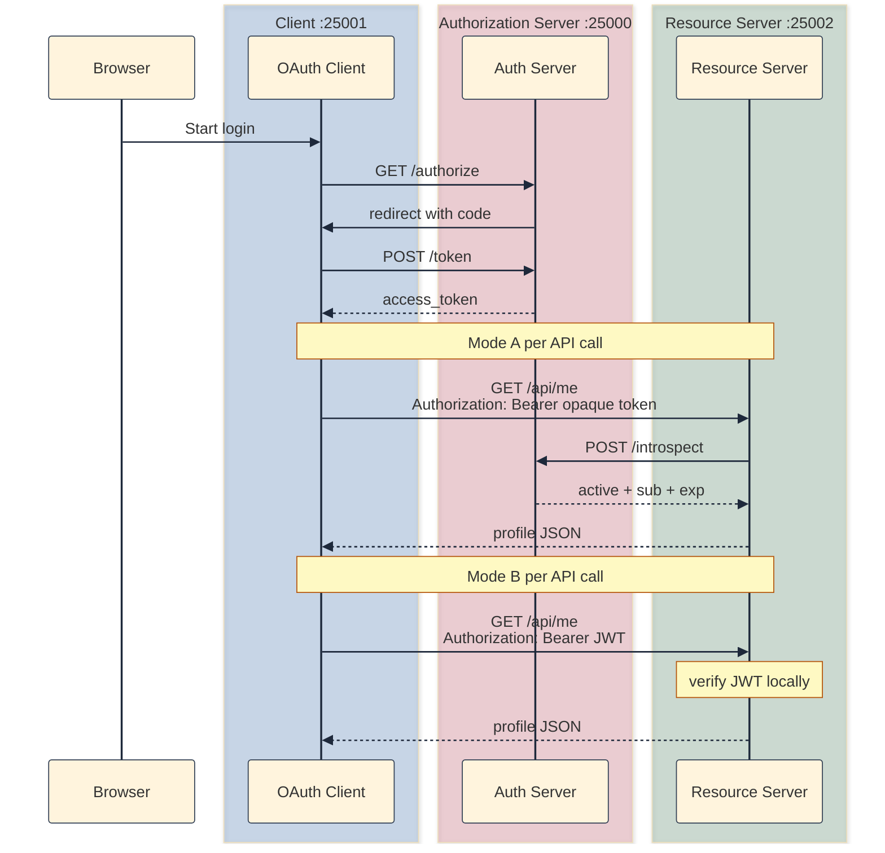
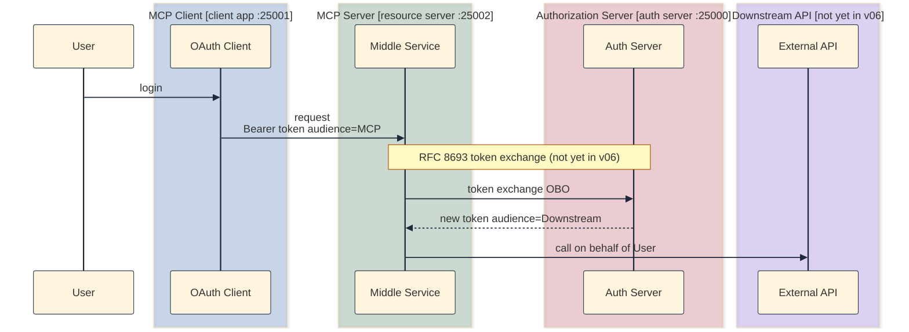

## Why v05's single process is not the finish line

[v05]() closed the refresh loop: short-lived access tokens, silent renewal via `grant_type=refresh_token`, and a protected `GET /api/me`. One convenience hid an architectural lie.

In v05, the authorization server and resource server share one Flask process on `:25000`. The client calls the same host for `POST /token` and `GET /api/me`. Token minting and token validation both read `memory.access_tokens` in the same Python dict. That works in a toy lab; it is not how production OAuth is deployed.

In the last blog's production checklist, I had already mentioned this as part of the next steps:

> Split the auth server and resource server so `/authorize` and `/token` run separately from `/api/me`, and have each service validate tokens on its own (often via introspection or JWT verification).

v06 is that step. The repo ships a working split under [`versions/v06-split-servers/`](https://github.com/sauvikbiswas/oauth-lab/tree/main/versions/v06-split-servers). It has three apps, both validation modes (introspection + JWT), and a Level 2 profile split (more on that later). This post outlines the ideas. In retrospect, I feel like it covers a lot more ground and introduces multiple concepts that are important for real world implementation.

### Example: why shared memory breaks with the split

**Setup:** In v05, the auth server mints an `access_token` in `memory.access_tokens`, and `GET /api/me` looks up the same dict in-process.

**What breaks when you deploy separately:**

1. The resource server starts on `:25002` with its own empty memory.
2. The client sends a valid Bearer token to `GET /api/me`.
3. The resource server has no record of that token and returns 401, even though the auth server issued it five seconds ago.
4. You see the split clearly: issuing a token and accepting a token are different jobs, often done by different programs.

**What v06 fixes:** Three isolated programs on three ports. The auth server issues tokens. The resource server validates them without sharing the auth server's in-memory dict, using introspection or JWT verification. This is what real-world looks like.

## Three programs, three roles

| Program | Port | Keeps from v05 | Changes |
|---------|------|----------------|--------------|
| Auth server | `:25000` | `/login`, `/authorize`, `POST /token`, refresh | Drops `GET /api/me`; adds `POST /introspect` |
| Resource server | `:25002` | (none) | Adds `GET /api/me`; validates Bearer tokens |
| Client app | `:25001` | OAuth flow, refresh-on-401 | API calls go to `RESOURCE_SERVER_URL`, not auth server |



## What user data lives where?

For the client app, `GET /api/me` returns the same JSON contract as v04/v05. The only change is that it uses the minted token from Auth server to fetch the data from Resource server. Splitting processes forces a question v05 never had to answer: should the auth server still hold full records for `user0` and `user1`? What belongs on `:25000` versus `:25002`?

### What each server is for

| Concern | Auth server | Resource server |
|---------|-------------|-----------------|
| Authentication ("who are you?") | Yes: login, passwords | No |
| Authorization / token issuance | Yes: codes, access/refresh tokens | No |
| Token validation | Yes: `/introspect` (Mode A) | Yes: accepts Bearer token |
| Client registry | Yes: `clients` (web apps) and `service_clients` (introspection callers) | No |
| User passwords | Yes (lab only; never on resource server) | Never |
| Profile / API data | Optional (see below) | Yes (in production) |

OAuth separates identity proof (auth server) from protected resources (resource server). v05 blurred that by keeping everything in one `memory.users` dict on `:25000`.

### Should the auth server have full user0 / user1 records?

For this lab, that's not necessary. v06 uses a realistic split. The auth server keeps `password` and `user_id` only, enough to log in and mint tokens. The resource server keeps `username` and `email` in `storage/profiles.py`; the API owns profile data.

The auth server proves who you are (`sub` or subject; a JWT construct that we'll come to that in a moment). The resource server decides what to show from its own profile store.

In production, the IdP typically holds credentials (or federated login) and a stable subject id (`sub`). The product API holds app-specific profile and business data, or fetches it from a user service keyed by `sub`. A client can call multiple resource servers to aggregate what it needs for that subject.

As a rule of thumb, anything needed to log in or mint and validate tokens belongs on the auth server. Anything needed to serve protected API responses belongs on the resource server, keyed by `sub` from the token.

### v06 split: what to keep on each side

On the auth server (`auth-server/storage/memory.py`), we have:

- `users` with `password` and `user_id` only (for login)
- `clients` for `demo-client` (Authorization Code flow; redirect URIs)
- `service_clients` for `resource-server` (backend caller to `POST /introspect`)
- `authorization_codes`, `access_tokens` (opaque access tokens only), `refresh_tokens`

See [Two client registries](#two-client-registries-not-one) below for why `demo-client` and `resource-server` are stored separately.

On the resource server (`resource-server/storage/profiles.py`), we have:

- `profiles` mapping `user_id` to `{username, email}` (in real world usecases, there would be more data)

The resource server must not have passwords, token stores, or `/login`.

The implementation flow on the resource server runs in three steps. First, token validation (`token_validation.py`) returns `{"user_id": "user0"}`. Second, profile lookup reads `profiles.profiles[user_id]`. Third, `GET /api/me` merges identity and profile.

### Two client registries, not one

For the Auth server, the resource server is not the same kind of OAuth client as `demo-client`. They both use `client_id` and `client_secret`, but they play different roles:

| Registry | Lab entry | Role |
|----------|-----------|------|
| `clients` | `demo-client` | Web app: Authorization Code flow, redirect URIs, user login |
| `service_clients` | `resource-server` | Backend: authenticates to `POST /introspect` only |

When a user logs in, `demo-client` receives tokens on behalf of `user0`. When `/api/me` runs on `:25002`, the resource server calls `/introspect` on `:25000` using `resource-server` credentials. That proves the caller is allowed to ask whether a Bearer token is valid; it is service-to-service auth, not user delegation.

Production IdPs often store these in separate tables (`oauth_clients` versus service principals or machine clients). v06 uses two dicts in `memory.py` for the same reason: different trust boundaries, different secrets, different grant types. Reusing `demo-client` for introspection would blur the line between a browser-facing app and a backend API.

`POST /introspect` validates against `service_clients` only. `POST /token` for the authorization code grant still validates against `clients`. You can check auth server `/debug/state`, both dicts are listed separately.

## Two ways to validate a token across process boundaries

Once auth and resource run separately, the resource server must answer whether the Bearer token is valid and who the user is. v06 implements both common answers, switchable via env.

| Mode | Env | Auth server mints | Resource server validates |
|------|-----|-------------------|---------------------------|
| A: introspection | `ACCESS_TOKEN_FORMAT=opaque`, `TOKEN_VALIDATION=introspection` | Opaque string (v05 style) | `POST /introspect`, then `sub`, then profile lookup |
| B: JWT | `ACCESS_TOKEN_FORMAT=jwt`, `TOKEN_VALIDATION=jwt` | HS256 JWT (`sub`, `client_id`, `exp`; plus `iss`, `aud`, `iat` for verify) | Local verify, then `sub`, then profile lookup |

Both modes share the same login and authorization-code exchange. They diverge at `GET /api/me`: Mode A sends the opaque token to the auth server via `/introspect`; Mode B verifies a JWT locally on the resource server (see the diagram under [Three programs, three roles](#three-programs-three-roles)).

Let us now go over each mode.

### Mode A: opaque token + introspection (RFC 7662)

This is what the Auth server does when it gets a `POST /introspect` request:

- Accept `token` in form body.
- Authenticate caller with `INTROSPECTION_CLIENT_ID` and `INTROSPECTION_CLIENT_SECRET` (must match `service_clients` on the auth server, not `clients`).
- Look up opaque token in `memory.access_tokens` and check `expires_at`.
- If the token is not in `memory.access_tokens`, fall back to JWT signature verification via PyJWT (covers stateless JWT access tokens or non-default env pairings; not the primary Mode A path).
- Return `{"active": false}` or an active payload with `sub`, `client_id`, and `exp` (identity only; no profile fields).

#### What `sub` and `exp` mean in the introspection response

When introspection returns an active token to the resource server, the JSON includes field names borrowed from [JWT registered claims](https://datatracker.ietf.org/doc/html/rfc7519#section-4.1) and [RFC 7662](https://datatracker.ietf.org/doc/html/rfc7662). That is normal even when the access token itself is an opaque random string.

| Field | Meaning in v06 | Where it comes from |
|-------|----------------|---------------------|
| `active` | Token is valid and not expired | Required by RFC 7662 |
| `sub` | Subject: the user this token represents (`user0`, `user1`) | Auth server maps `token_data["user_id"]` after lookup in `memory.access_tokens` |
| `client_id` | OAuth web client the token was issued to (usually `demo-client`) | Stored on the token record at mint time |
| `exp` | Expiration time as a Unix timestamp (seconds since epoch) | Auth server maps `expires_at` |

`sub` is the protocol-facing user id. It is not necessarily the same string the user typed on the login form, though in this lab they match. The resource server uses `sub` as the key into `profiles` on `:25002`.

`exp` lets a caller know when the token stops being valid without decoding anything. In production, resource servers often cache an introspection result until `exp` to avoid calling the auth server on every request.

The same claim names appear inside JWT access tokens in Mode B; see [What the JWT claims mean](#what-the-jwt-claims-mean).

A fuller introspection response from a production IdP might also include `iat` (issued at), `scope`, `aud`, or `token_type`. v06 returns a minimal subset on purpose:

```json
{
  "active": true,
  "sub": "user0",
  "client_id": "demo-client",
  "exp": 1718380800
}
```

We deliberately omit `username` and `email` here. Profile fields live on the resource server; introspection answers identity only.

For opaque Mode A, the auth server must retain each issued access token in `memory.access_tokens` so introspection can resolve it. That creates an extra network hop: on every `/api/me`, the resource server calls `POST /introspect` on the auth server (in addition to the earlier `/token` call at login).

On the resource server in Mode A:

- Forward the client's Bearer token to `POST /introspect` with `INTROSPECTION_CLIENT_*` credentials.
- If `active` is true, read `sub` and look up `profiles[sub]`.
- Return merged JSON from `GET /api/me`.

### Mode B: JWT + local verification (RFC 7519)

JWT (JSON Web Token) is defined in [RFC 7519](https://datatracker.ietf.org/doc/html/rfc7519). This mechanism enables the client app to call the resource server directly with an access token obtained from the auth server; the resource server can verify the request without talking to the auth server on each API call.

This is what the auth server does when minting a token:

- When `ACCESS_TOKEN_FORMAT=jwt`, mint an HS256 JWT with `sub`, `client_id`, `exp`, plus `iss`, `aud`, and `iat`.
- Do not store JWT access tokens in `memory.access_tokens`; validation in Mode B is fully local on the resource server.

#### What the JWT claims mean

A JWT on the wire is three Base64URL segments: `header.payload.signature`. The auth server signs the payload with `JWT_SECRET`; the resource server verifies the signature with the same secret (HS256). The decoded payload in v06 looks like this:

```json
{
  "iss": "auth-server",
  "aud": "resource-server",
  "iat": 1718377200,
  "sub": "user0",
  "client_id": "demo-client",
  "exp": 1718380800
}
```

| Claim | RFC | Value in v06 | Why it matters |
|-------|-----|--------------|----------------|
| `sub` | Registered ([RFC 7519 §4.1.2](https://datatracker.ietf.org/doc/html/rfc7519#section-4.1.2)) | `user0` / `user1` | Subject: who the token represents; resource server keys `profiles` on this |
| `exp` | Registered | Unix timestamp (~60s after mint) | Expiration; PyJWT rejects tokens past this time |
| `iat` | Registered | Unix timestamp at mint | Issued-at; helps detect tokens used before they were minted |
| `iss` | Registered | `"auth-server"` | Issuer; resource server expects this value when verifying |
| `aud` | Registered | `"resource-server"` | Audience: token is meant for this API, not arbitrary services |
| `client_id` | Custom (not in RFC 7519 registry) | `"demo-client"` | Which OAuth app received the token; useful for audit; v06 does not use it on `/api/me` |

When the resource server receives a request from the client app, it does the following:

- Verify JWT signature with `JWT_SECRET`; check `aud`, `iss`, and `exp`; extract `sub`.
- Look up `profiles[sub]` for username and email.

The resource server checks signature, `iss`, `aud`, and `exp` via PyJWT, then uses only `sub` for profile lookup. The end result matches introspection (identity from the token, profile from local storage); only the transport differs.

Here is the nuance that makes JWT stateless. If you stop the auth server, already-issued JWTs still work until `exp`.

| Concern | Mode A (opaque + introspection) | Mode B (JWT + local verify) |
|---------|----------------------------------|-----------------------------|
| Auth server down | `/api/me` fails (introspection unreachable) even if the client still holds a valid opaque token | Already-issued JWTs still verify until `exp` |
| Revocation | Delete from `memory.access_tokens`; introspection then returns inactive | No server-side record; token stays valid until `exp` unless you add short TTLs or a denylist |

Deleting an opaque token from `memory.access_tokens` makes introspection return inactive. Stateless JWTs still verify cryptographically until `exp`; production uses short TTLs or a denylist (out of scope for v06).

## "On behalf of": two different meanings

OAuth vocabulary overloads "on behalf of." v06 is a good place to separate the two senses.

### Meaning 1: client acts on behalf of the resource owner

From v01 onward, the Authorization Code grant is delegation. The client obtains an access token so it can call APIs on behalf of `user0` without holding `user0`'s password.

| Step | On-behalf-of in practice |
|------|--------------------------|
| `/authorize` | You delegate access to `demo-client` |
| `POST /token` | Token is issued for `user0` |
| `GET /api/me` | Bearer token proves the request is on behalf of `user0` |

v06 does not change this model. It only moves who validates the token to a separate resource server.

### Meaning 2: On-Behalf-Of (OBO) / token exchange (RFC 8693)

OBO is a specific second-hop pattern. A middle service already has a user token, then exchanges it for a new token scoped to a downstream API. The user is the same; the audience is different.



In v06, the client holds the user's token and calls the resource server directly. There is no middle tier exchanging tokens. The diagram above sketches OBO (RFC 8693): a middle service swaps one token for another at the auth server, then calls an external API with the new token. v06 does not implement that path.

## What comes after v06 (briefly)

This post stops at the split that is typical for most apps: tokens from the auth server, data from the resource server, validated by introspection or JWT. That is enough to ship a client plus API.

Some deployments add a middle service (for example an agent or gateway) that must call other APIs on the user's behalf. That is a second OAuth problem on top of v06: token exchange (OBO), audience binding, and never forwarding a token to a service it was not minted for. [MCP](https://modelcontextprotocol.io/specification/2025-11-25/basic/authorization) is one real-world case where both hops show up; I will cover that in a follow-up post rather than here.

For now, the v06 takeaway that carries forward: validate every Bearer token against the intended issuer and audience. A token meant for your resource server must not be treated as valid elsewhere.

## How to run it

Three terminals (from [github.com/sauvikbiswas/oauth-lab](https://github.com/sauvikbiswas/oauth-lab)):

**Terminal 1: auth server** (`:25000`)

```bash
cd versions/v06-split-servers/auth-server
python3 -m venv .venv && source .venv/bin/activate
pip install -r requirements.txt
cp ../../../.env.example .env
python3 app.py
```

**Terminal 2: resource server** (`:25002`)

```bash
cd versions/v06-split-servers/resource-server
python3 -m venv .venv && source .venv/bin/activate
pip install -r requirements.txt
cp ../../../.env.example .env
python3 app.py
```

**Terminal 3: client app** (`:25001`)

```bash
cd versions/v06-split-servers/client
python3 -m venv .venv && source .venv/bin/activate
pip install -r requirements.txt
cp ../../../.env.example .env
python3 app.py
```

Default env is Mode A (`ACCESS_TOKEN_FORMAT=opaque`, `TOKEN_VALIDATION=introspection`). Open `http://localhost:25001`, log in as `user0` / `password0`, and `/profile` should show username and email fetched from the resource server on `:25002`.

To try Mode B, set `ACCESS_TOKEN_FORMAT=jwt` and `TOKEN_VALIDATION=jwt` in all three `.env` files, use the same `JWT_SECRET` on the auth server and resource server, restart all three processes, and log in again.

### Negative tests

As usual, you can test some failure cases as well.

**Mode A (default):**

| Test | How | Expected |
|------|-----|----------|
| No Bearer header | `curl -s http://localhost:25002/api/me` | 401 |
| Fake token | `curl -s http://localhost:25002/api/me -H "Authorization: Bearer not-a-real-token"` | 401 |
| Auth server down | Stop the auth server process; reload `/profile` on the client app | Profile fails (introspection unreachable) |
| Access token expiry | Wait for `ACCESS_TOKEN_TTL` (60s in `auth-server/routes/token.py`); reload `/profile` | Silent refresh still works |

**Mode B** (after flipping env and restarting):

| Test | How | Expected |
|------|-----|----------|
| Valid API call | Log in; `curl` `/api/me` with Bearer token from client `/debug/state` | 200 with user JSON |
| Auth server down | Stop auth server; call `/api/me` with an unexpired JWT | 200 until `exp` |
| Expired JWT | Wait past access token expiry; call `/api/me` | 401; refresh needs auth server again |

## Cast of characters (v06 additions)

| Name | Who creates it | Where it travels | What it does |
|------|----------------|------------------|--------------|
| `POST /introspect` | Auth server | Resource server to auth server (Mode A) | RFC 7662: is this token active, and who is the subject? |
| `RESOURCE_SERVER_URL` | Config | Client to resource server | API base URL; separate from auth server. |
| `ACCESS_TOKEN_FORMAT` | Config | Auth server mint path | `opaque` or `jwt`. |
| `TOKEN_VALIDATION` | Config | Resource server | `introspection` or `jwt`; must match format. |
| `JWT_SECRET` | Config | Auth and resource (Mode B) | Shared signing key for HS256 lab tokens. |
| `INTROSPECTION_CLIENT_*` | Config | Resource server to auth server | Service credentials for introspection. |

Refresh tokens, PKCE, `state`, and Bearer headers are unchanged from v05.

## What next?

v06 adds the split auth server and resource server on top of v05's refresh loop. Diff adjacent snapshots to see exactly what changed:

```bash
diff -ru versions/v05-refresh-token versions/v06-split-servers
```

I can think of the following possible continuations (not yet in the repo, might edit this section once I have worked on stuff):

1. RFC 8693 token exchange (OBO): middle service swaps tokens for downstream APIs.
2. RFC 8707 `resource` parameter: bind tokens to a specific resource at mint time.
3. RS256 and JWKS: replace HS256 shared secret for JWT mode.
4. MCP and agent authorization: two-hop OAuth in practice (follow-up post).

## Further reading

- [RFC 7662: OAuth 2.0 Token Introspection](https://datatracker.ietf.org/doc/html/rfc7662)
- [RFC 7519: JSON Web Token](https://datatracker.ietf.org/doc/html/rfc7519)
- [RFC 8693: OAuth 2.0 Token Exchange](https://datatracker.ietf.org/doc/html/rfc8693)
- [RFC 8707: Resource Indicators for OAuth 2.0](https://www.rfc-editor.org/rfc/rfc8707.html)
