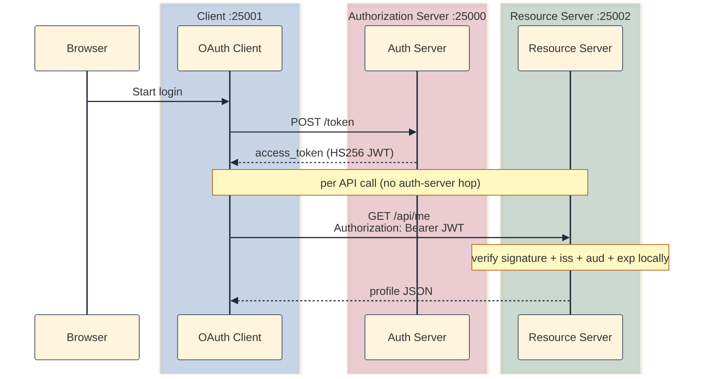

## Why a second validation mode

[v06]() split the authorization server from the resource server and taught the default way a separate resource server trusts a token it never issued: **introspection** (Mode A). On every `GET /api/me`, the resource server sends the opaque Bearer token to `POST /introspect` on the auth server and gets back `active`, `sub`, and `exp`.

That works, but it has a cost: a network hop to the auth server on every single API call, and a hard dependency — if the auth server is down, `/api/me` fails even when the client still holds a perfectly valid token.

This companion post covers the other validation mode the v06 code already ships: **JWT + local verification** (Mode B). No new snapshot. It is the same three apps under [`versions/v06-split-servers/`](https://github.com/sauvikbiswas/oauth-lab/tree/main/versions/v06-split-servers), run with the env flipped. The JWT claims introduced here (`sub`, `iss`, `aud`, `exp`, `iat`) are the vocabulary the rest of the series builds on: OIDC `id_token` in [v07](), RS256 + JWKS in [v08](), and audience binding in [v09]().

## Mode A vs Mode B at a glance

Both modes share the same login and authorization-code exchange. They diverge only at `GET /api/me`.

| Mode | Env | Auth server mints | Resource server validates |
|------|-----|-------------------|---------------------------|
| A: introspection | `ACCESS_TOKEN_FORMAT=opaque`, `TOKEN_VALIDATION=introspection` | Opaque string (v05 style) | `POST /introspect`, then `sub`, then profile lookup |
| B: JWT | `ACCESS_TOKEN_FORMAT=jwt`, `TOKEN_VALIDATION=jwt` | HS256 JWT | Local verify, then `sub`, then profile lookup |



## Mode B: JWT + local verification (RFC 7519)

JWT (JSON Web Token) is defined in [RFC 7519](https://datatracker.ietf.org/doc/html/rfc7519). This mechanism enables the client app to call the resource server directly with an access token obtained from the auth server; the resource server can verify the request without talking to the auth server on each API call.

This is what the auth server does when minting a token:

- When `ACCESS_TOKEN_FORMAT=jwt`, mint an HS256 JWT with `sub`, `client_id`, `exp`, plus `iss`, `aud`, and `iat`.
- Do not store JWT access tokens in `memory.access_tokens`; validation in Mode B is fully local on the resource server.

### What the JWT claims mean

A JWT on the wire is three Base64URL segments: `header.payload.signature`. The auth server signs the payload with `JWT_SECRET`; the resource server verifies the signature with the same secret (HS256). The decoded payload in v06 looks like this:

```json
{
  "iss": "auth-server",
  "aud": "resource-server",
  "iat": 1718377200,
  "sub": "user0",
  "client_id": "demo-client",
  "exp": 1718380800
}
```

| Claim | RFC | Value in v06 | Why it matters |
|-------|-----|--------------|----------------|
| `sub` | Registered ([RFC 7519 §4.1.2](https://datatracker.ietf.org/doc/html/rfc7519#section-4.1.2)) | `user0` / `user1` | Subject: who the token represents; resource server keys `profiles` on this |
| `exp` | Registered | Unix timestamp (~60s after mint) | Expiration; PyJWT rejects tokens past this time |
| `iat` | Registered | Unix timestamp at mint | Issued-at; helps detect tokens used before they were minted |
| `iss` | Registered | `"auth-server"` | Issuer; resource server expects this value when verifying |
| `aud` | Registered | `"resource-server"` | Audience: token is meant for this API, not arbitrary services |
| `client_id` | Custom (not in RFC 7519 registry) | `"demo-client"` | Which OAuth app received the token; useful for audit; v06 does not use it on `/api/me` |

When the resource server receives a request from the client app, it does the following:

- Verify JWT signature with `JWT_SECRET`; check `aud`, `iss`, and `exp`; extract `sub`.
- Look up `profiles[sub]` for username and email.

The resource server checks signature, `iss`, `aud`, and `exp` via PyJWT, then uses only `sub` for profile lookup. The end result matches introspection (identity from the token, profile from local storage); only the transport differs.

## The tradeoff: statelessness

Here is the nuance that makes JWT stateless. If you stop the auth server, already-issued JWTs still work until `exp`.

| Concern | Mode A (opaque + introspection) | Mode B (JWT + local verify) |
|---------|----------------------------------|-----------------------------|
| Per-call cost | Network hop to `/introspect` every request | Local signature check, no hop |
| Auth server down | `/api/me` fails (introspection unreachable) even if the client still holds a valid opaque token | Already-issued JWTs still verify until `exp` |
| Revocation | Delete from `memory.access_tokens`; introspection then returns inactive | No server-side record; token stays valid until `exp` unless you add short TTLs or a denylist |

Deleting an opaque token from `memory.access_tokens` makes introspection return inactive. Stateless JWTs still verify cryptographically until `exp`; production uses short TTLs or a denylist (out of scope here).

### A caveat that v08 fixes

Mode B uses HS256: the auth server and resource server share one `JWT_SECRET`. That is a lab shortcut. Any party holding the secret can *mint* tokens, not just verify them — so the "resource server trusts the auth server" story is really "everyone shares a password." [v08]() replaces this with RS256 + JWKS: the auth server signs with a private key, verifiers fetch the public key, and no shared secret is needed. Treat HS256 here as a stepping stone to that.

## How to run it

Start the same three processes as [v06]() (auth `:25000`, resource `:25002`, client `:25001`), but set Mode B in all three `.env` files before starting:

```bash
ACCESS_TOKEN_FORMAT=jwt
TOKEN_VALIDATION=jwt
```

Use the same `JWT_SECRET` on the auth server and resource server, restart all three processes, and log in as `user0` / `password0`. `/profile` should show the same username and email as Mode A — the difference is invisible to the user and lives entirely in how `/api/me` validates the token.

### Manual checks (Mode B)

**Should succeed:**

| Test | How | Expected |
|------|-----|----------|
| Valid API call | Log in; `curl` `/api/me` with Bearer token from client `/debug/state` | 200 with user JSON |
| Auth server down | Stop auth server; call `/api/me` with an unexpired JWT | 200 until `exp` |

**Should fail:**

| Test | How | Expected |
|------|-----|----------|
| Expired JWT | Wait past access token expiry; call `/api/me` | 401; refresh needs auth server again |
| Tampered JWT | Change one character in the payload segment; call `/api/me` | 401 (signature check fails) |

## What next?

Mode B is the same v06 code with the env flipped; to see the shared foundation, diff v05 and v06:

```bash
diff -ru versions/v05-refresh-token versions/v06-split-servers
```

The JWT claims introduced here carry directly into the rest of the series:

1. [v07 OpenID Connect](): a separate identity JWT (`id_token`) with `nonce`, alongside the access token.
2. [v08 JWKS + RS256](): drop the shared `JWT_SECRET`; verifiers fetch public keys and check RS256 signatures.
3. [v09 Resource indicators (RFC 8707)](): turn the placeholder `aud` into a real per-API binding.

## Further reading

- [RFC 7519: JSON Web Token](https://datatracker.ietf.org/doc/html/rfc7519)
- [RFC 7662: OAuth 2.0 Token Introspection](https://datatracker.ietf.org/doc/html/rfc7662) (v06 Mode A)
- [RFC 7517: JSON Web Key (JWK)](https://datatracker.ietf.org/doc/html/rfc7517) (v08)
