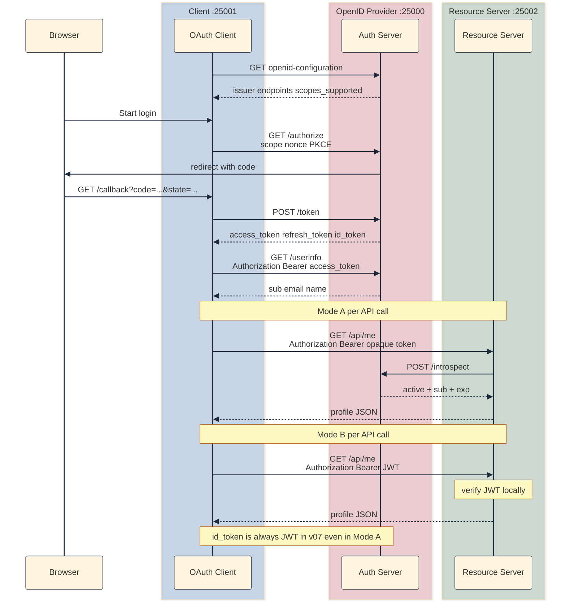

## Why v06 is not enough

[v06]() split the authorization server from the resource server and taught token validation across process boundaries. That is production-shaped OAuth 2.0.

It is not OpenID Connect. Vendors market themselves as OpenID Providers because OIDC standardizes *authentication* (who logged in) on top of OAuth's *authorization* (what APIs this token may call). While technically it's not part of OAuth 2 specs; and I had steered clear of implementing it; I decided to tackle this as well since I was working on a piece that covered what's available out there and what their business was. In almost all cases IdP (Identity providers) implement OIDC on top of OAuth. 

| OIDC concept | v06 | v07 |
|--------------|-----|-----|
| `openid` scope | ignored | required for OIDC login |
| `nonce` | (none) | replay binding for authentication (see below) |
| `id_token` | JWT access token has `sub` (Mode B only) | separate identity JWT at token time |
| `/userinfo` | (none) | standard claims endpoint on auth server |
| `.well-known/openid-configuration` | hard-coded `.env` URLs | discovery document on the OP |
| App profile | `GET /api/me` on resource server | unchanged |

### What `nonce` does (and how v07 uses it)

OAuth `state` ([v02]()) stops CSRF on the callback: the client checks that the `state` in the redirect URL matches what it stashed before sending the user to `/authorize`. `nonce` solves a different problem. It binds the `id_token` you receive at token time to this specific login attempt, so an attacker cannot replay an old identity JWT and trick your app into thinking a fresh login just happened.

| | `state` (OAuth) | `nonce` (OIDC) |
|--|-----------------|----------------|
| Protects against | CSRF / session swapping on callback | Replay of a captured `id_token` |
| Generated by | Client | Client |
| Sent on | `GET /authorize` query | `GET /authorize` query (when `openid` in scope) |
| Returns via | Redirect URL (`?state=...`) | `id_token` JWT claim; not the redirect URL |
| Verified on | `/callback` (compare query vs session) | `/profile` (compare JWT claim vs session) |

Flow in this lab:

1. **Client `/login`:** generate `nonce = secrets.token_urlsafe(32)`, store in Flask session, include in `/authorize` query alongside `scope=openid ...`.
2. **Auth server `/authorize`:** require `nonce` when `openid` is in scope; persist it on the authorization code dict in memory (with `scope`, PKCE fields, etc.).
3. **Auth server `POST /token`:** after code exchange, copy that `nonce` into the `id_token` JWT payload when minting.
4. **Client `/profile`:** decode `id_token`, verify signature/`iss`/`aud`/`exp`, then assert `id_token_claims["nonce"] == session["nonce"]`.

The browser redirect after login still contains only `code` and `state` not `nonce`. The idea and the mechanism is similar to PKCE's `code_verifier`: secrets that prove *this* login belong in server-side session storage and in the token response, not in a URL the user (or browser history) can leak.

The runnable snapshot lives at [`versions/v07-openid-connect/`](https://github.com/sauvikbiswas/oauth-lab/tree/main/versions/v07-openid-connect). Same three-process layout as v06: OpenID Provider on `:25000`, resource server on `:25002`, client on `:25001`. The auth server is both the OAuth authorization server and the OIDC OpenID Provider; it is not a separate product or host.

### Example: why OAuth authorization is not login

**Setup:** In v06, the client completes the Authorization Code flow and holds an `access_token`. Introspection returns `sub: user0`. The profile page calls `GET /api/me` and shows username and email.

**What breaks when you need "Sign in with …":**

1. There is no signed identity credential at login time; only an API token meant for `/api/me`.
2. There is no `nonce` to bind the login response to the original authorize request.
3. There is no discovery document; the client hard-codes endpoint URLs from `.env`.
4. Mode A (opaque access token) gives you authorization without any JWT identity artifact at all.

**What v07 fixes:** OIDC adds `scope` + `nonce` on `/authorize`, an `id_token` JWT in the token response, `GET /userinfo`, and `GET /.well-known/openid-configuration`. OAuth authorization (`access_token` to fetch `/api/me`) stays unchanged.

## Three programs, three roles

| Program | Port | Keeps from v06 | Changes |
|---------|------|----------------|--------------|
| Auth server (OpenID Provider) | `:25000` | `/login`, `/authorize`, `POST /token`, refresh, `/introspect` | + `scope`/`nonce` on authorize; + `id_token` minting; + discovery and UserInfo |
| Resource server | `:25002` | `GET /api/me`; token validation (Mode A/B) | unchanged |
| Client app | `:25001` | OAuth flow, refresh-on-401 | + OIDC login params; `/profile` shows id_token + UserInfo + `/api/me` |



## Authentication vs authorization

OAuth answers: *may this caller hit my API?* The `access_token` is an authorization artifact. It gates `GET /api/me` on the resource server and UserInfo on the auth server.

OIDC answers: *who logged in?* The `id_token` is an authentication artifact. It is a signed JWT attesting identity at login time (`sub`, and optionally `email`, `name`).

In most cases, both are needed. v06 had authorization end-to-end. v07 names the login side.

## What OIDC adds on top of OAuth 2

By now, it must be clear that OIDC does not replace OAuth. It adds parameters, response fields, endpoints, and JWT claims on top of the same authorization server.

### Authorize: scope and nonce

| Field | Standard | Since | Purpose in this lab |
|-------|----------|-------|---------------------|
| `response_type` | OAuth 2 ([RFC 6749](https://datatracker.ietf.org/doc/html/rfc6749)) | v01 | Must be `code` |
| `client_id` | OAuth 2 | v01 | Registered client |
| `redirect_uri` | OAuth 2 | v01 | Callback URL |
| `state` | OAuth 2 (best practice) | v02 | CSRF binding |
| `code_challenge` | OAuth 2 ([RFC 7636](https://datatracker.ietf.org/doc/html/rfc7636)) | v03 | PKCE |
| `code_challenge_method` | OAuth 2 PKCE | v03 | Must be `S256` |
| `scope` | OAuth 2 query param; OIDC requires `openid` in scope for login | v07 | Space-separated: `openid email profile` |
| `nonce` | OIDC Core ([§3.1.2.1](https://openid.net/specs/openid-connect-core-1_0.html#AuthRequest)) | v07 | Required when `openid` is in scope; echoed in `id_token` |

OAuth mints a code. OIDC adds `scope` + `nonce` so the token response can carry identity, not just API access. See [What `nonce` does](#what-nonce-does-and-how-v07-uses-it) for the full flow and how it differs from `state`.

### Token response: id_token

| Field | Standard | Since | Purpose |
|-------|----------|-------|---------|
| `access_token` | OAuth 2 | v03 | Bearer token for APIs |
| `token_type` | OAuth 2 | v03 | `Bearer` |
| `expires_in` | OAuth 2 | v03 | Access token TTL (seconds) |
| `refresh_token` | OAuth 2 | v05 | Silent renewal |
| `error`, `error_description` | OAuth 2 | v03 | Failure |
| `id_token` | OIDC Core | v07 | JWT identity credential; present when `openid` was in the authorization code's scope |

Refresh responses in this lab return a new `access_token` but no new `id_token`; that is allowed by OIDC and fine for v07.

The access token (opaque store, JWT payload, or introspection response) answers *may this caller hit `/api/me`?* See [v06]() for Mode A/B access-token formats; v07 adds `scope` on opaque token records for UserInfo filtering.

### id_token claims

At `POST /token`, when `openid` was in the authorization code's scope, the auth server returns two credentials that look nothing alike on purpose:

| Token | Job | Format in v07 Mode A (default) | Who consumes it |
|-------|-----|-------------------------------|-----------------|
| `access_token` | Authorization: *may this caller hit protected APIs?* | Opaque random string (server lookup / introspection) | Resource server, UserInfo |
| `id_token` | Authentication: *who logged in, bound to this authorize request?* | Always a JWT (HS256 in lab; RS256 in production) | Client app (login UI, session) |

OAuth 2 ([RFC 6749](https://datatracker.ietf.org/doc/html/rfc6749)) never standardizes access-token wire format. Opaque strings, self-contained JWTs, and reference tokens are all common. OIDC Core requires `id_token` to be a signed JWT so the client can verify `iss`, `aud`, `exp`, and `nonce` locally after login without calling the OpenID Provider on every page view.[^token-formats] In this lab the OP is the auth server on `:25000` (same program as the OAuth authorization server).

That is why v07 Mode A is not a contradiction: opaque `access_token` for `/api/me` (same as v06 introspection path) plus JWT `id_token` for identity at login. Mode B makes the access token a JWT too, but that JWT is still not an `id_token`. The JWT audience are different (`resource-server` vs `demo-client`), claims are different, lifecycles are different.[^idp-examples]

| Claim | Required | Value in this lab |
|-------|----------|-------------------|
| `iss` | yes | `OIDC_ISSUER` / `AUTH_SERVER_URL` (`http://localhost:25000`) |
| `sub` | yes | `user_id` |
| `aud` | yes | `client_id` (e.g. `demo-client`); not `resource-server` |
| `exp`, `iat` | yes | Short TTL (~60s) |
| `nonce` | yes | From authorization code; client verifies against session |
| `email` | if `email` scope | From `memory.users` |
| `name` | if `profile` scope | From `memory.users` |

We have to me mindful to not copy access-token JWT conventions into `id_token`: wrong `iss` string, wrong `aud`, or extra claims like `client_id` / `scope` in the payload are common mistakes (see [Pitfalls](#pitfalls-when-mixing-oauth-and-oidc)).

[^token-formats]: OIDC Core §2 defines `id_token` as a JWT. RFC 6749 §1.4 describes the access token concept but does not mandate JWT; see [RFC 6749 §7.1](https://datatracker.ietf.org/doc/html/rfc6749#section-7.1) (Bearer token usage) vs [OIDC Core §2](https://openid.net/specs/openid-connect-core-1_0.html#IDToken).

[^idp-examples]: **Google**: code exchange returns a JWT `id_token` and a separate bearer token for API calls ([OpenID Connect](https://developers.google.com/identity/openid-connect/openid-connect)). **Auth0**: documents `id_token` (identity for the app) separately from `access_token` (API access); access token representation is configurable ([ID tokens](https://auth0.com/docs/secure/tokens/id-tokens), [Access tokens](https://auth0.com/docs/secure/tokens/access-tokens)). **Okta**: JWT `id_token` at login; access tokens for custom APIs are often opaque reference tokens validated via introspection ([Implement Authorization Code flow](https://developer.okta.com/docs/guides/implement-auth-code/-/main/)).

### UserInfo

Bearer `access_token` (not `id_token`). Lives on the auth server (`:25000`).

| Claim | Returned when |
|-------|----------------|
| `sub` | `openid` in the access token's stored scope |
| `email` | `email` in scope |
| `name` | `profile` in scope |

UserInfo answers: *who is this user right now, per granted scopes?* It is an authentication / identity artifact.

### Discovery

Before OIDC, v06 clients hard-coded `AUTH_SERVER_URL` and friends in `.env`. Discovery replaces that with a well-known URL on the issuer: the client fetches JSON once and learns where `/authorize`, `/token`, and `/userinfo` live. No OAuth 2 equivalent exists at this path ([OIDC Discovery](https://openid.net/specs/openid-connect-discovery-1_0.html)).

| Field | Purpose |
|-------|---------|
| `issuer` | Must match `id_token` `iss` exactly |
| `authorization_endpoint`, `token_endpoint`, `userinfo_endpoint` | Base URLs for the flow |
| `scopes_supported`, `response_types_supported`, `grant_types_supported` | Capability advertisement |
| `id_token_signing_alg_values_supported` | `["HS256"]` in lab; RS256 + `jwks_uri` in a future version|

This is what the lab supports

```bash
curl -s http://localhost:25000/.well-known/openid-configuration | python3 -m json.tool
```

```json
{
    "authorization_endpoint": "http://localhost:25000/authorize",
    "code_challenge_methods_supported": [
        "S256"
    ],
    "grant_types_supported": [
        "authorization_code",
        "refresh_token"
    ],
    "id_token_signing_alg_values_supported": [
        "HS256"
    ],
    "issuer": "http://localhost:25000",
    "response_types_supported": [
        "code"
    ],
    "scopes_supported": [
        "openid",
        "email",
        "profile"
    ],
    "subject_types_supported": [
        "public"
    ],
    "token_endpoint": "http://localhost:25000/token",
    "userinfo_endpoint": "http://localhost:25000/userinfo"
}
```

Here are the openid-configuration for some well know issuers

| Provider | Discovery URL |
|----------|---------------|
| Google | `https://accounts.google.com/.well-known/openid-configuration` |
| Auth0 | `https://{your-tenant}.auth0.com/.well-known/openid-configuration` |
| Okta | `https://{yourOktaDomain}/.well-known/openid-configuration` |
| Microsoft Entra ID | `https://login.microsoftonline.com/{tenant}/v2.0/.well-known/openid-configuration` (`common` for multi-tenant) |

```bash
curl -s https://accounts.google.com/.well-known/openid-configuration | python3 -m json.tool
```

```json
{
    "issuer": "https://accounts.google.com",
    "authorization_endpoint": "https://accounts.google.com/o/oauth2/v2/auth",
    "device_authorization_endpoint": "https://oauth2.googleapis.com/device/code",
    "token_endpoint": "https://oauth2.googleapis.com/token",
    "userinfo_endpoint": "https://openidconnect.googleapis.com/v1/userinfo",
    "revocation_endpoint": "https://oauth2.googleapis.com/revoke",
    "jwks_uri": "https://www.googleapis.com/oauth2/v3/certs",
    "response_types_supported": [
        "code",
        "token",
        "id_token",
        "code token",
        "code id_token",
        "token id_token",
        "code token id_token",
        "none"
    ],
    "response_modes_supported": [
        "query",
        "fragment",
        "form_post"
    ],
    "subject_types_supported": [
        "public"
    ],
    "id_token_signing_alg_values_supported": [
        "RS256"
    ],
    "scopes_supported": [
        "openid",
        "email",
        "profile"
    ],
    "token_endpoint_auth_methods_supported": [
        "client_secret_post",
        "client_secret_basic"
    ],
    "claims_supported": [
        "aud",
        "email",
        "email_verified",
        "exp",
        "family_name",
        "given_name",
        "iat",
        "iss",
        "name",
        "picture",
        "sub"
    ],
    "code_challenge_methods_supported": [
        "plain",
        "S256"
    ],
    "grant_types_supported": [
        "authorization_code",
        "refresh_token",
        "urn:ietf:params:oauth:grant-type:device_code",
        "urn:ietf:params:oauth:grant-type:jwt-bearer"
    ],
    "authorization_response_iss_parameter_supported": true
}
```

## What identity data lives where?

For the client app, `GET /api/me` still returns the same JSON contract as v06. Splitting processes in v06 forced a profile split; adding OIDC forces a second question: what belongs on the OpenID Provider versus the resource server versus the client session?

### What each side is for

| Concern | Auth server (OP) | Resource server | Client session |
|---------|------------------|-----------------|----------------|
| Login / passwords | Yes | Never | Never |
| Token issuance | Yes | No | Holds tokens after callback |
| OIDC identity claims | Yes: `id_token`, UserInfo | No | Stores `id_token`, `nonce` |
| App profile / API data | No (lab: claims in `memory.users`) | Yes: `profiles.py` | Renders all three on `/profile` |
| Token validation for APIs | Yes: `/introspect` (Mode A) | Yes: accepts Bearer token | No |

[v06]() kept `email` and display name on the resource server only. For OIDC, the OpenID Provider must be able to assert identity claims, so v07 adds `email` and `name` to `auth-server/storage/memory.py` `users`. Since I had nothing extra other than email and user name in the `resource-server/storage/profiles.py`, and these are mandatory objets that must reside in the OpenID Provider, I had to add a dummy metadata string just to differentiate the dataset.

After login, `/profile` shows three identity surfaces:

1. **`id_token`**: signed attestation at login time; client can verify offline (with shared secret in lab; JWKS in production).
2. **UserInfo**: live claims from the OP using the access token; can differ if claims updated server-side.
3. **`/api/me`**: app-owned profile on the resource server; may include fields never in OIDC scope (like the dummy metadata in this lab).

For example, "Sign in with Google" will give (1) and (2) from Google; the backend still owns (3).

## Should the OpenID Provider and authorization server be separate?

v07 adds OIDC endpoints to the same Flask app that already runs `/authorize`, `/token`, and `/introspect`. That matches how most products ship. It is not the only defensible layout. The question is worth asking now, after the auth-server pieces are in place and before wiring the client.

### What the specs assume

OpenID Connect defines an **OpenID Provider**: the issuer of `id_token`s, discovery metadata, and UserInfo. OAuth 2 defines an **authorization server**: the issuer of authorization codes and access tokens. OIDC Core assumes the OpenID Provider *is* an OAuth 2 authorization server: same issuer URL, same `/authorize` and `/token`, with `openid` in scope triggering identity artifacts. Splitting them is a deployment choice, not a requirement of either spec.

v06 already split the **authorization server** from the **resource server** ([different problem](): API validation across process boundaries). v07 does not split OpenID Provider from the OAuth 2 authorization server. One program on `:25000` plays both roles.

Google, Okta, Auth0, and Keycloak all expose OAuth and OIDC from the same host (`accounts.google.com`, your Okta domain, etc.). Buyers say "OpenID Provider" and "authorization server" interchangeably because the product is usually both.

## Pitfalls when mixing OAuth and OIDC

These are some of the mistakes I made while building v07. These were mostly because of how each maps to a beginner's confusion between OAuth and OIDC, or between access tokens and identity tokens. Needless to say, I had to resort to LLMs multiple times to help me out of some of the mess.

1. **`id_token` instead of access/refresh**: always mint `access_token` + `refresh_token`; add `id_token` when `openid` is present. OIDC stacks identity on OAuth.
2. **Reading tokens off the authorization code**: codes hold `scope` and `nonce`, not tokens.
3. **Wrong claims on `id_token`**: do not copy access-token JWT shape. Mode B access JWT uses `iss: auth-server` and `aud: resource-server`; `id_token` uses `iss` = OIDC issuer URL and `aud` = `client_id`. Drop API-oriented extras like `client_id` / `scope` from the identity payload.
4. **Incomplete `id_token` verification**: check `iss`, `aud`, `exp`, and `nonce`: not just HS256 decode. `nonce` lives inside the JWT; it never appears in the `/callback` query.
5. **Stale `access_token` after silent refresh**: re-read `session["access_token"]` after every refresh; retry UserInfo on 401 the same way as `/api/me`.
6. **Logout left OIDC session data behind**: clear `id_token` and `nonce`, not just access/refresh tokens.
7. **UserInfo on the resource server**: OIDC UserInfo is an OpenID Provider endpoint (`:25000`), not an API concern.
8. **Discovery without `id_token` minting**: metadata alone is not login.
9. **Opaque access token means skip `id_token`**: valid OIDC (Mode A in this lab) uses opaque API token + JWT identity token.

## How to run it

Three terminals (from [github.com/sauvikbiswas/oauth-lab](https://github.com/sauvikbiswas/oauth-lab)):

**Terminal 1: auth server** (`:25000`)

```bash
cd versions/v07-openid-connect/auth-server
python3 -m venv .venv && source .venv/bin/activate
pip install -r requirements.txt
cp ../../../.env.example .env
python3 app.py
```

**Terminal 2: resource server** (`:25002`)

```bash
cd versions/v07-openid-connect/resource-server
python3 -m venv .venv && source .venv/bin/activate
pip install -r requirements.txt
cp ../../../.env.example .env
python3 app.py
```

**Terminal 3: client app** (`:25001`)

```bash
cd versions/v07-openid-connect/client
python3 -m venv .venv && source .venv/bin/activate
pip install -r requirements.txt
cp ../../../.env.example .env
python3 app.py
```

Default env is Mode A (`ACCESS_TOKEN_FORMAT=opaque`, `TOKEN_VALIDATION=introspection`). Open [http://localhost:25001](http://localhost:25001), click Start authorization, log in as `user0` / `password0`; `/profile` shows all three identity sections (id_token, UserInfo, `/api/me`). Compare local discovery JSON with [production examples above](#discovery).

### Negative tests

As usual, you can test some failure cases as well.

**OIDC:**

| Test | How | Expected |
|------|-----|----------|
| Missing `nonce` | `/authorize` with `scope=openid` but no `nonce` | 400 |
| Discovery | `curl /.well-known/openid-configuration` | 200 JSON with endpoints |
| UserInfo no token | `curl /userinfo` | 401 |
| UserInfo fake token | `curl /userinfo -H "Authorization: Bearer fake"` | 401 |
| `id_token` nonce | Decode JWT after login | `nonce` matches authorize request |

**API (unchanged from v06):**

| Test | How | Expected |
|------|-----|----------|
| No Bearer header | `curl -s http://localhost:25002/api/me` | 401 |
| Fake token | `curl -s http://localhost:25002/api/me -H "Authorization: Bearer not-a-real-token"` | 401 |
| `/api/me` on profile | Profile page third section after login | 200 with username/email |
| Auth server down (Mode A) | Stop auth server; reload `/profile` | Profile fails (introspection unreachable) |

## Cast of characters (v07 additions)

| Name | Who creates it | Where it travels | What it does |
|------|----------------|------------------|--------------|
| `scope` | Client | `/authorize` query | Requests OIDC (`openid`) and claim sets (`email`, `profile`). |
| `nonce` | Client | `/authorize` query to `id_token` claim | Replay protection for authentication ([OIDC Core](https://openid.net/specs/openid-connect-core-1_0.html)). |
| `id_token` | Auth server | `POST /token` JSON to client session | JWT identity credential at login time. |
| `/.well-known/openid-configuration` | Auth server | Client discovery (HTTP GET) | Lists endpoints and supported algorithms/scopes. |
| `GET /userinfo` | Auth server | Client with Bearer `access_token` | Returns scoped identity claims JSON. |
| `OIDC_ISSUER` | Config | `id_token` `iss`, discovery `issuer` | Canonical issuer URL; must match everywhere. |

Refresh tokens, PKCE, `state`, Bearer headers, and v06 token validation modes are unchanged.

## What next?

v07 adds OpenID Connect on top of v06's split auth server and resource server. Diff adjacent snapshots to see exactly what changed:

```bash
diff -ru versions/v06-split-servers versions/v07-openid-connect
```

Next up in the lab (unsure of the version):

1. JWKS / RS256 (v08): drop shared `JWT_SECRET`; publish `jwks_uri`; clients verify `id_token` without a symmetric secret.
2. RFC 8707, OBO, MCP: later snapshots.

My next blog post would be about how businesses have been built around these. In fact, I had to pause writing that and visit OIDC because most companies provide both OIDC and OAuth.

## Further reading

- [OpenID Connect Core 1.0](https://openid.net/specs/openid-connect-core-1_0.html)
- [OpenID Connect Discovery 1.0](https://openid.net/specs/openid-connect-discovery-1_0.html)
- [RFC 6749: OAuth 2.0](https://datatracker.ietf.org/doc/html/rfc6749)
- [v06: Split auth and resource servers]()
- [oauth-lab on GitHub](https://github.com/sauvikbiswas/oauth-lab)
