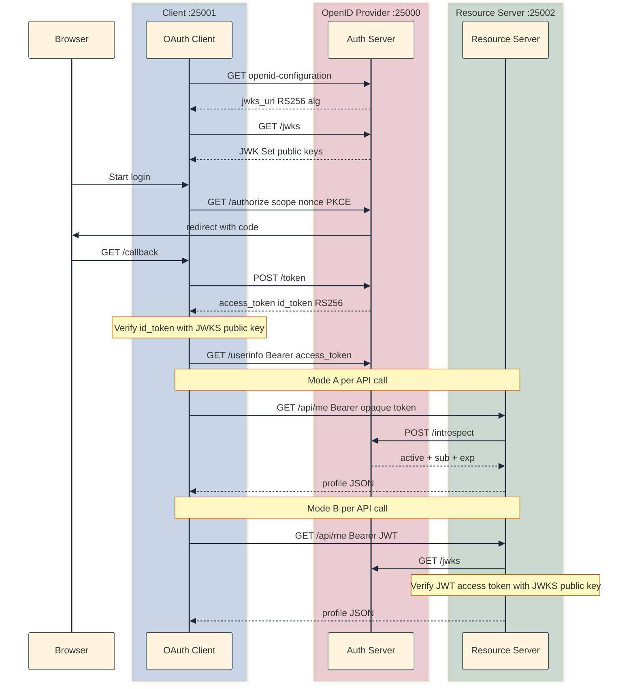

## Why verify-only apps shouldn't hold the signing key

[v07]() added OpenID Connect on top of v06's split architecture. The `id_token` is a signed JWT. Mode B access tokens are JWTs too. Both used HS256 with a shared `JWT_SECRET` copied into three `.env` files.

That worked in a toy lab. It is not how production IdPs ship.

| Concern | v07 (HS256 + `JWT_SECRET`) | v08 (RS256 + JWKS) |
|---------|---------------------------|---------------------|
| Who can *sign* tokens? | Any process with `JWT_SECRET` | Only the auth server (private key) |
| Who can *verify* tokens? | Any process with `JWT_SECRET` | Anyone with the public key from `jwks_uri` |
| Key rotation | Re-sync `JWT_SECRET` everywhere | Publish new key in JWKS; verifiers pick by `kid` |
| Discovery | `id_token_signing_alg_values_supported: ["HS256"]` | `["RS256"]` + `jwks_uri` |
| Real IdPs (Google, Okta, Auth0) | Not available (no shared secret) | RS256; public keys at `jwks_uri` in discovery |

### What HS256 actually means

HS256 is symmetric: one secret signs and verifies. In v07, the client verified `id_token` with `JWT_SECRET` and the resource server verified Mode B access tokens with the same secret while the auth server signed with it.

The problem is not "HS256 is broken." The problem is trust boundaries. A client app that only needs to *verify* identity should not hold the same key that *mints* tokens. If `JWT_SECRET` leaks from the client `.env`, an attacker can forge `id_token`s and trick the client app into believing a login happened.

RS256 is asymmetric: the auth server holds a private key and signs. Everyone else fetches the public key from `GET /jwks` and verifies. Forging requires the private key, which never leaves the OpenID Provider.

The runnable snapshot lives at [`versions/v08-jwks-rs256/`](https://github.com/sauvikbiswas/oauth-lab/tree/main/versions/v08-jwks-rs256). Same three-process layout as v07: OpenID Provider on `:25000`, resource server on `:25002`, client on `:25001`. OAuth authorization, OIDC identity, and Mode A introspection are unchanged. v08 only changes how JWTs are signed and verified.

### Example: why a shared secret breaks at scale

**Setup:** In v07, all three apps copy `JWT_SECRET` from `.env.example`. The client decodes `id_token` locally; the resource server verifies JWT access tokens in Mode B.

**What breaks when this is deployed in production:**

1. The mobile or SPA client needs to verify `id_token`. The signing secret cannot be embedded in client-side code.
2. Three separate deploy pipelines must keep `JWT_SECRET` in sync; a mismatch causes mysterious 401s.
3. Rotating the secret requires coordinated restarts of auth server, resource server, and every client instance.
4. Any service that can verify can also forge as there is no "verify-only" credential.

**What v08 fixes:** The auth server generates an RSA key pair at startup. Only it signs. Discovery advertises `jwks_uri`. Client and resource server fetch public keys and verify RS256. No `JWT_SECRET` on the client or resource server.

## Three programs, three roles

| Program | Port | Keeps from v07 | Changes |
|---------|------|----------------|----------|
| Auth server (OpenID Provider) | `:25000` | OAuth + OIDC flow | RS256 signing; `GET /jwks`; discovery `jwks_uri` |
| Resource server | `:25002` | `GET /api/me`; Mode A introspection | Mode B: verify JWT via JWKS (not `JWT_SECRET`) |
| Client app | `:25001` | OAuth + OIDC flow; `/profile` triptych | Verify `id_token` via JWKS (not `JWT_SECRET`) |



Mode A (opaque access token + introspection) is unchanged. v08 only changes how JWTs are signed and verified. i.e., `id_token` (always JWT in OIDC) and Mode B access tokens.

## Symmetric vs asymmetric signing

| | HS256 (v07 lab) | RS256 (v08 / production) |
|--|-----------------|--------------------------|
| Key type | Single shared secret | RSA key pair (private + public) |
| Sign | `jwt.encode(payload, secret, algorithm="HS256")` | `jwt.encode(payload, private_key, algorithm="RS256")` |
| Verify | `jwt.decode(token, secret, algorithms=["HS256"])` | `jwt.decode(token, public_key, algorithms=["RS256"])` |
| Who holds signing material | Auth server, client, resource server | Auth server only (private key) |
| How verifiers get the key | Copy `JWT_SECRET` into `.env` | `GET {issuer}/jwks` or `jwks_uri` from discovery |
| JWT header | `alg: HS256` | `alg: RS256`, `kid: ...` |
| Spec | [RFC 7518](https://datatracker.ietf.org/doc/html/rfc7518) | [RFC 7518](https://datatracker.ietf.org/doc/html/rfc7518) + [RFC 7517](https://datatracker.ietf.org/doc/html/rfc7517) |

## What v08 changes on top of v07

v08 does not add a new OAuth grant or OIDC endpoint beyond JWKS. It replaces the signing and verification machinery underneath the JWTs v07 already minted.

### Auth server: generate, sign, publish

**`auth-server/keys.py`** generates a 2048-bit RSA key pair on first use and keeps it in memory for the process lifetime (ephemeral — restart means a new key). `get_private_key()` feeds `jwt.encode(..., algorithm="RS256")`. `get_jwks()` exports the public half as a JWK Set with `kty`, `use`, `alg`, `kid`, `n`, and `e`.

**`auth-server/routes/token.py`** signs `id_token` and Mode B access tokens with RS256. Every signed JWT includes `headers={"kid": "oauth-lab-v081"}` so verifiers know which JWK to use. `id_token` claims (`iss`, `sub`, `aud`, `nonce`, etc.) are unchanged from v07 — only the algorithm and key material changed.

**`auth-server/routes/oidc.py`** adds `GET /jwks` and updates discovery: `jwks_uri` points at `{issuer}/jwks`, and `id_token_signing_alg_values_supported` is `["RS256"]`.

**`auth-server/routes/introspect.py`** still falls back to JWT verification for Mode B access tokens, but now verifies RS256 with the local public key instead of `JWT_SECRET` + HS256.

### Client: verify `id_token` without the signing secret

On `/profile`, the client no longer calls `jwt.decode(id_token, JWT_SECRET, ...)`. The flow:

1. `GET {issuer}/jwks`
2. Read `kid` from the `id_token` header (`jwt.get_unverified_header`)
3. Find the matching JWK in `keys[]`
4. Build an RSA public key from JWK `n` and `e` (Base64URL integers, not raw strings)
5. `jwt.decode(id_token, public_key, algorithms=["RS256"], audience=CLIENT_ID, issuer=OIDC_ISSUER)`
6. Assert `nonce` against session — unchanged from v07

Removing `JWT_SECRET` from the client `.env` should not break login.

### Resource server: Mode B via JWKS

When `TOKEN_VALIDATION=jwt`, `resource-server/token_validation.py` mirrors the client pattern: fetch JWKS, match `kid`, verify RS256, check `aud=resource-server` and `iss=auth-server`, extract `sub` for profile lookup. 

Mode A introspection is untouched.

## What is a JWK?

[RFC 7517](https://datatracker.ietf.org/doc/html/rfc7517) defines the **JSON Web Key (JWK)**: a JSON object representing a cryptographic key. A **JWK Set** is `{"keys": [ ... ]}` returned from `jwks_uri`.

For RSA (RS256), each public key in the set looks roughly like:

```json
{
  "keys": [
    {
      "kty": "RSA",
      "use": "sig",
      "alg": "RS256",
      "kid": "oauth-lab-v081",
      "n": "<modulus-base64url>",
      "e": "AQAB"
    }
  ]
}
```

| Field | Meaning |
|-------|---------|
| `kty` | Key type: `"RSA"` for RS256 |
| `use` | `"sig"` for signing (verify signatures) |
| `alg` | Algorithm this key is intended for — `"RS256"` |
| `kid` | Key ID: matches the `kid` in the JWT header so verifiers pick the right key when multiple keys exist |
| `n`, `e` | RSA public modulus and exponent (Base64URL-encoded). `e` is almost always `AQAB`, which decodes to 65537 (0x10001), the standard RSA public exponent |

The private key never appears in JWKS. Only the auth server keeps it (in memory for this lab).

### Discovery and JWKS in practice

v07 discovery already listed endpoints; v08 adds the fields production IdPs expose for asymmetric verification.

| Field | v07 | v08 |
|-------|-----|-----|
| `jwks_uri` | (absent) | `{issuer}/jwks` |
| `id_token_signing_alg_values_supported` | `["HS256"]` | `["RS256"]` |

We can do local discovery after v08:

```bash
curl -s http://localhost:25000/.well-known/openid-configuration | python3 -m json.tool
```

```json
{
    "authorization_endpoint": "http://localhost:25000/authorize",
    "code_challenge_methods_supported": [
        "S256"
    ],
    "grant_types_supported": [
        "authorization_code",
        "refresh_token"
    ],
    "id_token_signing_alg_values_supported": [
        "RS256"
    ],
    "issuer": "http://localhost:25000",
    "jwks_uri": "http://localhost:25000/jwks",
    "response_types_supported": [
        "code"
    ],
    "scopes_supported": [
        "openid",
        "email",
        "profile"
    ],
    "subject_types_supported": [
        "public"
    ],
    "token_endpoint": "http://localhost:25000/token",
    "userinfo_endpoint": "http://localhost:25000/userinfo"
}

```

If we proble our JWKS endpoint, we'll get something like this:

```bash
curl -s http://localhost:25000/jwks | python3 -m json.tool
```

```json
{
    "keys": [
        {
            "alg": "RS256",
            "e": "AQAB",
            "kid": "oauth-lab-v081",
            "kty": "RSA",
            "n": "vTlndHZVQKS8JDmEPpJeDZNagnK2AT8JXsYHJnwzQfl-qRhhm4iuVyyVE872tkQXV_rUJyZIVfIcuXvTPfI1qTdgW6c_yKlZOkZQMgsLjdDlkuXnQd3QfnOGy-lNklvQXMG-YTdBVOQAVlFoPqo4kWi9PMUYWeD7n2-kSKeuRckoahNVg__j32pVd1oEPmb-j-tBJTOqQV4LJaeO10vc0DUwXisakjVpqTbmt8QLTHxkpRl-LxbtE5bPZQTs7A_XKlqJCMbOY4kOwhpJI5XI1Ena7CdyH18N6wCBi71KhCj90q_ZgnRdBXFpUTOownAgY36LJVq12a6SjcBAFTnzmQ",
            "use": "sig"
        }
    ]
}
```

This is Google's discovery for comparison; note `jwks_uri` and RS256:

```json
"jwks_uri": "https://www.googleapis.com/oauth2/v3/certs",
"id_token_signing_alg_values_supported": ["RS256"]
```

Probing the `jwks_uri` returns something like this:

```json
{
    "keys": [
        {
            "alg": "RS256",
            "n": "9v8ffWKjUXk3eaIkYY6ylAMEvWbSfJiU56Exk9vhWsIkwuSMdr4NOBTPSAj0XRTC7hPLUskkogPCGM0k2JMmbG46OfpNIJyvym0lyPdd_xFoQvp8rVz3dtiGYjJ5-xa2wQGN1M4l0Zq3qZzFCD3-AXeu5PLVzT9N0SdR7jjWeN4QyrY_lQ0sGXDy0fOvbsylhskk-A8HPVuOlPiixb9VSa8E3Aw0LLJcvznObhq1XZfS6_p9BOt2zy5guK8UBSlThYInuFoFaXu4CIaPDLKE0NCxyWMmhOmWtCLblb2WfdPflBP-mUZW8PF7GLTaUw0IEbWef-LSRsS0uk-heISdJw",
            "use": "sig",
            "kty": "RSA",
            "kid": "3035bb86d99f22e613467a6680825eeb0d8139a2",
            "e": "AQAB"
        },
        {
            "kty": "RSA",
            "n": "_YiYSsfKSMg0sWfZxdcui2BYLSUlm-wJ9uG-hNuF4LIvgSAmeFNPR0tMw-QHW0bDRITcHzHK1zRAWcbpXgZ7V8A7eA5sH4ivEcqXWCV37vJxx6FEpFllMIW1zXoW3NNuP3ULNGl6mdpxYsNjquOxrypo0Dol7TsS1eLdk2C7SNesmQzI_2j-ZFIMtESZwdIWATV9EiMUgF5riffKb5jyNFMpPRVkI2G8X5ImIkiLPOs663PQPidVijrfOc4nV8PmPCsCqYUWuBkMGgzT6Am-tBem2h_facDhfmdgSCDHnYHi6PxIgyHIQSKU4jtF5sDJGuIORHNZwBUK2VNRcqf8xw",
            "use": "sig",
            "e": "AQAB",
            "kid": "d12978ba4c29ef1154a34e4870c7a3a51d26df10",
            "alg": "RS256"
        },
        {
            "alg": "RS256",
            "kty": "RSA",
            "n": "2eGGURDods69Y0yhtuq-zF3hLp1YotvE4WfmqxUoMXbfNy8lW4xiYVQRMlRDgEQgq01Yzm5vHjHcGWY2Ktgn62N4tWVjfStnlBavsF8MZ4JE7q3csepAzqa068r6Gkuyv7qqutx8G3WdBFhwlK6pwuVo1TNng6cmjumLIev2xy3ES7omfVRneHh-eHuim3ZJ8uSMAG2z4dcLUiTXKDofjkeBRHsgjbOwyHVyuYxnQTthHH8BmomQUu2hIqsHUTeJIEWreyQdjsAulLeFi1Ny3vWd4BQNvviQWjmBXNlCsaXEM5A2U1yvuGp_6zM4KJByEvPKH1cYfaw07xZAXViW2w",
            "use": "sig",
            "e": "AQAB",
            "kid": "8f4730071a99b44ef52dbd6dac2d96af3a7c9b3f"
        },
        {
            "kid": "f10f87405a979c1df36df26606734f33cd85c271",
            "e": "AQAB",
            "n": "4rY5uwZK1dQ-UVgB5s4NLyC-u5LC2MT7b8GWZztiNgMsp0Nnqx0pM7Ofx0ws32N2aZcx10-J8ydQxnNb9uAcf-7LyhyOIcv_WEyzaSbUAMOgoF-nQmJetckxNg6ekhNfaFcTQS0T-29ql2_CBLIML6CvSh-r0fgWRsqN2ayB7wCl74Gv6OOVbvagUWhj5z2L6o_plmsPDwLVuvA7o3WDEDjoq-IXafRQowj92kQUenrOKD4YCopuLIBhel6VH8doFRNZ6KISQhMcOivWaLU_UtKKAMloGJieTf_3r-_nErs2h5wB7T7FrMCScmO7mvFQXKh8_4P-MlbfgS9CUvQksw",
            "use": "sig",
            "kty": "RSA",
            "alg": "RS256"
        }
    ]
}

```

#### Multiple keys, `kid`, and signing (not random)

As evident from Google's response, a JWKS response is an array of public keys, each with a unique `kid`. That does not mean the auth server picks a random key when signing.

| Step | Who | What happens |
|------|-----|--------------|
| Sign | Auth server | Uses the current active private key; puts that key’s `kid` in the JWT header |
| Publish | Auth server | `GET /jwks` returns the public halves for every key verifiers might still need |
| Verify | Client / resource server | Reads `kid` from the JWT header, finds the matching entry in `keys[]`, verifies with that public key |

`kid` is the link: *this token was signed with key X; here is X’s public material.*

So we might ask, why more than one key in JWKS? This is usually to facilitate key rotation, and not random signing:

| Key in JWKS | Typical role |
|-------------|--------------|
| `kid: 2024-06-old` | Still published so tokens signed before rotation verify until they expire |
| `kid: 2024-06-new` | Current signing key. All **new** tokens use this `kid` |

During rotation an IdP may publish two public keys while only one private key signs new JWTs. After old tokens expire, the old public key drops out of JWKS.

This lab is the minimal case: one RSA key pair at startup, one stable `kid` (`oauth-lab-v081`). Key material is generated once per auth-server process. This is ephemeral on restart, so clients must refetch `/jwks` after a restart during local dev.


### `id_token` vs access-token JWT (still different jobs)

v08 changes the **algorithm** for both JWT types, not their **roles** from [v07]():

| Token | Job | Signed with (v08) | `aud` in this lab |
|-------|-----|-------------------|-------------------|
| `id_token` | Authentication: who logged in | RS256 + private key | `demo-client` |
| Access JWT (Mode B) | Authorization: can this caller hit APIs | RS256 + same private key | `resource-server` |

Same key pair can sign both; verifiers still check different audiences. Opaque Mode A access tokens never touch JWKS.

## How to run it

Three terminals (from [github.com/sauvikbiswas/oauth-lab](https://github.com/sauvikbiswas/oauth-lab)):

**Terminal 1: auth server** (`:25000`)

```bash
cd versions/v08-jwks-rs256/auth-server
python3 -m venv .venv && source .venv/bin/activate
pip install -r requirements.txt
cp ../../../.env.example .env
python3 app.py
```

**Terminal 2: resource server** (`:25002`)

```bash
cd versions/v08-jwks-rs256/resource-server
python3 -m venv .venv && source .venv/bin/activate
pip install -r requirements.txt
cp ../../../.env.example .env
python3 app.py
```

**Terminal 3: client app** (`:25001`)

```bash
cd versions/v08-jwks-rs256/client
python3 -m venv .venv && source .venv/bin/activate
pip install -r requirements.txt
cp ../../../.env.example .env
python3 app.py
```

Default env is Mode A (`ACCESS_TOKEN_FORMAT=opaque`, `TOKEN_VALIDATION=introspection`). Open [http://localhost:25001](http://localhost:25001), log in as `user0` / `password0`; `/profile` shows all three identity sections. The `id_token` section is verified via JWKS — `JWT_SECRET` is not required on the client.

To try Mode B, set `ACCESS_TOKEN_FORMAT=jwt` and `TOKEN_VALIDATION=jwt` in all three `.env` files and restart. Access tokens are RS256 JWTs verified via JWKS on the resource server.

### Manual checks

**JWKS / RS256:**

**Should succeed:**

| Test | How | Expected |
|------|-----|----------|
| JWKS endpoint | `curl -s http://localhost:25000/jwks` | 200, `keys` array with RSA JWK |
| Discovery | `curl -s http://localhost:25000/.well-known/openid-configuration` | `jwks_uri` present, `RS256` in algs |
| `id_token` header | Decode after login | `"alg": "RS256"`, `"kid": "oauth-lab-v081"` |
| Client without `JWT_SECRET` | Remove from client `.env` | Login + profile still works |

**Should fail:**

| Test | How | Expected |
|------|-----|----------|
| Tampered `id_token` | Flip one character in session; reload `/profile` | 401 invalid token |

## Cast of characters (v08 additions)

| Name | Who creates it | Where it travels | What it does |
|------|----------------|------------------|--------------|
| RSA key pair | Auth server at startup | Private key stays on `:25000` | Signs `id_token` and JWT access tokens |
| `GET /jwks` | Auth server | Client, resource server (HTTP GET) | Publishes public keys as JWK Set ([RFC 7517](https://datatracker.ietf.org/doc/html/rfc7517)) |
| `jwks_uri` | Discovery document | Client config / libraries | URL to fetch JWKS |
| `kid` | Auth server in JWT header | Inside each RS256 JWT | Lets verifiers select the right key from JWKS |
| `n`, `e` | Auth server in JWK | JWKS JSON only | RSA public modulus and exponent |

PKCE, `state`, `nonce`, `id_token` claims, refresh tokens, UserInfo, and Mode A introspection are unchanged from v07.

## What next?

v08 replaces the shared `JWT_SECRET` with production-shaped RS256 + JWKS. Diff adjacent snapshots:

```bash
diff -ru versions/v07-openid-connect versions/v08-jwks-rs256
```

Next up in the lab I intend to tackle RFC 8707: `resource` parameter binds tokens to a specific API at mint time.

## Further reading

- [RFC 7517: JSON Web Key (JWK)](https://datatracker.ietf.org/doc/html/rfc7517)
- [RFC 7518: JSON Web Algorithms (JWA)](https://datatracker.ietf.org/doc/html/rfc7518)
- [RFC 7519: JSON Web Token (JWT)](https://datatracker.ietf.org/doc/html/rfc7519)
- [OpenID Connect Discovery 1.0](https://openid.net/specs/openid-connect-discovery-1_0.html) (see `jwks_uri`)