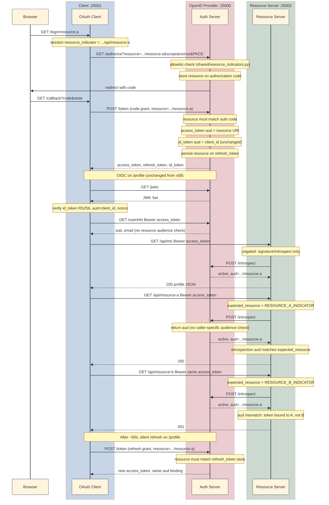

## Why a generic access token is not enough

[v08]() replaced the shared `JWT_SECRET` with RS256 + JWKS. Verifiers fetch public keys and check signatures. That fixed the question of who can forge tokens.

It did not fix the question of where a token may be used.

In v08, Mode B access tokens carry a hard-coded audience:

```json
{ "aud": "resource-server", "iss": "auth-server", "sub": "user0" }
```

That string is a lab placeholder, not a real resource binding. Any API that knows to expect `aud: resource-server` would accept the token. In production there can be dozens of APIs behind one IdP (payments, calendar, internal admin tools), each with its own canonical URI. A token minted for one API should not work against another, even when both trust the same issuer.

[RFC 8707: Resource Indicators for OAuth 2.0](https://datatracker.ietf.org/doc/html/rfc8707) adds the **`resource` parameter**. With it, the client tells the authorization server which protected resource it wants access to at authorize time and again at token time. The authorization server binds the resulting access token to that resource, typically via the JWT `aud` claim or introspection metadata.

| Concern | v08 | v09 (RFC 8707) |
|---------|-----|----------------|
| Who mints the token? | Auth server on `:25000` | Same as v08 |
| Who verifies the token? | Resource server on `:25002` | Same as v08 |
| How is the target API named? | Implicit (`aud: resource-server`) | Explicit `resource` URI on authorize + token |
| Token usable at wrong gated API? | Yes, if another service accepts the same placeholder `aud` | No; resource server rejects wrong `aud` on `/api/resource-a` and `/api/resource-b` |
| `id_token` audience | `client_id` (OIDC) | Unchanged; resource indicators apply to **access** tokens |

### What the `resource` parameter is

The `resource` parameter is a URI that identifies the protected resource. In this lab, each gated API endpoint has its own URI (for example, `http://localhost:25002/api/resource-a`). The client sends it in two places:

1. The client sends `resource` on **`GET /authorize`**. That ties user consent and the authorization code to a specific API from the start.
2. The client sends `resource` on **`POST /token`**. That lets the token exchange confirm which resource the access token should target.

The authorization server validates the URI against an allowlist, stores it on the authorization code, and mints access tokens bound to that URI. Gated resource-server routes check that audience before returning data. Ungated routes do not.

The runnable snapshot lives at [`versions/v09-resource-indicators/`](https://github.com/sauvikbiswas/oauth-lab/tree/main/versions/v09-resource-indicators). It uses the same three-process layout as v08. OAuth, OIDC, JWKS, and introspection behave as before, except where resource binding changes token minting and validation.

### Example: one login, two APIs

**Setup:** A company runs `api.example.com/payments` and `api.example.com/calendar` behind Okta. The mobile app completes OIDC login and receives an access token.

**What breaks without resource indicators:**

1. The token has a broad or generic audience; calendar code might accept a payments-scoped token if both APIs share validation logic.
2. The client cannot tell the IdP *at login time* which downstream API it needs; scope alone does not name the resource server.
3. Token exchange and MCP agent flows need a standard way to name the target API, and the `resource` parameter is that hook.

**What v09 fixes:** The client sends `resource=https://api.example.com/payments` on authorize and token. The auth server mints an access token with `aud` set to that URI, and the payments API rejects tokens whose `aud` does not match.

## Three programs, three roles

| Program | Port | Keeps from v08 | Changes |
|---------|------|----------------|---------|
| Auth server (OpenID Provider) | `:25000` | OAuth + OIDC + JWKS | Accept `resource`; validate allowlist; bind access tokens |
| Resource server | `:25002` | `GET /api/me` (ungated); Mode A/B validation | + gated `GET /api/resource-a` / `GET /api/resource-b` with per-endpoint audience checks |
| Client app | `:25001` | OAuth + OIDC flow; `/profile` triptych | Resource picker login; send `resource`; profile shows A/B pass/fail |

Verification of `id_token` (JWKS, `nonce`, `aud=client_id`) is unchanged from v08. v09 only changes how access tokens are bound and validated. The sequence diagram at the end of [What v09 changes on top of v08](#what-v09-changes-on-top-of-v08) walks through the full flow.

## `resource` vs `aud` vs `scope`

| | `scope` | `resource` (RFC 8707) | `aud` (JWT claim) |
|--|---------|----------------------|-------------------|
| Purpose | What actions/claims the token may carry | **Which API** the token is for | How the token **records** that binding (access tokens) |
| Example | `openid email profile` | `http://localhost:25002/api/resource-a` | `http://localhost:25002/api/resource-a` |
| Set by | Client on `/authorize` | Client on `/authorize` and `/token` | Auth server at mint time |
| Checked by | Auth server (UserInfo, consent) | Auth server (allowlist) | Resource server (must match self) |

Here, `scope` names what the token may do (openid, email, profile); it does not name which API should accept it. OIDC keeps identity and API access separate: the `id_token` still carries `aud: client_id`, while RFC 8707 puts the resource URI on the access token's `aud` claim.

## What v09 changes on top of v08

v09 does not add a new grant type. It threads the RFC 8707 `resource` parameter through the existing Authorization Code and refresh flow, and it binds access tokens to a specific API URI. `id_token`, JWKS, PKCE, and UserInfo behave as in v08.

### Auth server: accept, validate, bind

The auth server is the only place that decides which `resource` URIs are valid and what goes into each access token's audience.

**Shared URIs.** `shared/resource_indicators.py` builds the indicator strings all three apps use: `{RESOURCE_SERVER_URL}/api/resource-a` and `.../resource-b` by default, overridable via `RESOURCE_A_INDICATOR` and `RESOURCE_B_INDICATOR` in each `.env`. The auth server imports the same helpers for its allowlist and for `protected_resources` in discovery.

**Per route:**

| File | What changes |
|------|----------------|
| `authorize.py` | Requires `resource` on `/authorize`; 400 if not on the allowlist; stores the URI on the authorization code with `scope` and `nonce` |
| `token.py` | Binds the access token to that URI (see below) |
| `introspect.py` | Returns `"aud": <resource URI>` for active tokens; JWT path uses `verify_aud: False` locally, then checks `aud` against the allowlist |

**Why introspection skips PyJWT `audience=` verification:** Introspection answers “is this token valid, and what is its `aud`?” It does not answer “is this token for *my* API?” The resource server asks that second question when it compares introspection `aud` to `expected_resource`. If introspection used `jwt.decode(..., audience=RESOURCE_A_INDICATOR)`, it would mark Resource B tokens inactive even though this auth server minted them. There is no single audience to verify at introspection time. The code therefore turns off PyJWT audience verification, reads `aud` from the payload, and checks only that the value is in `allowed_resources()`: one of the URIs this OpenID Provider actually issues tokens for.

**`token.py` binding** (authorization code grant):

1. Read `resource` from the POST body; `invalid_grant` if it does not match the value on the code.
2. Pass the URI into `_mint_access_token()`.
3. Mode B (JWT): set `"aud": resource` instead of the v08 placeholder `"resource-server"`.
4. Mode A (opaque): store `"resource": resource` on `memory.access_tokens[...]`.
5. Leave `id_token` alone: still `aud: client_id`.

On **refresh**, the URI is stored on `memory.refresh_tokens`. The client must send the same `resource` in the POST body; the new access token is re-bound to it. Access tokens expire after 60 seconds in this lab, so reloading `/profile` exercises that path quickly.

**`auth-server/routes/oidc.py`** adds `protected_resources` to discovery ([RFC 9728 §4](https://datatracker.ietf.org/doc/html/rfc9728#section-4)). This field is a sorted list of URIs clients may send as the `resource` parameter:

```bash
curl -s http://localhost:25000/.well-known/openid-configuration | python3 -m json.tool
```

```json
"protected_resources": [
    "http://localhost:25002/api/resource-a",
    "http://localhost:25002/api/resource-b"
]
```

### Resource server: per-endpoint audience checks

**`resource-server/token_validation.py`** adds an optional `expected_resource` argument to `validate_bearer_token(token, expected_resource=None)`.

When `expected_resource` is set, which is what `/api/resource-a` and `/api/resource-b` do, Mode B (JWT) passes `audience=expected_resource` to `jwt.decode(...)`. Mode A (introspection) checks that the introspection `aud` matches via `_audience_matches()`, with trailing slashes normalized.

### Gated vs ungated: `/api/me`

Not every route on the resource server checks audience. **`GET /api/me`** is deliberately **ungated**: it calls `validate_bearer_token(token)` without `expected_resource`, exactly as in v08. Any access token that passes signature or introspection checks still returns profile data, even when the token was minted for Resource A or B.

That is worth noticing on `/profile`. The **Resource binding** section shows 401 on the wrong gated API, but **`/api/me`** still returns 200 with username and email. Resource indicators bind the token to a named API; they do not automatically apply that binding to every endpoint on the host. Each route decides whether to pass `expected_resource`. In production you would gate `/api/me` too, or retire it in favor of resource-specific routes only. This lab keeps it ungated so you can compare legacy behavior side by side with the new gated endpoints.

**`resource-server/routes/resource.py`** adds the two gated endpoints. Each calls `validate_bearer_token` with its indicator from `shared/resource_indicators.py`:

| Route | Env override | Default URI |
|-------|--------------|-------------|
| `GET /api/resource-a` | `RESOURCE_A_INDICATOR` | `{RESOURCE_SERVER_URL}/api/resource-a` |
| `GET /api/resource-b` | `RESOURCE_B_INDICATOR` | `{RESOURCE_SERVER_URL}/api/resource-b` |

The responses are placeholder JSON (`{"resource": "resource-a metadata"}`), which is enough to prove audience enforcement without separate storage modules. A token minted for resource-a returns **401** on resource-b, and the reverse is also true.

### Client: picker login and access matrix

The client must pick a target API before login, send that URI on every token request, and show on `/profile` whether the resulting token is bound correctly.

**Login picker** (`app.py`, `login.html`):

| Route | What happens |
|-------|----------------|
| `GET /login` | Choose Resource A or Resource B |
| `GET /login/resource-a` | Start authorize for resource-a; store URI in `session["resource_indicator"]` |
| `GET /login/resource-b` | Same for resource-b |

**Where `resource` is sent** (same URI each time):

| Step | Call |
|------|------|
| Authorize | `resource` on the `/authorize` query (`_start_authorize`) |
| Callback | `resource` on `POST /token` (authorization code grant) |
| Silent refresh | `resource` on `POST /token` in `refresh_access_token()` |

**Profile demo** (`profile.html`): a **Resource binding** section calls `/api/resource-a` and `/api/resource-b` with the same access token and shows 200 vs 401. That is the lab proof that RFC 8707 binding works end to end.

### End-to-end flow (login for Resource A)

The diagram assumes Mode A (opaque access token + introspection), which is the default in `.env.example`. Mode B skips the introspect hop and verifies JWT `aud` locally on the resource server.



## Configuration (Optional)

For the default local demo, you do **not** need to set `RESOURCE_A_INDICATOR` or `RESOURCE_B_INDICATOR`. All three apps read the same URIs from **`shared/resource_indicators.py`**, which builds defaults from `RESOURCE_SERVER_URL` (already in `.env.example`):

```text
http://localhost:25002/api/resource-a
http://localhost:25002/api/resource-b
```

Copy `.env.example` into each app directory. That is enough for v09 on `:25000` / `:25001` / `:25002`.

Set explicit overrides only when you change hosts, ports, or path prefixes. Put the same values in each app's `.env` so the auth server allowlist, client authorize requests, and resource server audience checks stay aligned:

```bash
RESOURCE_A_INDICATOR=http://localhost:25002/api/resource-a
RESOURCE_B_INDICATOR=http://localhost:25002/api/resource-b
```

## How to run it

Run three terminals from [github.com/sauvikbiswas/oauth-lab](https://github.com/sauvikbiswas/oauth-lab):

**Terminal 1: auth server** (`:25000`)

```bash
cd versions/v09-resource-indicators/auth-server
python3 -m venv .venv && source .venv/bin/activate
pip install -r requirements.txt
cp ../../../.env.example .env
python3 app.py
```

**Terminal 2: resource server** (`:25002`)

```bash
cd versions/v09-resource-indicators/resource-server
python3 -m venv .venv && source .venv/bin/activate
pip install -r requirements.txt
cp ../../../.env.example .env
python3 app.py
```

**Terminal 3: client app** (`:25001`)

```bash
cd versions/v09-resource-indicators/client
python3 -m venv .venv && source .venv/bin/activate
pip install -r requirements.txt
cp ../../../.env.example .env
python3 app.py
```

Open `http://localhost:25001/login`, pick Resource A or B, complete login, then visit `/profile`. The resource binding section should show 200 for the chosen API and 401 for the other.

### Manual checks

**Should succeed:**

| Test | How | Expected |
|------|-----|----------|
| Normal login for A | `/login/resource-a`, then `/profile` | resource-a section 200, resource-b 401 |
| Normal login for B | `/login/resource-b`, then `/profile` | resource-b section 200, resource-a 401 |
| JWT `aud` (Mode B) | Decode access token after login for A | `"aud": "http://localhost:25002/api/resource-a"` |
| Introspection `aud` (Mode A) | Introspect opaque token minted for A | `"aud": "http://localhost:25002/api/resource-a"` |
| Refresh keeps binding | Login for A; wait 60s; reload `/profile` | Matrix unchanged; refresh sent `resource` and the new token stays bound to A |
| `/api/me` regardless of binding | Login for A; check `/api/me` section on `/profile` | 200 with profile data; no audience check on this route |
| Discovery | `curl /.well-known/openid-configuration` | `protected_resources` lists both indicator URIs |

**Should fail:**

| Test | How | Expected |
|------|-----|----------|
| Token at wrong API | Login for A; `curl /api/resource-b` with that token | 401 |
| Unknown resource | `/authorize` with `resource=http://evil.example` | 400 |
| Missing `resource` | `/authorize` without `resource` | 400 |
| Token exchange mismatch | POST `/token` with `resource` different from authorize | `invalid_grant` |
| Refresh without `resource` | POST `/token` refresh grant omitting `resource` | `invalid_grant` (Resource mismatch) |

**Unchanged from v08:**

| Test | How | Expected |
|------|-----|----------|
| JWKS / RS256 `id_token` | `/profile` after login | Verified via JWKS; `aud` still `demo-client` |
| UserInfo | Bearer access token | 200 with scoped claims |

## Cast of characters (v09 additions)

| Name | Who creates it | Where it travels | What it does |
|------|----------------|------------------|--------------|
| `resource` | Client | `/authorize` query; `POST /token` body | Names the target protected API ([RFC 8707](https://datatracker.ietf.org/doc/html/rfc8707)) |
| `RESOURCE_A_INDICATOR` / `RESOURCE_B_INDICATOR` | Optional config (`.env`) | All three apps via `shared/resource_indicators.py` | Override canonical URI per gated API; defaults to `{RESOURCE_SERVER_URL}/api/resource-a` and `.../resource-b` |
| `allowed_resources()` | `shared/resource_indicators.py` | Auth server allowlist / discovery | URIs the OP will mint tokens for (same defaults unless overridden above) |
| Access token `aud` | Auth server at mint | JWT payload or introspection JSON | Records which API may accept this token |

PKCE, `state`, `nonce`, `id_token`, JWKS, refresh tokens, and UserInfo behave the same way they did in v08.

## Pitfalls

Here are some pitfalls that I had to pay close attention to. I fell into a couple of them as well.

1. **Changing `id_token` `aud`:** OIDC identity tokens should keep `aud: client_id`. Only access tokens should carry the resource URI.
2. **Trailing slash drift:** `http://localhost:25002/api/resource-a` and `http://localhost:25002/api/resource-a/` are different strings. The resource server normalizes trailing slashes when it verifies tokens, but the auth server allowlist uses exact matches. Keep env values consistent and omit trailing slashes.
3. **Forgetting refresh:** If a refresh grant omits `resource`, the new access token may lose its binding or fail validation.
4. **Mode A vs Mode B:** Opaque tokens need `resource` in server-side storage and in the introspection `aud` field. JWT access tokens need `aud` in the payload.
5. **UserInfo still on auth server:** Resource indicators do not move UserInfo to the resource server. The UserInfo endpoint validates the access token for OIDC claims, not for API audience. You may optionally check resource there in production, but this lab does not.
6. **Assuming every route is gated:** `/api/me` does not check `aud` against a resource indicator. Only `/api/resource-a` and `/api/resource-b` do. A token bound to one API can still read profile data from `/api/me`.

## What next?

v09 binds access tokens to a named API at mint time. To see what changed, diff the adjacent snapshots:

```bash
diff -ru versions/v08-jwks-rs256 versions/v09-resource-indicators
```

Next up is Token Exchange (On-Behalf-Of) ([RFC 8693](https://datatracker.ietf.org/doc/html/rfc8693)). In that pattern, a middle service presents one token and receives another with a tighter audience, scope, or subject. Agents and BFFs use it before calling downstream APIs.

## Further reading

- [RFC 8707: Resource Indicators for OAuth 2.0](https://datatracker.ietf.org/doc/html/rfc8707)
- [RFC 7662: Token Introspection](https://datatracker.ietf.org/doc/html/rfc7662), including the `aud` field in introspection responses
- [RFC 7519: JSON Web Token](https://datatracker.ietf.org/doc/html/rfc7519), which defines the `aud` claim
