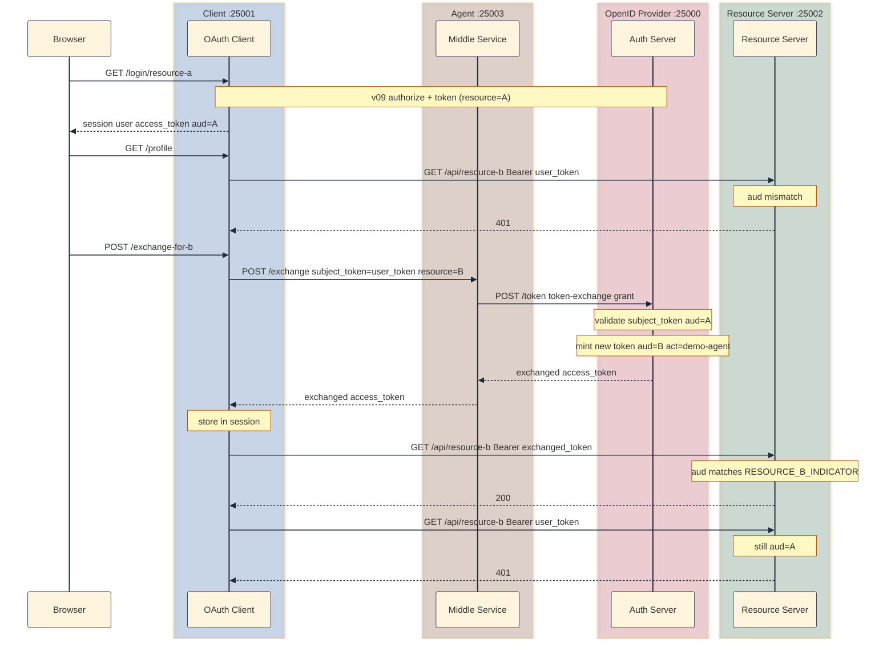

## Why resource binding alone is not enough

[v09]() binds each access token to a named API at mint time. The client sends `resource` on authorize and token; the auth server sets JWT `aud` (or introspection `aud`) to that URI. Gated routes on the resource server reject tokens bound to the wrong API.

That fixes which API may accept a given token. It does not fix who may present the token, or how a middle tier gets a downstream token without asking the user to log in again.

In v09, if the user logs in for Resource A:

1. `GET /api/resource-a` with the user token returns **200**
2. `GET /api/resource-b` with the same user token returns **401**

That is correct for audience binding. An agent or BFF sitting between the user and multiple APIs often needs a different token: same user (`sub`), different `aud`. The user already consented at login, so the middle service should not replay the user's Resource A token against Resource B.

#### What the middle tier is (BFF and agent)

A **BFF** (Backend for Frontend) is a server built for one specific UI. The browser or mobile app talks only to the BFF; the BFF holds secrets, runs OAuth, and calls downstream APIs. An **agent** is the same architectural slot for a different caller: an autonomous tool, workflow, or LLM runtime that acts on behalf of the user without a human clicking through every API.

| | BFF | Agent |
|--|-----|-------|
| Typical caller | React SPA, iOS app, Next.js page | AI assistant, Zapier workflow, background job |
| Who drives the session | Human in a browser or app | Tool chain or scheduled task |
| Why it needs token exchange | UI logged in for one API; BFF must call others server-side | User delegated once; agent must call APIs the user's token was not minted for |

**Real-world BFF examples:**

- **Shopify storefront:** The checkout page does not call inventory, tax, payments, and shipping APIs directly from the browser. A Node or Rails BFF aggregates them, keeps `CLIENT_SECRET` off the client, and attaches the right token per downstream service.
- **Netflix** (pattern originator): Separate BFFs per device (TV, phone, web) each shape responses and auth for that client while shared microservices stay generic.
- **Next.js API routes:** A React app on `app.example.com` calls `/api/profile` on the same origin. That route is the BFF: it uses the user's session, exchanges or refreshes tokens server-side, then calls internal HR or billing APIs the SPA never sees.

**Real-world agent examples:**

- **Microsoft 365 Copilot:** User signs into Outlook; Copilot needs Microsoft Graph calendar or SharePoint with a token scoped for those resources, not whatever the mail client received at login. Azure AD's on-behalf-of (OBO) flow is token exchange under another name ([Microsoft identity platform OBO](https://learn.microsoft.com/en-us/entra/identity-platform/v2-oauth2-on-behalf-of-flow)).
- **Salesforce Einstein / CRM agents:** An agent reads a support case (API A) and updates a record (API B). Replaying the case-scoped user token against the write API fails audience or scope checks; exchange mints a token fit for the write.
- **Zapier or Make:** User connects Google and Slack once; the automation runtime holds delegated access and calls each API with credentials appropriate to that step. That is conceptually the same middle tier as v10's `:25003` agent.

In this lab, the process on `:25003` is labeled **agent**, but you can read it as a minimal BFF. It never serves HTML to end users; it only accepts a subject token and returns a downstream token. Production BFFs usually do more (aggregate JSON, cache, rate-limit), but the OAuth problem is identical: the middle service needs its own client identity and a controlled way to obtain tokens for APIs the user's original token cannot access.

[RFC 8693: OAuth 2.0 Token Exchange](https://datatracker.ietf.org/doc/html/rfc8693) adds a **`token-exchange` grant** on `POST /token`. A client (here, the agent) presents a `subject_token` (the user's access token) and receives a new access token, typically with a tighter or different audience, scope, or delegation record.

| Concern | v09 | v10 (RFC 8693) |
|---------|-----|----------------|
| Token bound to one API? | Yes (`aud` = resource URI) | Same; exchanged token also bound via `resource` |
| Middle service calls downstream API? | Must reuse user token (wrong `aud` returns 401) | Agent exchanges user token for downstream token |
| Who acts on behalf of whom? | Implicit (client holds user token) | Optional `act` claim names the agent |
| New grant on `/token`? | `authorization_code`, `refresh_token` | + `urn:ietf:params:oauth:grant-type:token-exchange` |
| Processes | 3 (`:25000` / `:25001` / `:25002`) | 4 (adds agent middle service on `:25003`) |

### What token exchange is

Token exchange is a grant type, not a redirect flow. The agent authenticates as itself (`demo-agent` / `agent-secret`), posts to the auth server's token endpoint, and supplies:

- `grant_type=urn:ietf:params:oauth:grant-type:token-exchange`
- `subject_token`: the user's access token from the normal OIDC login
- `subject_token_type=urn:ietf:params:oauth:token-type:access_token`
- `resource`: downstream API URI ([RFC 8707](https://datatracker.ietf.org/doc/html/rfc8707) still applies)

The auth server validates the subject token, applies policy (lab: allow A to B only), mints a new access token with `aud` set to the requested resource, and optionally records the agent in an `act` claim.

The runnable implementation lives at [`versions/v10-token-exchange/`](https://github.com/sauvikbiswas/oauth-lab/tree/main/versions/v10-token-exchange). v09 behavior is intact; v10 adds the agent process and token-exchange grant on top.

### Example: agent needs calendar after user signed in for email

**Setup:** User completes OIDC login in the client app for `api.example.com/email`. The client holds an access token with `aud` = email API.

**What breaks without token exchange:**

1. An agent that summarizes email and updates calendar cannot call `api.example.com/calendar` with the email-scoped token. Resource B rejects it (v09 demo).
2. Forcing a second browser login for calendar is poor UX and does not model delegation.
3. Passing the user's email token to the agent and letting it call calendar is a confused deputy: the token is not minted for calendar.

**What v10 fixes:** The agent presents the user's token to the IdP via token exchange, requests `resource=https://api.example.com/calendar`, receives a new token with `aud` = calendar, and calls Resource B. The resource server still checks audience; the exchange is the controlled way to mint the right `aud`.

## Four programs, four roles

| Program | Port | Keeps from v09 | Changes |
|---------|------|----------------|---------|
| Auth server (OpenID Provider) | `:25000` | OAuth + OIDC + resource indicators | Token-exchange grant on `POST /token`; `agent_clients` registry |
| Resource server | `:25002` | Gated A/B + ungated `/api/me` | Surfaces `act` in `/debug/state` `last_validation` when validating OBO tokens |
| Client app | `:25001` | Resource picker login; binding matrix | Profile OBO section; `POST /exchange-for-b` |
| Agent (middle service) | `:25003` | (new) | `POST /exchange`, then auth server token exchange |

OIDC (`id_token`, UserInfo, JWKS) is unchanged. v10 only adds delegation mechanics on access tokens.

## `subject_token` vs `resource` vs `act`

| | `subject_token` | `resource` (requested) | `act` (optional JWT claim) |
|--|-----------------|------------------------|----------------------------|
| Purpose | Proof of user delegation | Which API the exchanged token is for | Which service performed the exchange |
| Example | User's opaque or JWT access token | `http://localhost:25002/api/resource-b` | `{"sub": "demo-agent"}` |
| Set by | Client login (v09) | Agent on exchange request | Auth server when minting exchanged token |
| Checked by | Auth server validates before mint | Auth server allowlist; resource server on use | Resource server / logs (optional in lab) |

`scope` on the exchanged token can mirror the subject token's scope in this lab; production policies often narrow it.

## What v10 changes on top of v09

v10 does not add a new browser redirect. It adds a fourth process and a new branch on `POST /token`.

### Shared constants

`shared/token_exchange.py` holds RFC 8693 URNs used by the auth server and agent:

```python
GRANT_TYPE_TOKEN_EXCHANGE = "urn:ietf:params:oauth:grant-type:token-exchange"
TOKEN_TYPE_ACCESS_TOKEN = "urn:ietf:params:oauth:token-type:access_token"
```

#### What is a URN?

A **URN** (Uniform Resource Name) is a kind of identifier string. It is not a URL you fetch, but a stable, globally unique name for a type or concept. The format looks like:

```text
urn:ietf:params:oauth:grant-type:token-exchange
```

| Part | Meaning |
|------|---------|
| `urn:` | This is a URN, not a web address |
| `ietf:params:oauth:` | IETF-registered OAuth parameter namespace |
| `grant-type:token-exchange` | The specific thing being named |

For well-known grants, plain strings suffice: `grant_type=authorization_code`, `grant_type=refresh_token`. Token exchange is an extension. If every vendor invented its own short name (`obo`, `token_swap`, `exchange`), servers and clients would not interoperate. RFC 8693 registers official URNs so every implementation uses the same string for the same meaning.

In v10, those registered names appear on `POST /token`:

- `grant_type` = `urn:ietf:params:oauth:grant-type:token-exchange` (selects the exchange handler, not authorization code or refresh)
- `subject_token_type` = `urn:ietf:params:oauth:token-type:access_token` (declares that the subject token is an access token)

The auth server matches these strings and routes to `_handle_token_exchange()` instead of `_handle_authorization_code()`.

**URN vs URL vs URI:** A **URL** locates something on the network (`http://localhost:25002/api/resource-b`); you can request it. A **URN** names something (`urn:ietf:params:oauth:grant-type:token-exchange`); you compare it as a label, you do not HTTP GET it. **URI** is the umbrella term; both URLs and URNs are URIs. In v09, `resource=http://localhost:25002/api/resource-a` is a URL (which API the token is for). In v10, `grant_type=urn:...` is a URN (which OAuth operation you are requesting). Different roles, same idea: a standardized string everyone agrees on.

#### Where the standard defines these strings

The URNs in `shared/token_exchange.py` are not lab inventions. They are copied from [RFC 8693: OAuth 2.0 Token Exchange](https://datatracker.ietf.org/doc/html/rfc8693), which defines the grant, the request/response parameters, and the registered identifier strings.

| Constant in the lab | Standard | Where |
|---------------------|----------|-------|
| `GRANT_TYPE_TOKEN_EXCHANGE` | RFC 8693 | [§2](https://datatracker.ietf.org/doc/html/rfc8693#section-2): `urn:ietf:params:oauth:grant-type:token-exchange` |
| `TOKEN_TYPE_ACCESS_TOKEN` | RFC 8693 | [§2.1](https://datatracker.ietf.org/doc/html/rfc8693#section-2.1): `subject_token_type` / `requested_token_type` |
| `TOKEN_TYPE_REFRESH_TOKEN` | RFC 8693 | [§2.1](https://datatracker.ietf.org/doc/html/rfc8693#section-2.1) and IANA registry |
| `TOKEN_TYPE_ID_TOKEN` | RFC 8693 | [§2.1](https://datatracker.ietf.org/doc/html/rfc8693#section-2.1): when an ID token is exchanged |

RFC 8693 registers names in the IETF OAuth URN namespaces maintained by IANA:

- [OAuth Grant Type URIs](https://www.iana.org/assignments/oauth-parameters/oauth-parameters.xhtml#grant-types): `token-exchange` appears as `urn:ietf:params:oauth:grant-type:token-exchange`
- [OAuth Token Type URIs](https://www.iana.org/assignments/oauth-parameters/oauth-parameters.xhtml#token-types): `access_token`, `refresh_token`, `id_token`, and others

[RFC 6749](https://datatracker.ietf.org/doc/html/rfc6749) (OAuth 2.0) uses short grant names (`authorization_code`, `refresh_token`) because they were in the base spec from day one. Extensions like token exchange register new values in IANA so vendors do not collide. That is why token exchange uses the long URN form instead of a new short string like `token_exchange`.

Related standards used together in v10 but not the source of these URNs:

| Topic | Standard |
|-------|----------|
| Token endpoint, `grant_type` parameter | [RFC 6749](https://datatracker.ietf.org/doc/html/rfc6749) |
| Requested downstream API (`resource` on exchange) | [RFC 8707](https://datatracker.ietf.org/doc/html/rfc8707) |
| Optional `act` claim on exchanged JWTs | RFC 8693 [§4.1](https://datatracker.ietf.org/doc/html/rfc8693#section-4.1) |

#### Why agent and auth server share one module

The agent and auth server are separate processes, but they speak one protocol on the wire. The agent sends URNs in the `POST /token` body; the auth server compares those strings byte-for-byte to route the request:

```text
Agent -> grant_type=urn:ietf:params:oauth:grant-type:token-exchange
          subject_token_type=urn:ietf:params:oauth:token-type:access_token

Auth -> if grant_type == GRANT_TYPE_TOKEN_EXCHANGE:
            _handle_token_exchange()
```

A typo on either side yields `unsupported_grant_type`; there is no fuzzy matching. The same pattern as v09: `shared/resource_indicators.py` keeps Resource A/B URIs aligned across three apps; `shared/token_exchange.py` keeps grant and token-type URNs aligned between agent and auth server (and discovery in `oidc.py`).

| Belongs in `shared/token_exchange.py` | Does not belong there |
|----------------------------------------|------------------------|
| Grant/token type URNs (fixed by RFC 8693 + IANA) | `demo-agent` / `agent-secret` (runtime credentials in `.env`) |
| Same on every compliant deployment | `subject_token` (unique per user session) |
| | `resource` URL (from `shared/resource_indicators.py`) |

If discovery advertises a grant URN from this module but `token.py` hard-codes a different string, clients trust metadata the server does not implement. One shared source avoids that drift.

### Auth server: exchange grant

**Registry.** `auth-server/storage/memory.py` adds `agent_clients` for `demo-agent` (separate from web `clients` and introspection `service_clients`).

**Per route:**

| File | What it does |
|------|----------------|
| `token.py` | Routes `grant_type=urn:ietf:params:oauth:grant-type:token-exchange` to `_handle_token_exchange()` |
| `introspect.py` | Returns `act` when present on exchanged tokens (opaque store and JWT) |
| `oidc.py` | Lists token-exchange grant in `grant_types_supported` |

**`_handle_token_exchange()` flow:**

1. Authenticate the agent. `_authenticate_agent_client()` checks `client_id` / `client_secret` against `agent_clients`. Failure returns `invalid_client`.
2. Validate inputs. Require `subject_token`, `subject_token_type=urn:ietf:params:oauth:token-type:access_token`, and `resource` or `audience`.
3. Validate subject token. Reuse `_active_from_memory()` / `_active_from_jwt()` from introspection. Invalid or expired returns `invalid_grant`.
4. Apply lab policy. Requested `resource` must be in `allowed_resources()`; subject `aud` must be Resource A; requested target must be Resource B. Anything else returns `invalid_grant`.
5. Mint downstream token. `_mint_access_token()` with `sub` from the subject token, `aud` = requested resource, and `act={"sub": agent_client_id}`. Exchanged tokens do not get refresh tokens.
6. Respond. `_token_exchange_response()` returns `access_token`, `token_type`, `expires_in`, and `issued_token_type` per RFC 8693 §2.2.1.

**Lab policy (enforced in code):** Exchange only when subject token `aud` is Resource A and requested `resource` is Resource B. Reject unknown subject tokens, expired tokens, same-resource exchange (A to A), and reverse exchange (B to A).

**Exchange request (curl):** After login for Resource A, copy `session.access_token` from client debug state, then:

```bash
export SUBJECT_TOKEN='PASTE_USER_ACCESS_TOKEN'

curl -s -X POST http://localhost:25000/token \
  -d grant_type=urn:ietf:params:oauth:grant-type:token-exchange \
  -d client_id=demo-agent \
  -d client_secret=agent-secret \
  -d subject_token="$SUBJECT_TOKEN" \
  -d subject_token_type=urn:ietf:params:oauth:token-type:access_token \
  -d resource=http://localhost:25002/api/resource-b
```

**Expected response:**

```json
{
  "access_token": "...",
  "issued_token_type": "urn:ietf:params:oauth:token-type:access_token",
  "token_type": "Bearer",
  "expires_in": 60
}
```

### Agent: middle service

New folder `versions/v10-token-exchange/agent/`:

| Route | Purpose |
|-------|---------|
| `POST /exchange` | Accept `subject_token` + target `resource`; call auth server with agent credentials |
| `GET /demo` | Standalone OBO matrix UI (paste subject token, exchange, probe APIs) |
| `POST /demo` | Same page; form submit runs exchange and renders the 2x2 matrix |
| `GET /debug/state` | Last exchange cache (`storage.exchanged_tokens.last`) |

The agent is the acting party in RFC 8693 terms. It never exposes `agent-secret` to the browser; the client calls the agent server-side from `POST /exchange-for-b`.

**Shared helper.** `_exchange_with_auth_server()` posts to the auth server token endpoint with agent credentials and caches successful results in `memory.exchanged_tokens["last"]`. Both `POST /exchange` and `POST /demo` use it.

**Agent exchange (curl):** After login for Resource A, copy `session.access_token` from [http://localhost:25001/debug/state?format=json](http://localhost:25001/debug/state?format=json) (use the access token, not `id_token`). Then:

```bash
export SUBJECT_TOKEN='PASTE_ACCESS_TOKEN_HERE'

curl -s -X POST http://localhost:25003/exchange \
  -d subject_token="$SUBJECT_TOKEN" \
  -d resource=http://localhost:25002/api/resource-b
```

On success you get a new `access_token` with `aud` = Resource B. Confirm the agent cache at [http://localhost:25003/debug/state?format=json](http://localhost:25003/debug/state?format=json) (`storage.exchanged_tokens.last`).

**Standalone OBO demo (`/demo`):** Open [http://localhost:25003/demo](http://localhost:25003/demo). Paste the user's access token, click **Exchange for Resource B and show matrix**. The page probes both gated APIs with each token:

| Token | `/api/resource-a` | `/api/resource-b` |
|-------|-------------------|-------------------|
| Subject (user, bound to A) | **200** | **401** |
| Exchanged (agent OBO, bound to B) | **401** | **200** |

This mirrors the client profile matrix but runs entirely on the agent. It is useful when debugging exchange without the client session.

### Client: profile OBO demo

After login for Resource A, `/profile` shows:

1. Resource binding (v09): user token yields A 200, B 401
2. On-Behalf-Of (v10): button triggers exchange via agent; exchanged token should yield B 200

**`POST /exchange-for-b`** (server-side, no agent secret in the browser):

1. Read `session.access_token` (refresh silently if needed).
2. `POST` to agent `/exchange` with `subject_token` + `resource_b_indicator()`.
3. On success, store `session["exchanged_access_token"]`; on failure, set `session["exchange_error"]` and redirect back to profile.
4. Logout clears `exchanged_access_token` and `exchange_error`.

**`/profile` OBO section.** After exchange, the route calls `GET /api/resource-b` with the exchanged token and passes `resource_b_obo` to the template. Expected: **200 OK** in the OBO section while the user-token row for Resource B still shows **401**.

### Resource server: `act` in validation debug

Gated routes are unchanged from v09. They still call `validate_bearer_token(token, expected_resource=...)`. v10 adds one optional debug surface:

When introspection or JWT validation returns an `act` claim (RFC 8693 actor), `token_validation.py` includes it in the validation result. After an OBO token hits a gated route, check [http://localhost:25002/debug/state?format=json](http://localhost:25002/debug/state?format=json):

```json
{
  "last_validation": {
    "mode": "introspection",
    "result": {
      "user_id": "alice",
      "act": { "sub": "demo-agent" }
    },
    "error": null
  }
}
```

This confirms the resource server saw the delegation record. The happy path does not require route changes.

### End-to-end flow (login A, exchange for B)



## Configuration (Optional)

v10 adds agent settings to `.env.example` (copy into `agent/`, `auth-server/`, and `client/`):

```bash
AGENT_SERVER_URL=http://localhost:25003
AGENT_SERVER_PORT=25003
AGENT_CLIENT_ID=demo-agent
AGENT_CLIENT_SECRET=agent-secret
```

Resource indicator URIs (`RESOURCE_A_INDICATOR`, `RESOURCE_B_INDICATOR`) remain as in v09.

## How to run it

Run four terminals from [github.com/sauvikbiswas/oauth-lab](https://github.com/sauvikbiswas/oauth-lab):

**Terminal 1: auth server** (`:25000`)

```bash
cd versions/v10-token-exchange/auth-server
python3 -m venv .venv && source .venv/bin/activate
pip install -r requirements.txt
cp ../../../.env.example .env
python3 app.py
```

**Terminal 2: resource server** (`:25002`)

```bash
cd versions/v10-token-exchange/resource-server
python3 -m venv .venv && source .venv/bin/activate
pip install -r requirements.txt
cp ../../../.env.example .env
python3 app.py
```

**Terminal 3: client app** (`:25001`)

```bash
cd versions/v10-token-exchange/client
python3 -m venv .venv && source .venv/bin/activate
pip install -r requirements.txt
cp ../../../.env.example .env
python3 app.py
```

**Terminal 4: agent** (`:25003`)

```bash
cd versions/v10-token-exchange/agent
python3 -m venv .venv && source .venv/bin/activate
pip install -r requirements.txt
cp ../../../.env.example .env
python3 app.py
```

Open `http://localhost:25001/login/resource-a`, complete login, visit `/profile`. Click **Exchange via agent for Resource B**; the OBO section should show **200** on Resource B with the exchanged token while the user-token row still shows **401** on B.

Alternative paths without the client button:

- **Agent UI:** [http://localhost:25003/demo](http://localhost:25003/demo): paste subject token, submit form
- **Agent curl:** `POST /exchange` smoke test above
- **Auth server curl:** direct `POST /token` with token-exchange grant

### Manual checks

**Should succeed:**

| Test | How | Expected |
|------|-----|----------|
| v09 baseline | Login for A; profile matrix | A 200, B 401 with user token |
| Token exchange | curl or agent `/exchange` | New token with `aud` = Resource B |
| OBO profile | Exchange then reload `/profile` | OBO section B 200 |
| Agent `/demo` matrix | Paste token at `:25003/demo` | Subject A 200 / B 401; exchanged A 401 / B 200 |
| User token unchanged | Same user token on B after exchange | Still 401 |
| `act` in resource debug | Call Resource B with exchanged token; check `:25002/debug/state` | `last_validation.result.act.sub` = `demo-agent` |
| Discovery | `curl /.well-known/openid-configuration` | `grant_types_supported` includes token-exchange URN |

**Should fail:**

| Test | How | Expected |
|------|-----|----------|
| Exchange without agent auth | Omit `client_secret` | `invalid_client` |
| Exchange with invalid subject | Garbage `subject_token` | `invalid_grant` |
| Exchange with expired subject | Wait past 60s TTL, then exchange | `invalid_grant` |
| Exchange A to A (policy forbids) | Request same `resource` as subject `aud` | `invalid_grant` |
| Exchanged token on A | Use B token on `/api/resource-a` | 401 |

**Unchanged from v09:**

| Test | Expected |
|------|----------|
| `id_token` / UserInfo | OIDC path unchanged |
| Refresh with `resource` | Re-binds same resource URI |
| `/api/me` ungated | 200 regardless of `aud` binding |

## Cast of characters (v10 additions)

| Name | Who creates it | Where it travels | What it does |
|------|----------------|------------------|--------------|
| `grant_type` (token-exchange URN) | Agent | `POST /token` body | Selects RFC 8693 exchange handler |
| `subject_token` | User login (v09) | Agent to auth server | User access token to delegate |
| `subject_token_type` | Agent | `POST /token` body | Declares subject token format |
| `demo-agent` | Config / `agent_clients` | Agent to auth server | Acting party client credentials |
| `act` | Auth server at exchange | JWT or introspection | Names agent that obtained delegation |
| Exchanged `access_token` | Auth server | Agent to client to Resource B | Downstream token with new `aud` |

PKCE, `resource` on authorize, JWKS, refresh tokens, and UserInfo behave as in v09.

## Pitfalls

1. **Reusing the user token downstream:** Token exchange exists because audience-bound tokens should not be replayed at the wrong API. The agent must call exchange, not forward the user's token.
2. **Agent secret in the browser:** The client should call the agent server-side; never embed `AGENT_CLIENT_SECRET` in front-end code.
3. **Skipping subject validation:** The auth server must verify the subject token (signature, expiry, `aud`) before minting a new token. Otherwise any stolen token becomes a delegation primitive.
4. **Over-broad exchange policy:** Production IdPs restrict which agents may exchange which subject tokens for which audiences. The lab uses a simple A to B rule; real systems use policy engines.
5. **Confused deputy:** An agent with a valid user token for A should not receive tokens for arbitrary resources without policy checks. That is the v10 threat model Intermission 2 expands on.
6. **`id_token` is not a subject token here:** Exchange uses access tokens as `subject_token`. OIDC identity tokens stay on the client for login proof.
7. **Shell one-liner trap when curling `/exchange`:** Writing `SUBJECT_TOKEN=... curl ... -d subject_token="$SUBJECT_TOKEN"` does not work. The `VAR=value` prefix only exports `VAR` to the `curl` process; the shell expands `"$SUBJECT_TOKEN"` in the parent shell before `curl` runs, where it is still empty. You get `subject_token is required` even though you typed the token on the same line. Use `export SUBJECT_TOKEN=...` on its own line first, assign then curl on the next lines, or paste the token inline in `-d subject_token=...`.
8. **`/debug/state` on the client: `session` vs `storage`:** A successful login puts the live token in `session.access_token`. Keys under `storage.access_tokens` are a client-side debug mirror from the callback, not proof you are still logged in. If `"session": {}`, log in again (logout, expired cookie, different browser, or client restart). Do not reuse an old key from `storage.access_tokens` without checking `session`.
9. **Subject token TTL:** Access tokens in this lab expire in 60 seconds. Copy from `/debug/state` and run exchange immediately. An expired subject token returns `invalid_grant` from the auth server.

## What next?

v10 adds On-Behalf-Of delegation on top of v09 resource binding. To see what changed, diff the adjacent snapshots:

```bash
diff -ru versions/v09-resource-indicators versions/v10-token-exchange
```

Next up: Intermission 2 (Agents, consent, and the MCP authorization model), then v11 (MCP-style agent authorization). Intermission 2 maps the v08-v10 artifacts to the agent threat model and the MCP authorization spec. It adds no new code.

## Further reading

- [RFC 8693: OAuth 2.0 Token Exchange](https://datatracker.ietf.org/doc/html/rfc8693) (defines grant and token-type URNs used in `shared/token_exchange.py`)
- [IANA OAuth Grant Type URIs](https://www.iana.org/assignments/oauth-parameters/oauth-parameters.xhtml#grant-types)
- [IANA OAuth Token Type URIs](https://www.iana.org/assignments/oauth-parameters/oauth-parameters.xhtml#token-types)
- [RFC 8707: Resource Indicators](https://datatracker.ietf.org/doc/html/rfc8707) (requested `resource` on exchange)
- [RFC 7662: Token Introspection](https://datatracker.ietf.org/doc/html/rfc7662) (`aud`, optional `act`)
