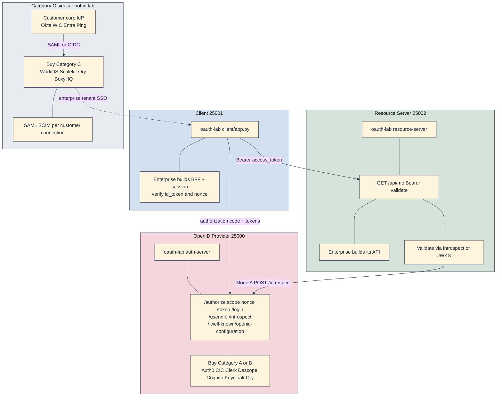
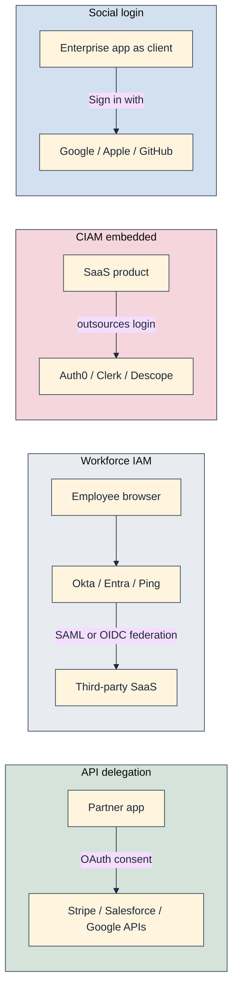
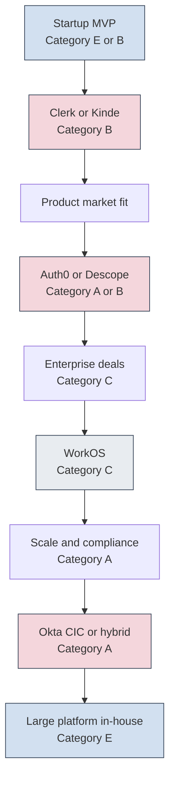
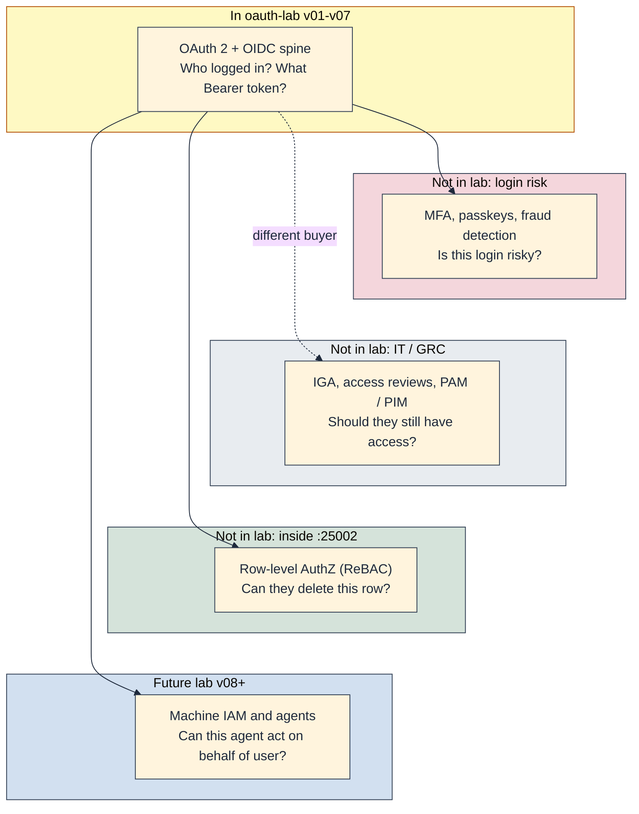

## A deliberate pause

[v07]() is in the repo. It consists of OpenID Connect on top of the [v06]() split; i.e. `id_token`, discovery, UserInfo, `nonce`, and the `openid` scope; while keeping v06's opaque-or-JWT access-token modes. The runnable snapshot is [`versions/v07-openid-connect/`](https://github.com/sauvikbiswas/oauth-lab/tree/main/versions/v07-openid-connect). In my opinion, that is a lot of ground for seven incremental snapshots.

I started drafting this market-research post earlier, then paused the write-up to implement OIDC first. Almost every commercial IdP ships OAuth and OIDC together; reading vendor pricing without knowing what an `id_token` would not be correct. With v07 done, the OAuth+OIDC spine is complete enough to read the landscape.

At some point in the lab I'll have to cover the next layer: JWKS and RS256 (public keys so services verify JWT signatures locally, without shared secrets), [RFC 8707](https://datatracker.ietf.org/doc/html/rfc8707) resource indicators (declaring which API a token is meant for), [RFC 8693](https://datatracker.ietf.org/doc/html/rfc8693) token exchange (swapping one token for a tighter-scoped one: how an agent acts on a user's behalf), and MCP-style agent authorization (OAuth for AI tools calling protected APIs). This intermission sits deliberately between v07 and that work. Before those RFCs, I want to map what production actually looks like, and why billion-dollar companies exist whose entire product is "we run `/authorize` and `/token` so enterprises do not have to".

This post is that pause: no new code version, just market research. What do identity vendors sell, who buys it, and where is the money?

### Disclaimer: A lot of help from agents

I have sourced financials, analyst reports, and pricing links where I could find them. I must say that modern LLMs like Gemini Pro and ChatGPT did a great job in shaping a lot of the content, the references and in general, the structure of this post. We have already entered the new era of search. On a side note, it took me multiple passes rephrasing and rewording sections, and yet the post reeks of LLM.

The motivation from [v01]() still holds: agents, [Model Context Protocol (MCP)](https://modelcontextprotocol.io/specification/2025-11-25/basic/authorization), and OAuth 2.1 as the authorization mechanism. Seven versions of [oauth-lab](https://github.com/sauvikbiswas/oauth-lab) later, I finally have enough of the protocol spine to see where commercial products sit relative to the toy Flask apps in the repo. The build log is [v01]() through [v07](); this post is everything else.

*Disclaimer: Numbers are snapshots from public filings, press releases, and vendor pricing pages. They will go stale. Also, they are what LLMs could provide me as references.*

## Key takeaways

If I can summarize the current situation of the market, it would be this:

- Identity is a large, growing market. Analyst estimates range from roughly $8B to $30B depending on category definitions; the spread itself is informative.
- OAuth and OIDC are commodities. Vendors monetize distribution, integrations, compliance, and operational burden; not secret sauce in `/token`.
- The market segments into **identity infrastructure (A)**, **developer experience (B)**, **enterprise readiness (C)**, **API platforms (D)**, and **build neither (E)** (more on this later). These are categorised by buyer, not feature checklist.
- Okta remains the dominant independent pure-play identity company (~$2.6B FY2025 revenue); Auth0/CIC, Clerk, and Descope compete on developer CIAM; WorkOS monetizes enterprise SSO/SCIM per connection, not login UX.
- Pricing model predicts enterprise bill at scale better than SAML vs OIDC debates: per seat, per MAU, per connection, take rate, or self-hosted ops.
- M&A is the industry. Auth0 was bought by Okta, ForgeRock by Ping, Stytch by Twilio, BoxyHQ by Ory. So, enterprises have to bet on protocols and portability, not startup brand permanence.
- Machine IAM and agent authorization are real vendor investment themes. On-Behalf-Of token exchange (RFC 8693), not just prettier login. It is not yet clear whether that becomes a standalone SKU or bundled with some existing MAU pricing.
- AuthN vendors creep into adjacent domains (fraud, IGA, org roles) but fine-grained AuthZ (ReBAC / Zanzibar-style) usually stays a separate layer. Hybrid architectures are normal.
- Hybrid layering is common. Clerk or Descope for consumer login plus WorkOS for enterprise SSO side-by-side; the evolution diagram is illustrative, not a rip-and-replace ladder.
- There are three identity surfaces ([v07]()): vendors supply `id_token` and UserInfo; enterprises still own app profile and API data (the `/profile` triptych plus resource-only fields like `metadata` on `/api/me`).
- In production enterprises usually buy the auth server, build the resource server, and mostly build the client. See the lab topology diagram below.

## How production maps to oauth-lab

If I have to have only one diagram, this would be the one.

If you ran [oauth-lab](https://github.com/sauvikbiswas/oauth-lab) through **v07**, you already know the shape: three processes on `:25001` (client), `:25000` (auth server / OpenID Provider), and `:25002` (resource server). The diagram maps each box to what enterprises buy in production versus what the lab implements. Category labels (A–E) match the vendor sections below.

In the default CIAM pattern, enterprises *buy* the red box (`:25000`), *build* the green box (`:25002`), and *mostly build* the blue box (`:25001`, often with a vendor SDK). The *gray sidecar* is **Category C**, i.e. WorkOS-style SAML/SCIM federates each customer's corporate IdP into an app when an enterprise tenant demands it, usually alongside (not instead of) Category A/B login.

| Lab artifact | Introduced | Typical vendor slot | Category |
|--------------|------------|---------------------|----------|
| `/authorize`, `/login`, `code` | v01–v03 | Auth0, Descope, Cognito | A / B |
| `state`, PKCE | v02–v03 | (same OpenID Provider) | n/a |
| `POST /token`, refresh | v03, v05 | (same OpenID Provider) | n/a |
| `GET /api/me` | v04 | Enterprise backend (always) | E |
| Split + `/introspect` | v06 Mode A | OpenID Provider exposes introspection; RS calls it | A |
| JWT local verify | v06 Mode B | RS + JWKS (future lab v08) | A infra |
| `id_token`, `/userinfo`, discovery | v07 | OpenID Provider (OIDC) | A / B |
| `scope`, `nonce` on `/authorize` | v07 | OpenID Provider (OIDC authorize) | A / B |
| Client verifies `id_token` | v07 | Enterprise client (SDK/JWKS); lab uses shared `JWT_SECRET` | E |
| Profile `metadata` on `/api/me` | v07 | Enterprise API (never in OIDC scope) | E |
| Enterprise SAML/SCIM | not in lab | WorkOS, Scalekit, Ory+BoxyHQ | C |
| Workforce employee SSO | not in lab | Okta WIC, Entra, Ping | workforce |

### Three identity surfaces (v07)

[v07]() `/profile` shows three panels: a useful map for what vendors sell versus what enterprises build:

1. **`id_token`**: OpenID Provider (Category A/B). Signed identity at login; the enterprise client verifies locally (JWKS in production; shared secret in the lab).
2. **UserInfo**: same OpenID Provider. Live scoped claims fetched with the access token; can differ from the `id_token` if the OpenID Provider updates claims server-side.
3. **`/api/me`**: enterprise resource server (Category E). App-owned data only the enterprise API knows. In the lab, `metadata` on `/api/me` never appears in OIDC scope or UserInfo.

"Sign in with Google" gives the enterprise (1) and (2) from Google; the enterprise backend still owns (3). Production IdPs rarely expose an enterprise product's business fields.

Four deployment patterns dominate: *who is the client*, not *which lab process enterprises outsource*:

1. **Social login**: The enterprise is always the client. Google/Microsoft/GitHub run the authorization server.[^social-login]
2. **CIAM**: Enterprise SaaS outsources login; the enterprise remains client + resource server.[^ciam-split]
3. **Workforce IAM**: IT buys per-seat SSO into hundreds of apps.[^gartner-am]
4. **API delegation**: OAuth is distribution: Stripe Connect, Salesforce connected apps, GitHub Apps.[^stripe-connect]

## Identity market map

Before listing vendors, here are the main segments of the identity market.

- **Identity infrastructure (Category A)**: Okta, Auth0/CIC, Ping Identity, Microsoft Entra, AWS Cognito, Keycloak
- **Developer experience (Category B)**: Clerk, Descope, Kinde, Stytch, FusionAuth, PropelAuth, SuperTokens
- **Enterprise readiness (Category C)**: WorkOS, Scalekit, Ory (+ BoxyHQ)
- **API platforms (Category D)**: Stripe, Salesforce, GitHub, Google APIs
- **Build neither (Category E)**: enterprise API + vendor SDK; rational default for most teams

Categories A and B both sit in the red `:25000` box on the lab diagram. Category C is the gray sidecar. Category D is a different business model entirely.

## Who buys what

| Buyer | Typical purchase | Category | Lab color |
|-------|------------------|----------|-----------|
| Engineering / product | Auth0 CIC, Clerk, Descope | A / B (CIAM) | Red OpenID Provider |
| Startup founder (speed) | Clerk, Kinde, FusionAuth | B | Red OpenID Provider |
| Enterprise sales (SSO tax) | WorkOS, Scalekit | C | Gray sidecar |
| Corporate IT | Okta WIC, Entra, Ping | A / workforce (employee IAM) | Customer corp IdP in gray box |
| Platform company | Build OAuth internally or hybrid | E | All three boxes |

**Workforce** in the table means employee IAM. corporate IT buys per-seat SSO so staff can reach Slack, Salesforce, and internal apps. That is distinct from CIAM (customer login for product end-users), which engineering usually owns. From a B2B SaaS vendor's perspective, the customer corp IdP row is the buyer's IT department IdP (Okta WIC, Entra, Ping) federating into the app via Category C; not the red `:25000` box the vendor built for consumer login.

## How identity choices evolve

As companies evolve, they may choose to move from one offering to another. Here is an illustrative path (not necessarily this is how it would play out). WorkOS usually adds to Auth0/Descope, not replaces it.

Real startups often dual-wield categories long before they reach the bottom of that path. For example, this is a common pattern: Clerk (Category B) for social login, passkeys, and fast consumer onboarding, while WorkOS (Category C) federates each enterprise tenant's corporate IdP over SAML/SCIM. Both run in parallel; engineering wires tenant routing ("if `org.enterprise`, use WorkOS SSO; else Clerk") rather than migrating off one vendor when the other appears. The diagram reads top-to-bottom as *pressure over time*, not a single stack at every stage.

## The five vendor categories (A–E)

I grouped vendors by economic wedge: the pain point they monetize, not protocol feature parity. Anchor vendor sources can be found in [Appendix B](#appendix-b-vendor-detail-tables).

### Category A: Identity infrastructure

Sell the authorization server / OpenID Provider.

**In this category:** Okta, Auth0/CIC, Entra, Ping, Cognito, Keycloak

**Anchor: Okta.** Per seat (WIC) + per MAU (CIC); FY2025 revenue $2.610B. WIC (workforce) and CIC (customer identity, formerly Auth0) are separate products and contracts. Buyers: IT for workforce, engineering for customer login. Moat: Okta Integration Network (8,000+ app integrations). Risk: two platforms and two budgets; the product is distribution, not a better `/token`. <a href="#okta-nasdaq-okta" title="Sources in Appendix B">B</a>

**Also in A:**

- **Auth0 / Okta CIC**: per MAU; dev UX and Actions hooks; MAU surprise bills at viral scale.
- **Microsoft Entra**: per-user within M365/Azure; default IdP for Microsoft shops; often the *customer's* IdP, not the enterprise's embedded login.
- **Ping Identity (+ ForgeRock)**: enterprise subscription; PE-backed roll-up (Ping merged ForgeRock) with the compliance depth regulated industries expect; long sales cycles.
- **AWS Cognito**: per MAU + AWS infra; native hooks into Amplify (client login) and API Gateway/Lambda (JWT authorizers, auth triggers); less dev-ergonomics than Auth0/Clerk.
- **Keycloak**: free OSS; no MAU tax and data residency; the enterprise runs HA, upgrades, and patches.

### Category B: Developer experience

Time-to-first-login: UI components, docs, quickstarts.

**In this category:** Clerk, Stytch, Descope, Kinde, FusionAuth, Ory, PropelAuth, SuperTokens

**Anchor: Clerk.** Per MAU; ~$101M raised (Series C, Anthology Fund). Buyer: frontend-heavy startups. Moat: drop-in `<SignIn />` components; agent identity thesis. Risk: expanding scope into authZ and billing. <a href="#clerk" title="Sources in Appendix B">B</a>

**Also in B:**

- **Stytch (Twilio)**: acquired Nov 2025; passwordless and agent primitives; Twilio fraud graphs post-deal; challenger exit playbook.
- **Descope**: per MAU; ~$88M seed; visual Flows + MCP/agent R&D; mid-market until enterprise compliance depth.
- **Kinde**: per MAU; ~$10M raised; transparent pricing for startups; smaller integration catalog.
- **FusionAuth**: cloud MAU or self-host; bootstrapped; Inc 5000 growth; smaller brand than Auth0.
- **Ory**: OSS + cloud; ~$27.5M raised; composable stack (Hydra for OAuth/OIDC, Kratos for login/users); blurs A/B; integration burden on the enterprise team.
- **PropelAuth**: per MAU + org features; ~$3M seed (YC); multi-tenant SaaS from day one; narrow wedge before WorkOS scale.
- **SuperTokens**: MAU or self-host; OSS Cognito alternative; smaller vendor viability vs incumbents.

Challenger MAU tiers often undercut Okta CIC below ~500k MAU; above that, enterprise SSO connection counts and SLAs dominate.[^challenger-pricing]

### Category C: Enterprise readiness

Monetize the **SSO tax** (the per-tenant SAML, SCIM, and audit-log burden enterprise procurement demands before they'll sign), not prettier login CSS.

**In this category:** WorkOS, Scalekit, Ory (+ BoxyHQ)

**Anchor: WorkOS.** $125/connection/month SSO tier; AuthKit free to 1M MAU. Buyer: B2B SaaS closing enterprise tenants. Moat: SAML/SCIM in hours, not quarters. Risk: painful at hundreds of tenant IdP links. <a href="#workos" title="Sources in Appendix B">B</a>

**Also in C:**

- **Scalekit**: per-connection APIs competing with WorkOS; focused enterprise-readiness wedge; smaller distribution.

### Category D: API platforms

OAuth is onboarding for a larger moat, not an identity SKU.

**In this category:** Stripe Connect, Salesforce, Google APIs, GitHub

**Anchor: Stripe Connect.** Platform take rates, not MAU; OAuth for legacy Standard account onboarding. Moat: payments network + compliance. Risk: Stripe recommends Connect Onboarding over OAuth for new platforms. <a href="#stripe-connect" title="Sources in Appendix B">B</a>

**Also in D:**

- **Salesforce, Google, GitHub**: platform businesses where OAuth gates API access; moat is data and distribution, not login UX.

### Category E: Build neither (the default)

Most teams integrate Category A or B, validate JWTs via JWKS, decode `id_token` for login UI, and never implement `/authorize`. That is the rational default, and what oauth-lab teaches you to debug when a vendor flow misbehaves.

Buying a vendor does not eliminate security code. Category E means the enterprise is not building the authorization server, not that engineering stops writing auth middleware. Enterprises still own the resource server (`:25002`): parse the `Authorization: Bearer` header, fetch JWKS (or call `/introspect`), cryptographically verify signature, audience, and expiry, and only then attach claims to the request context. The client (`:25001`) still verifies `id_token` and `nonce`, manages sessions, and decides when to refresh. Vendors sell `:25000`; they do not replace the green and blue boxes in the lab diagram.

After [v07](), teams can read what vendors actually ship: discovery replaces hard-coded endpoint URLs; an opaque access token paired with a JWT `id_token` is normal (v06 Mode A + OIDC). The client is still mostly enterprise-owned: session management, `nonce` verification, optional UserInfo fetch; even when the OpenID Provider is fully managed.

No vendor list here: enterprises own the resource server (`:25002`) and most of the client (`:25001`); they *buy* the OpenID Provider (`:25000`) or run Keycloak/Ory if self-hosting.

## Market size and industry structure

Analyst estimates range from roughly $8B to $30B depending on definitions: CIAM-only vs access management vs bundled fraud/MFA. The spread is the insight. Identity is overlapping segments, not one TAM. Despite those overlapping slices, analysts generally agree the category is growing at double-digit rates (cloud migration, regulation, API-first architectures). Sourced TAM figures, confidence tiers, and Gartner MQ notes live in [Appendix C](#appendix-c-market-and-analyst-sources). M&A compresses the landscape continuously; see [Appendix A](#appendix-a-ma-and-consolidation) for the timeline.

## Beyond the lab: governance, privilege, and authZ

The three-box topology covers login and API access tokens. Vendors also sell adjacent layers. The solutions are for different buyers within the organization but target the same security budget. None of these appear in oauth-lab v01–v07. The diagram groups them by where they attach in the flow; the table names example vendors.

Each row names recognizable examples in a layer adjacent to oauth-lab, not Gartner rankings, not exhaustive market coverage, and not in the lab unless the third column says Yes.

| Layer | Question | In oauth-lab? | Example vendors (not ranked) |
|-------|----------|---------------|------------------------------|
| CIAM/OAuth | Who logged in / what token? | Yes (v01–v07) | Auth0, Descope, Clerk *(Categories A–B)* |
| MFA / fraud | Is this login risky? | No | Duo, Okta Verify, Twilio Verify |
| IGA / UAR | Should they still have this role? | No | SailPoint, Saviynt, Entra ID Governance |
| PAM / PIM | Who can become root for 15 min? | No | CyberArk, Delinea, Entra PIM |
| AuthZ | Can they delete this row? | No (scopes only) | Cerbos, Oso, AuthZed, OpenFGA *(ReBAC / Zanzibar)* |
| Machine IAM | Which agent may exchange tokens? | Future lab | Descope, WorkOS, Stytch/Twilio *(early movers)* |

WorkOS (Category C) and workforce IdPs sit partly in the gray governance ring: enterprise SAML/SCIM is not another lab port, but it is how B2B SaaS closes Fortune 500 deals. Fine-grained authZ runs inside the green resource-server layer after Bearer validation.

### Adjacent domain matrix

Core OAuth/OIDC vendors are not standing still: they expand into adjacent layers that share the same security budget. The table below maps economic wedge: where vendors creep next: recognizable implementations. It complements the layer table above by naming *who* is blurring the lines, not just *what* the layer is.

| Vendor category | Core wedge | Adjacent expansion domain | Real-world implementation |
|-----------------|------------|---------------------------|---------------------------|
| **Category A** (Okta, Auth0/CIC) | `/token` and identity infra | Fraud, IGA, orchestration | Okta Actions for dynamic risk scoring; Okta Identity Governance expanding down from workforce; Auth0 Actions hooks into third-party fraud APIs |
| **Category B** (Clerk, Descope, Stytch/Twilio) | Component login UI and dev speed | Fine-grained AuthZ, user data, agent tokens | Clerk expanding orgs/roles and billing; Descope Flows orchestrating third-party fraud/risk APIs; Stytch/Twilio positioning ephemeral token exchange for LLM tools |
| **Category C** (WorkOS, Scalekit) | SAML/SCIM sidecar | Directory infrastructure and audit | All-in-one "enterprise B2B OS": audit trails, directory sync, agent/MCP hooks alongside per-connection SSO |

These expansions are upsell vectors, not protocol replacements. A Clerk org role or an Auth0 custom claim can answer simple "is this user an admin?" checks; they do not replace a dedicated authorization engine.

### AuthN vs AuthZ: where vendors hit a wall

OAuth and OIDC vendors *try* to absorb authorization via scopes, custom claims, and org/role primitives baked into the token. That works until the question stops being "who logged in?" and becomes "can Alice delete *this specific row* in *this tenant's* database?"

**Authentication (AuthN)**: who is the subject? That is what Categories A and B sell. **Authorization (AuthZ)**: what may they do to which resource? That is a different problem. Complex applications almost always hit a wall:

- **Scope explosion**: encoding every row-level rule in JWT claims does not scale; tokens get huge and stale fast.
- **Relationship-based access control (ReBAC)**: the OpenFGA / Google Zanzibar model ("user X is editor of document Y owned by team Z") is rarely solved natively by Category B vendors.
- **Policy outside the token**: Cerbos, Oso, and AuthZed evaluate policies at request time against live data; the IdP never sees the enterprise's Postgres rows.

The practical architecture is hybrid: buy AuthN (Category A/B), validate the Bearer token on `:25002` (Category E middleware), then call a dedicated AuthZ service before mutating data. oauth-lab v01–v07 stops at scopes; a future snapshot could add an AuthZ check after `/api/me` validation, but that is intentionally a separate ring in the diagram above.

## Economics and pricing models

The pricing model often matters more than protocol support.

| Pricing model | Growth driver | Unit | Example vendors | When it hurts |
|---------------|---------------|------|-----------------|---------------|
| Per seat | More employees | Monthly active employee | Okta WIC, Entra | Headcount at 50,000 |
| Per MAU | More product users | Monthly active end-user | Auth0/CIC, Clerk, Kinde, Descope | Viral B2C; free-tier caps |
| Per connection | More enterprise customers | Per customer IdP link | WorkOS SSO/SCIM | Many tenants, each with SAML |
| Take rate | More transaction volume | % of payment volume | Stripe Connect | Not identity-priced |
| Self-hosted | More operational complexity | Enterprise ops team's time | Keycloak, Ory, SuperTokens | CapEx to OpEx inversion |

Auth0/CIC MAU created predictable vendor revenue and surprise bills for apps whose active-user count diverges from paying customers.[^mau-surprise] WorkOS per-connection pricing aligns revenue with the first Fortune 500 logo: painful at scale, predictable for the vendor.

## Competitive positioning

Where vendors sit on two axes that matter more than feature checklists:

| | Managed (vendor-hosted) | Self-hosted / composable |
|--|-------------------------|---------------------------|
| **Enterprise focus** | Okta, Ping, Entra | Keycloak |
| **Developer focus** | Auth0, Clerk, Descope, Cognito | Ory, SuperTokens, FusionAuth (self-host option) |

Cognito is AWS-managed but developer-oriented. PropelAuth and challengers blur the B/C line with built-in org SSO upsell.

## Moats: what is actually defensible

| Moat type | Who has it | Why it persists |
|-----------|-----------|---------------|
| Integration catalog | Okta (8,000+ OIN apps) | IT standardizes on the IdP that supports their SaaS stack |
| Suite bundling | Microsoft Entra | Identity included in M365/Azure contracts |
| Developer mindshare | Auth0, Clerk, Kinde, FusionAuth | Docs, SDKs, quickstarts reduce migration appetite |
| Flow orchestration | Descope; Auth0 Actions | Journey logic without custom middleware |
| Communications data | Twilio + Stytch | Fraud signals from phone/email graphs |
| Enterprise procurement | Ping, ForgeRock heritage | Regulated buyers need vendor viability |
| Open source + no MAU tax | Keycloak, Ory, SuperTokens | Data residency and cost control |

OAuth itself is not a moat. The RFCs are public.

## Machine IAM and agents

This adjacent domain is a battlefield, not a footnote; the friction is architectural, not marketing.

In traditional OIDC, the `id_token` asserts human identity to a frontend client at login time. The access token delegates API access. That model assumes a person clicked "Sign in" and a browser holds the session.

Agent architectures break that assumption. An LLM tool or MCP server needs to act On-Behalf-Of (OBO) a user across varying scopes and downstream APIs, without hardcoding a permanent master API token in the agent's config. Each tool invocation may need a short-lived, scope-restricted credential tied to the user's consent, not the agent's static secret.

That is why vendors like Descope, Stytch/Twilio, and WorkOS are not just selling prettier login anymore. They are positioning for [RFC 8693 token exchange](https://datatracker.ietf.org/doc/html/rfc8693): swapping one token for another with tighter audience and scope, and for MCP-style dynamic client registration (DCR) plus resource indicators ([RFC 8707](https://datatracker.ietf.org/doc/html/rfc8707)). These companies are betting that the next monetizable wedge is ephemeral delegation to non-human clients, not another `<SignIn />` component.

### What is observable today

- [MCP authorization spec](https://modelcontextprotocol.io/specification/2025-11-25/basic/authorization) exists: OAuth 2.1, DCR, resource indicators.
- Vendors are investing: Descope (Flows + agent R&D), Stytch/Twilio (passwordless + fraud graphs), WorkOS (Series C agent/MCP thesis), Okta ("Auth0 for AI Agents").

### What remains uncertain

- Whether machine clients outnumber human logins in most product categories: a vendor bet, not a measured fact.
- Whether machine IAM becomes a standalone SKU or gets bundled into MAU pricing.
- How vendors price agent vs human tokens: per exchange, per agent identity, or folded into existing MAU tiers.

Gartner's 2025 AM MQ notes CIAM vendors adding machine IAM capabilities.[^gartner-trends] Whether that sticks is open.

## Closing

Now that I've build a significant chunk of the oauth-lab, I would keep some points in mind:

1. **Read pricing model before API docs**: it predicts scale cost better than protocol debates.
2. **Pick category by buyer**: engineering (B), IT (A workforce), enterprise sales (C), platform (D or E); hybrid stacks (B + C) are normal, not a migration failure.
3. **Bet on protocols**: JWT, standard scopes, portable tokens, not vendor brand permanence.
4. **Separate access token from identity token**: v07 is enough OIDC literacy to read vendor docs (`id_token_signing_alg_values_supported`, discovery metadata) without conflating what the OpenID Provider signs at login with what the enterprise API accepts at `/api/me`.
5. **Separate AuthN from AuthZ**: vendors expand into fraud, org roles, and agent tokens, but row-level ReBAC still lives in Cerbos/Oso/OpenFGA on the enterprise API side.

**Where this post sits in the series.** This is deliberately a transition guide, not a standalone market report with no lab follow-through. v07 finished the OAuth+OIDC spine. In the next snapshots in [oauth-lab](https://github.com/sauvikbiswas/oauth-lab), I plan to implement JWKS, RFC 8707, RFC 8693, and MCP-style agent authorization. i.e., the "future ring" in the diagram above. 

---

## Appendix

### Appendix A: M&A and consolidation

Private equity and strategic buyers compress the vendor landscape. OAuth is rarely the acquisition thesis alone: buyers want recurring revenue and enterprise distribution.

| Year | Deal | Value | Strategic logic |
|------|------|-------|-----------------|
| 2021 | [Okta acquires Auth0](https://www.sec.gov/Archives/edgar/data/1660134/000119312521067561/d149091dex991.htm) | ~$6.5B (stock) | Unify workforce + customer identity[^auth0-deal] |
| 2023 | [Thoma Bravo acquires ForgeRock](https://www.thomabravo.com/press-releases/thoma-bravo-completes-acquisition-of-forgerock-combines-forgerock-into-ping-identity); merged into Ping | ~$2.3B (cash) | Enterprise CIAM + workforce roll-up[^forgerock-deal] |
| 2025 | [Twilio acquires Stytch](https://www.twilio.com/en-us/blog/company/news/twilio-to-acquire-stytch) | Undisclosed | Identity + communications + fraud[^stytch-deal] |
| 2026 | [WorkOS Series C](https://workos.com/blog/series-b) | $100M at $2B valuation | Enterprise SSO/SCIM + agent/MCP[^workos-c] |

### Appendix B: Anchor vendor sources {#appendix-b-vendor-detail-tables}

Sourced numbers for the four anchor vendors in Categories A–D. Other vendors: one primary link each.

#### Okta (NASDAQ: OKTA) {#okta-nasdaq-okta}

FY2025 revenue $2.610B (+15% YoY); subscription $2.556B (+16%); FCF $730M (28% of revenue); market cap ~$20B (Jun 2026). Sources: [FY2025 earnings](https://investor.okta.com/news-and-events/news-releases/news-details/2025/Okta-Announces-Fourth-Quarter-And-Fiscal-Year-2025-Financial-Results/default.aspx), [10-K](https://www.sec.gov/Archives/edgar/data/1660134/000166013426000020/okta-20260131.htm).

#### Clerk {#clerk}

Total funding $101.3M; Series B $30M (Jan 2024, Stripe participated); Series C $50M (Jul 2025, Anthology Fund); ~1,300 customers and 16M end-users (Jan 2024). Sources: [CB Insights](https://www.cbinsights.com/company/clerkdev/financials), [Clerk Series B](https://clerk.com/blog/series-b), [Clerk Series C](https://clerk.com/blog/series-c), [TechCrunch](https://techcrunch.com/2024/01/23/clerk-the-authentication-startup-lands-30m-and-inks-a-strategic-deal-with-stripe/).

#### WorkOS {#workos}

Total funding ~$198M; Series C $100M at $2B valuation (2026); SSO $125/connection/month (1–15 tier); AuthKit free to 1M MAU; 200+ customers including Vercel, Stripe, Airtable (2022). Sources: [WorkOS pricing](https://workos.com/pricing), [WorkOS blog](https://workos.com/blog/series-b), [Clay dossier](https://www.clay.com/dossier/workos-funding), [TechCrunch](https://techcrunch.com/2022/06/01/workos-raises-80m-to-add-enterprise-features-like-sso-to-apps/).

#### Stripe Connect {#stripe-connect}

OAuth for legacy Standard account onboarding; Stripe recommends Connect Onboarding for new platforms. Business model: platform take rates, not MAU. Sources: [Connect OAuth docs](https://docs.stripe.com/connect/oauth-standard-accounts), [Connect platform guide](https://docs.stripe.com/connect/interactive-platform-guide).

**Other vendors (primary links):**

- Auth0 / Okta CIC: [Auth0 pricing](https://auth0.com/pricing)
- Microsoft Entra: [Entra ID](https://www.microsoft.com/en-us/security/business/identity-access/microsoft-entra-id)
- Ping Identity (+ ForgeRock): [Thoma Bravo press release](https://www.thomabravo.com/press-releases/thoma-bravo-completes-acquisition-of-forgerock-combines-forgerock-into-ping-identity)
- AWS Cognito: [Cognito pricing](https://aws.amazon.com/cognito/pricing/)
- Keycloak: [Keycloak](https://www.keycloak.org/)
- Stytch (Twilio): [Twilio acquisition blog](https://www.twilio.com/en-us/blog/company/news/twilio-to-acquire-stytch)

### Appendix C: Market and analyst sources

#### How to read the numbers

| Confidence | What it covers | Examples in this post |
|------------|----------------|----------------------|
| High | Audited public company data | Okta FY2025 revenue, 10-K, SEC Auth0 filing, market cap |
| Medium | Funding rounds, pricing pages, customer counts | WorkOS $125/connection, challenger raised amounts |
| Low | Vendor MQ claims, analyst CAGR, roadmap marketing | Agent IAM narratives, Gartner projections via press releases |

#### Analyst TAM estimates (snapshots)

| Source | Scope | Figure | Horizon |
|--------|-------|--------|---------|
| [MarketsandMarkets](https://www.marketsandmarkets.com/) (via [CIAM industry research summary](https://guptadeepak.com/research/ciam-industry-research-ma/)) | Global CIAM | $14.12B (2025) to $22.47B (2030), 9.7% CAGR | 2025–2030 |
| [Grand View Research](https://www.grandviewresearch.com/industry-analysis/customer-identity-access-management-market-report) | Global CIAM | $8.12B (2023) to $26.72B (2030), 17.4% CAGR | 2023–2030 |
| [Mordor Intelligence](https://www.mordorintelligence.com/industry-reports/global-consumer-identity-and-access-management-market) | Consumer IAM | $13.3B (2026) to $30.06B (2031), 17.7% CAGR | 2026–2031 |
| [Gartner](https://www.gartner.com/en/documents/7169730) (Nov 2025 AM MQ) | Access Management | $6.85B (2024), 14.2% YoY; projected $24.1B by 2027 | 2024–2027 |

**Primary sources:**

- [Gartner Magic Quadrant for Access Management (Nov 2025)](https://www.gartner.com/en/documents/7169730)
- [Okta FY2025 earnings](https://investor.okta.com/news-and-events/news-releases/news-details/2025/Okta-Announces-Fourth-Quarter-And-Fiscal-Year-2025-Financial-Results/default.aspx)
- [Okta Form 10-K (FY2025)](https://www.sec.gov/Archives/edgar/data/1660134/000166013426000020/okta-20260131.htm)
- [Auth0 acquisition SEC filing](https://www.sec.gov/Archives/edgar/data/1660134/000119312521067561/d149091dex991.htm)
- [Grand View Research: CIAM](https://www.grandviewresearch.com/industry-analysis/customer-identity-access-management-market-report)
- [Mordor Intelligence: Consumer IAM](https://www.mordorintelligence.com/industry-reports/global-consumer-identity-and-access-management-market)
- [Auth0 pricing](https://auth0.com/pricing)
- [WorkOS pricing](https://workos.com/pricing)
- [Descope pricing](https://www.descope.com/pricing)
- [Kinde pricing](https://kinde.com/pricing)
- [FusionAuth pricing](https://fusionauth.io/pricing)
- [Okta WIC vs CIC](https://www.accessowl.com/blog/okta-workforce-identity-vs-customer-identity)
- [OAuth 2.0 Simplified](https://www.oauth.com/)
- [Auth0 architecture scenarios](https://auth0.com/docs/get-started/architecture-scenarios)
- [MCP Authorization](https://modelcontextprotocol.io/specification/2025-11-25/basic/authorization)

[^social-login]: Google, Apple, and Microsoft publish OIDC discovery for "Sign in with …": [OpenID Connect](https://openid.net/connect/).
[^ciam-split]: [Auth0 CIAM vs workforce scenarios](https://auth0.com/docs/get-started/architecture-scenarios).
[^gartner-am]: Gartner, *Magic Quadrant for Access Management*, 11 November 2025, [gartner.com/documents/7169730](https://www.gartner.com/en/documents/7169730).
[^gartner-trends]: Gartner AM MQ summary: CIAM growth, machine IAM, passwordless: [market definition excerpt](https://research.oz.spotlightar.com/reports/magic-quadrant-access-management-2025/market-definition).
[^auth0-deal]: Okta EX-99.1, March 3, 2021, [SEC filing](https://www.sec.gov/Archives/edgar/data/1660134/000119312521067561/d149091dex991.htm).
[^forgerock-deal]: Thoma Bravo, August 23, 2023, [press release](https://www.thomabravo.com/press-releases/thoma-bravo-completes-acquisition-of-forgerock-combines-forgerock-into-ping-identity).
[^stytch-deal]: Twilio, November 14, 2025, [blog](https://www.twilio.com/en-us/blog/company/news/twilio-to-acquire-stytch).
[^workos-c]: WorkOS Series B/C per [WorkOS blog](https://workos.com/blog/series-b) and [Clay dossier](https://www.clay.com/dossier/workos-funding).
[^stripe-connect]: [Stripe Connect OAuth docs](https://docs.stripe.com/connect/oauth-standard-accounts).
[^mau-surprise]: [CheckThat.ai Okta pricing analysis](https://checkthat.ai/brands/okta/pricing).
[^challenger-pricing]: [CIAM Compass Descope profile](https://guptadeepak.com/ciam-compass/vendors/descope/).
