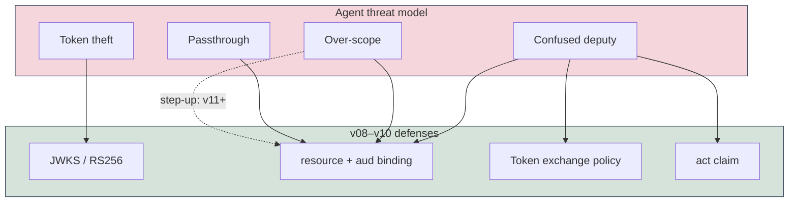
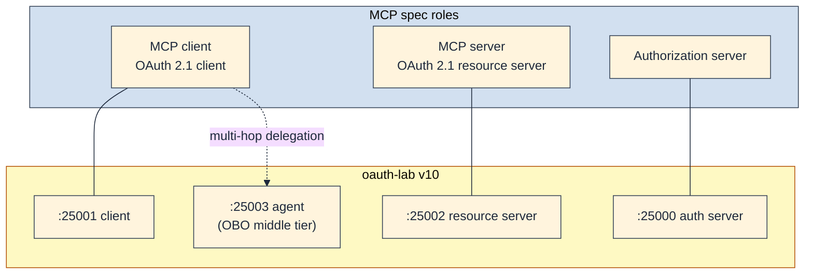
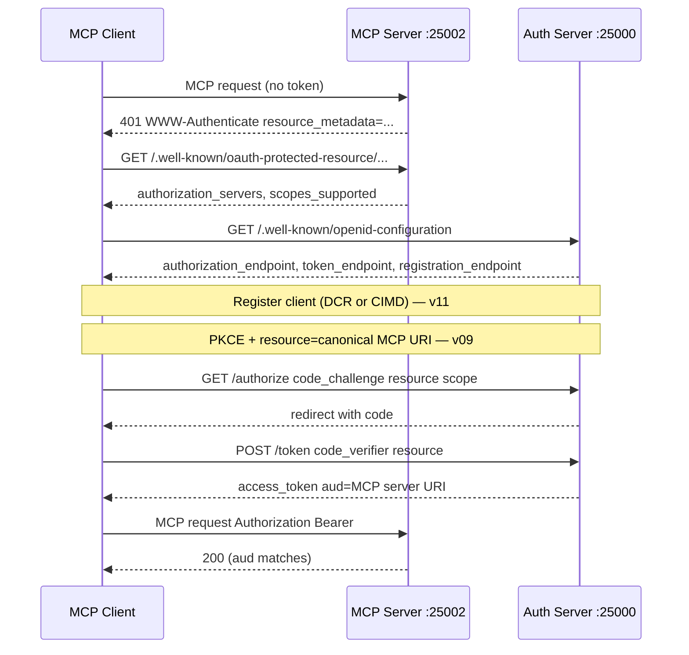
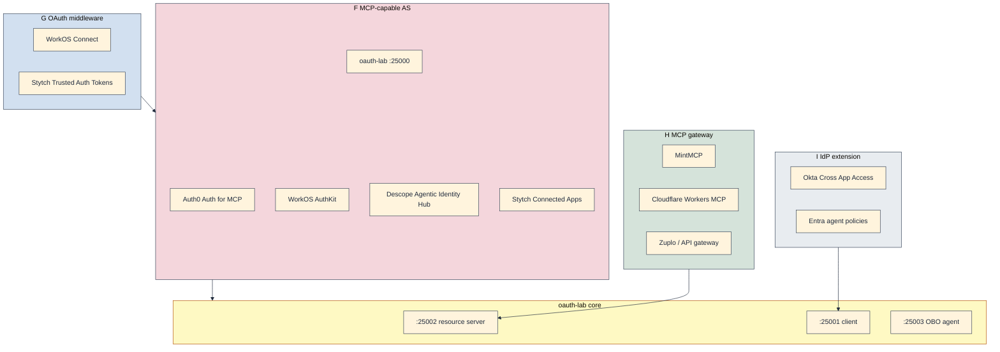
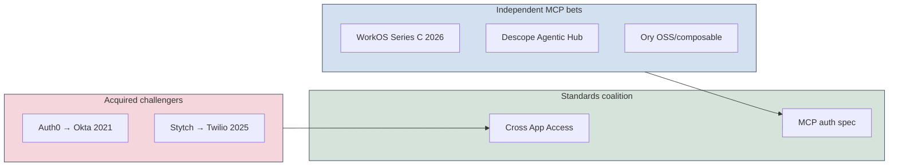
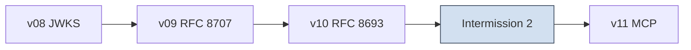

## A deliberate pause

[v10]() adds On-Behalf-Of delegation: a fourth process on `:25003` exchanges a user's access token for a downstream token bound to a different resource URI. The runnable snapshot is [`versions/v10-token-exchange/`](https://github.com/sauvikbiswas/oauth-lab/tree/main/versions/v10-token-exchange). Before that, [v08]() dropped the shared `JWT_SECRET` for RS256 + JWKS, and [v09]() bound each access token to a named API via [RFC 8707](https://datatracker.ietf.org/doc/html/rfc8707) resource indicators.

[Intermission 1]() mapped the **commercial** landscape after the OAuth+OIDC spine ([v07]()): who sells identity, how pricing works, and where `:25001` / `:25000` / `:25002` map to production. v08–v10 add the **delegation** mechanics the vendor "machine IAM" section pointed at: JWKS trust, audience binding, and token exchange.

[v11]() is where the series returns to its original motivation from [v01](): agents and [Model Context Protocol (MCP)](https://modelcontextprotocol.io/specification/2025-11-25/basic/authorization) authorization. That jump is large enough for a second pause — no new code version, just architecture, threat-model, and **market** context before implementing MCP in the lab.

This post connects what we already built to what MCP expects, and maps where vendors are placing bets (authorization servers, OAuth middleware, MCP gateways, IdP extensions). If v01–v07 taught "who logged in?", and v08–v10 taught "which API may accept this token, and who may swap it for another?", MCP asks "how does a tool runtime obtain and use that token without a human in the loop on every call — and who gets paid to run that infrastructure?"

## Key takeaways

- **Browser OAuth is a login model; agent OAuth is a delegation model.** A human clicks "Sign in" once; a tool runtime then needs short-lived, scope-bound credentials tied to that consent — not a static API key in config and not an `id_token` replayed as an API credential.
- **MCP maps cleanly onto the v06+ lab topology.** The MCP server is the resource server (`:25002`). The MCP client is the OAuth client (`:25001`). The authorization server stays on `:25000`. v10's agent (`:25003`) is the optional middle tier when a host must call downstream APIs the user's original token cannot reach.
- **RFC 8707 is not optional in MCP.** The `resource` parameter binds tokens to the MCP server's canonical URI — the same binding v09 enforces on `/api/resource-a` and `/api/resource-b`.
- **Client registration is the new hard part.** MCP adds [RFC 9728](https://datatracker.ietf.org/doc/html/rfc9728) Protected Resource Metadata, discovery chains, and a registration priority order (pre-registration → Client ID Metadata Documents → Dynamic Client Registration). v01–v10 use a static `clients` registry; v11 must grow registration and metadata endpoints.
- **Token exchange (RFC 8693) is adjacent, not identical, to MCP's base flow.** MCP's primary HTTP authorization path is Authorization Code + PKCE + `resource`, like v09. Token exchange is how multi-hop agent architectures mint downstream tokens without a second browser login — exactly what v10 demonstrates.
- **The threat model shifts from CSRF to confused deputy.** Stolen tokens, over-scoped agents, and audience mismatch are the failures v08–v10 artifacts were built to catch. MCP explicitly forbids token passthrough between servers.
- **The market is consolidating around three bets, not one product category.** Full-stack IdP extensions (Auth0, WorkOS, Descope), MCP gateways that sit in front of tools (MintMCP, Cloudflare), and standards coalitions (Cross App Access) are converging on the same OAuth primitives v08–v10 implement — with different buyers and pricing meters.
- **M&A is compressing the challenger lane.** Twilio closed Stytch (Nov 2025); Okta already owns Auth0 (2021). WorkOS raised at a $2B valuation with an explicit agent/MCP thesis (2026). Bet on protocol portability; vendor permanence is not guaranteed.

## Why browser OAuth is the wrong mental model for agents

Traditional OIDC assumes a person clicked "Sign in" and a browser (or browser-like WebView) holds the session. The client app verifies an `id_token` for login UI, stores an access token server-side or in a secure session, and calls APIs until refresh or logout.

Agent architectures break every part of that assumption:

| Assumption | Browser / SPA login | Agent / MCP tool runtime |
|------------|----------------------|---------------------------|
| Who drives the flow | Human in a browser | IDE, CLI, or orchestrator on a schedule |
| Where credentials live | HttpOnly cookie or BFF session | Tool process, MCP host, possibly multiple hops |
| Primary token question | "Who logged in?" (`id_token`) | "May this tool call this API right now?" (`access_token`) |
| Consent model | One login screen | Initial grant + possible step-up when scope is insufficient |
| Client identity | Pre-registered web app (`client_id`) | May be unknown to the server until first contact (DCR / metadata URL) |

### Static API keys vs ephemeral delegation

The anti-pattern is familiar: paste a long-lived API key into an agent's config file. Anyone with repo access inherits the user's privileges forever. Rotation requires redeploying every agent instance. There is no per-user consent boundary — the key is the agent's identity, not the user's delegation.

OAuth for agents inverts that:

1. The user consents once (or incrementally) through a normal authorization flow.
2. The authorization server mints **short-lived access tokens** bound to a **specific resource** ([RFC 8707](https://datatracker.ietf.org/doc/html/rfc8707)).
3. A middle tier that needs a different downstream API exchanges tokens under policy ([RFC 8693](https://datatracker.ietf.org/doc/html/rfc8693)), rather than forwarding the user's original token.

v10's agent on `:25003` is the minimal version of step 3. MCP's base spec focuses on step 1–2 for the MCP client talking directly to the MCP server.

### Why `id_token` is not the agent credential

[v07]() established three identity surfaces: `id_token`, UserInfo, and `/api/me`. For agents, only the **access token** belongs in tool calls.

| Token | Answers | Agent use |
|-------|---------|-----------|
| `id_token` | Who authenticated at login time? | Display name, audit log subject — not for MCP `Authorization: Bearer` |
| Access token | What API access was delegated? | Every MCP HTTP request |
| Refresh token | Can we silently renew without re-prompting? | Long-running agents; rotation rules matter |

An agent that sends `id_token` to an MCP server is misusing OIDC. MCP servers validate access tokens with audience binding to their own canonical URI — the same check v09's gated routes perform against `expected_resource`.

## Threat model

Intermission 1 listed machine IAM as a vendor bet. v08–v10 give concrete lab artifacts for each failure mode. The table maps threats to what we already validate in code.

| Threat | What goes wrong | Lab artifact that catches it | MCP spec alignment |
|--------|-----------------|------------------------------|-------------------|
| **Confused deputy** | Agent presents a broad user token; server mints or accepts access it should not have | v10 exchange policy: subject `aud` must be Resource A; target must be Resource B; agent authenticated as `demo-agent` | Audience binding ([RFC 8707](https://datatracker.ietf.org/doc/html/rfc8707)); servers MUST NOT accept tokens for other resources |
| **Token theft / replay** | Stolen Bearer token used from another host | v08 RS256 + short TTL (60s in lab); v09 rejects wrong `aud` at gated routes | Short-lived tokens; token MUST NOT appear in query strings; secure storage required |
| **Token passthrough** | MCP server forwards a token minted for API A to API B | v09 binding matrix: user token for A returns 401 on B | MCP servers MUST NOT accept or transit tokens issued for other resources |
| **Over-scoped agent** | Tool holds `files:read files:write admin` when it only needs `files:read` | v09 `scope` on authorize; MCP `insufficient_scope` step-up (not in lab yet) | Scope challenge in `WWW-Authenticate`; step-up re-authorization |
| **Forged tokens** | Attacker mints JWTs without the private key | v08 JWKS: only `:25000` holds signing key; RS verifies via `GET /jwks` | OAuth 2.1 resource-server validation |
| **Agent impersonation** | Unknown client registers as a trusted app | v01 `clients` registry; v10 `agent_clients` — static in lab | CIMD / DCR + redirect URI validation (v11) |
| **Open redirect / CSRF** | Authorization code stolen or replayed | v02 `state`, v03 PKCE | MCP requires PKCE (`S256`); `state` verification |

### Confused deputy in v10 terms

The v10 pitfall list names this explicitly. Without exchange policy:

1. User logs in for Resource A.
2. A compromised or over-trusted agent receives the user's access token.
3. Agent calls Resource B directly with that token — or asks the IdP to exchange it for arbitrary audiences.

v10's auth server rejects exchange unless subject `aud` is A and requested `resource` is B, and the agent authenticates with its own client credentials. Production systems replace the A→B allowlist with a policy engine; the shape is the same.

The optional `act` claim records **which agent** obtained the delegation:

```json
{ "sub": "alice", "aud": "http://localhost:25002/api/resource-b", "act": { "sub": "demo-agent" } }
```

Resource server debug at `:25002/debug/state` surfaces `act` after an OBO call. That is audit evidence, not authorization by itself — the gate is still `aud` + signature + expiry.



## MCP authorization spec walkthrough

The [November 2025 MCP authorization spec](https://modelcontextprotocol.io/specification/2025-11-25/basic/authorization) is optional for MCP implementations, but HTTP-based transports SHOULD conform. STDIO transports SHOULD NOT use this flow — credentials come from the environment instead.

### Roles map to the lab



| MCP role | OAuth role | Lab process | v11 plan |
|----------|------------|-------------|----------|
| Authorization server | OpenID Provider / AS | `:25000` | Add PRM pointer, registration, `protected_resources` |
| MCP server | Resource server | `:25002` | Add `401` + `WWW-Authenticate`, RFC 9728 metadata |
| MCP client | OAuth client | `:25001` (or new MCP host) | Discovery chain, DCR/CIMD, `resource` on authorize |
| (not in MCP base flow) | Acting party / middle tier | `:25003` agent | OBO for downstream APIs beyond the MCP server |

### Discovery chain (new in v11)

MCP clients do not hard-code `:25000` the way the lab client does today. The flow starts at the MCP server:

1. **Unauthenticated MCP request** → `401 Unauthorized` with `WWW-Authenticate: Bearer resource_metadata="..."` ([RFC 9728](https://datatracker.ietf.org/doc/html/rfc9728)).
2. **Protected Resource Metadata** → `authorization_servers` list, optional `scopes_supported`.
3. **Authorization Server Metadata** → try [RFC 8414](https://datatracker.ietf.org/doc/html/rfc8414) and OIDC discovery URLs in priority order (path-aware).
4. **Client registration** → pre-registered, Client ID Metadata Document (HTTPS URL as `client_id`), or DCR fallback ([RFC 7591](https://datatracker.ietf.org/doc/html/rfc7591)).
5. **Authorization Code + PKCE + `resource`** → same spine as v03 + v09.
6. **MCP requests** → `Authorization: Bearer` on every HTTP call; token audience must match MCP server URI.

v07 discovery at `/.well-known/openid-configuration` is step 3 only. v11 adds steps 1–2 and registration before the redirect the lab already implements.



### OAuth 2.1 baseline

MCP mandates OAuth 2.1 security properties the lab already implements piecemeal:

| Requirement | Lab version | Artifact |
|-------------|-------------|----------|
| Authorization Code flow | v01–v03 | `/authorize` → `/callback` → `POST /token` |
| PKCE (`S256`) | v03 | `code_challenge` / `code_verifier` |
| No tokens in query strings | v04+ | Bearer header on `/api/me` and gated routes |
| Refresh token rotation (public clients) | v05 | Refresh grant on `/token` |
| Resource indicators | v09 | `resource` on authorize + token; JWT `aud` |
| JWKS verification | v08 | `GET /jwks`, RS256 |
| Token exchange (multi-hop) | v10 | `grant_type=urn:ietf:params:oauth:grant-type:token-exchange` |

### Client registration priority

MCP defines a priority order the lab does not implement yet:

1. **Pre-registration** — static `client_id` in config (v01–v10 default).
2. **Client ID Metadata Documents** — HTTPS URL as `client_id`; AS fetches JSON metadata ([draft OAuth CIMD](https://datatracker.ietf.org/doc/html/draft-ietf-oauth-client-id-metadata-document)).
3. **Dynamic Client Registration** — `POST /register` ([RFC 7591](https://datatracker.ietf.org/doc/html/rfc7591)); spec notes this is primarily backwards compatibility.
4. **Manual entry** — user pastes credentials from a vendor console.

The MCP blog's [client registration evolution post](https://blog.modelcontextprotocol.io/posts/client_registration/) explains why CIMD is preferred over unbounded DCR: no registration endpoint spam, no per-client database growth on the AS, natural "one URL per app" model.

### Resource indicators (v09 → MCP)

MCP clients **MUST** send `resource` on both authorization and token requests. The value is the **canonical URI of the MCP server** — same concept as v09's `RESOURCE_A_INDICATOR`, but naming the MCP endpoint itself (for example `https://mcp.example.com/mcp`), not a sub-path API unless required.

| | v09 lab | MCP spec |
|--|---------|----------|
| `resource` on `/authorize` | Required | Required |
| `resource` on `/token` | Required | Required |
| Binds via | JWT `aud` or introspection `aud` | Same ([RFC 8707 §2](https://datatracker.ietf.org/doc/html/rfc8707#section-2)) |
| RS validation | `validate_bearer_token(..., expected_resource=...)` | MCP server MUST reject wrong audience |
| `id_token` audience | Still `client_id` (OIDC) | Unchanged; resource binding is for access tokens |

### Token exchange (v10 → multi-hop agents)

MCP's primary authorization flow does not require [RFC 8693](https://datatracker.ietf.org/doc/html/rfc8693). A MCP client that only talks to one MCP server completes steps 1–6 above and stops.

Token exchange enters when the **host** is not the API caller:

- User consents to a desktop agent (MCP client).
- The agent host must also call Google Calendar, an internal HR API, or a second MCP server.
- Replaying the MCP-scoped token elsewhere fails audience checks (v09 demo).
- The host exchanges the user's token for a downstream token (v10 demo) instead of asking the user to log in again.

That is the Copilot / Zapier pattern from [v10](): same user (`sub`), different `aud`, optional `act` naming the middle service.

### MCP requirement → lab mapping

| MCP requirement | Standard | Lab today (v08–v10) | Planned v11 |
|-----------------|----------|---------------------|-------------|
| Resource server validates Bearer tokens | OAuth 2.1 §5.2 | v04 `/api/me`; v09 gated A/B | Same + MCP route |
| Audience binding | RFC 8707 | v09 `aud` check | MCP canonical URI as `resource` |
| PKCE on authorize | OAuth 2.1 | v03 | Unchanged |
| OIDC / AS discovery | RFC 8414, OIDC | v07 `/.well-known/openid-configuration` | Path-aware fallback order |
| Protected Resource Metadata | RFC 9728 | Not implemented | `GET /.well-known/oauth-protected-resource` on `:25002` |
| `401` + `WWW-Authenticate` | RFC 9728 §5.1 | v04 returns 401 on missing Bearer | Add `resource_metadata` parameter |
| JWKS local verify | RFC 7517 | v08 `GET /jwks` | Unchanged |
| Client registration | CIMD / RFC 7591 | Static `clients` registry (v01) | `POST /register` and/or CIMD fetch |
| Scope step-up | RFC 6750, MCP §Error | Not implemented | `403 insufficient_scope` + re-authorize |
| Token exchange (OBO) | RFC 8693 | v10 agent `:25003` | Optional; keep for downstream APIs |
| `act` delegation record | RFC 8693 §4.1 | v10 introspection + RS debug | Same for exchanged MCP downstream tokens |

## Consent and UX

### Incremental authorization vs one-time login

Browser CIAM optimizes for a single "Sign in with …" moment. MCP optimizes for **least privilege over time**:

1. **Initial handshake** — client requests scopes from the `401` challenge or `scopes_supported` in Protected Resource Metadata. MCP allows requesting all supported scopes when the client lacks domain knowledge; the consent screen and AS policy trim the grant.
2. **Runtime step-up** — MCP server returns `403` with `error="insufficient_scope"` and a `scope=` hint. Client re-runs authorization with expanded scopes (bounded retries).

The lab's v09 resource picker ("log in for Resource A or B") is a manual stand-in for explicit resource selection. MCP automates resource selection via the canonical server URI and metadata discovery.

### What the user should see

For a first-time MCP client connecting to a protected server, the user should see:

1. **Which client** — `client_name` from metadata document or registration record, not an opaque UUID alone.
2. **Which resource** — the MCP server identity (canonical URI), tied to the `resource` parameter.
3. **Which scopes** — human-readable permission names (`files:read`, not bare JWT claim keys).
4. **Which authorization server** — especially when PRM lists multiple `authorization_servers`.

v07's `/login` + welcome page is the skeleton. v11 needs consent copy that names the MCP server URI explicitly, because that URI is the audience bound into the token.

### Out of scope for the lab

To keep v11 implementable, these stay outside the oauth-lab path (same list as Intermission 1's adjacent layers):

| Concern | Example production control | In lab? |
|---------|---------------------------|---------|
| Step-up MFA | "Confirm with passkey before `files:write`" | No |
| PAR / JAR | Pushed or signed authorization requests | No |
| Enterprise policy engines | OPA, Auth0 Actions, Cerbos | No (v10 uses hard-coded A→B exchange rule) |
| Fine-grained AuthZ | ReBAC / OpenFGA row checks | No (scopes only) |
| Fraud / risk scoring | Block login from new device | No |

The lab proves protocol mechanics. Production adds governance on top.

## Where the market is

[Intermission 1]() sized the **identity market** (~$8B–$30B depending on analyst definition) and mapped Categories A–E to `:25000` / `:25001` / `:25002`. Agent and MCP authorization is not a separate TAM line item in public filings yet. It is an **adjacent expansion ring** inside the same budget: CIAM vendors, enterprise SSO sidecars, and new MCP gateway startups all sell answers to "how does a non-human client get a scoped Bearer token?"

Three forces define where the market actually is in mid-2026:

1. **MCP normative requirements outran legacy IdPs.** Google's, GitHub's, and Microsoft Entra's consumer OAuth surfaces do not ship the full MCP stack (DCR, RFC 9728 Protected Resource Metadata, RFC 8707 resource binding, CIMD) without workarounds. That gap created a **purpose-built product lane** — not a new protocol, but new product packaging on top of OAuth 2.1.
2. **Enterprise buyers want governance, not another login widget.** Fortune 500 IT already owns Okta WIC or Entra for employees. Agent deployments fail procurement when they rely on static API keys or per-tool OAuth consent with no central revocation. Vendors sell **policy, audit, and IdP integration**, not prettier authorize screens.
3. **Consolidation is ahead of revenue clarity.** Twilio bought Stytch; Okta already absorbed Auth0; WorkOS raised $100M at a $2B valuation with agent/MCP in the pitch deck. Nobody publishes "agent MAU" as a standard metric yet, but everyone publishes "AI agents" in the roadmap.

*Disclaimer: Product names, GA status, and funding figures are snapshots from vendor blogs, press releases, and pricing pages. They will go stale. Treat "MCP-ready" marketing as a hypothesis until you run a cold-client discovery test.*

### Four market segments (agent / MCP specific)

These segments overlap [Intermission 1]()'s Categories A–C. The difference is **what gets bought for agents**, not whether OAuth exists.

| Segment | Economic wedge | Who buys | Maps to lab |
|---------|----------------|----------|-------------|
| **F — MCP-capable authorization server** | Run compliant `/authorize`, `/token`, registration, PRM pointers | MCP server vendor, platform team | Extend `:25000` (v11) |
| **G — OAuth middleware / "bring your own users"** | Add MCP OAuth without migrating user DB | Team with existing auth that cannot rip-and-replace | v10 agent + `:25000` split; WorkOS Connect pattern |
| **H — MCP gateway / agent control plane** | Centralize tool access, credentials, audit in front of many MCP servers | Security / platform eng deploying Cursor, Claude, Copilot at scale | Sits **in front of** `:25002`; not in oauth-lab today |
| **I — Enterprise IdP extension (XAA coalition)** | Route agent traffic through existing Okta/Entra policy | Corporate IT / workforce IAM | Gray sidecar from Intermission 1; `:25000` federates to customer IdP |



**Segment F** is closest to what v11 will implement: an authorization server that speaks MCP's discovery and registration chain. **Segment G** is the commercial insight WorkOS and Stytch emphasize: most teams already have login; they need MCP OAuth **grafted on**, not a migration project. **Segment H** is where revenue is forming fastest for enterprise deployments — gateways that turn STDIO servers into hosted, SSO-gated endpoints with audit logs. **Segment I** is the IT-buyer path: keep Okta as system of record; agents become another client class with centralized policy.

### What companies are building

The products differ by **which box in the lab diagram they replace or wrap**, not by inventing a rival to OAuth.

#### Segment F: MCP-capable authorization servers

| Company | Shipped product (mid-2026) | What it adds beyond v07 OIDC | Lab analogue |
|---------|---------------------------|------------------------------|--------------|
| **[Auth0 / Okta](https://www.okta.com/newsroom/articles/auth0-may-2026-product-innovations/)** | **Auth for MCP** (GA May 2026): CIMD, OBO token exchange, Universal Login for MCP clients | PRM + registration + `resource`; FGA for tool-level permissions (separate SKU) | v09 + v10 + v11 registration |
| **[WorkOS](https://workos.com/blog/best-mcp-server-authentication-providers)** | **AuthKit** (full AS) and **Connect** (OAuth-only middleware); DCR, RFC 9728, RFC 8707, CIMD | Dual path: greenfield vs BYO users | AuthKit ≈ `:25000`; Connect ≈ middleware in front of existing AS |
| **[Descope](https://www.descope.com/)** | **Agentic Identity Hub 2.0**: agent registry, MCP auth for servers, credential vault, Flows | Visual policy + 50+ connector templates; tenant isolation for B2B MCP | `:25000` + `:25003` + vault (out of lab scope) |
| **[Stytch / Twilio](https://www.twilio.com/en-us/blog/company/news/twilio-to-acquire-stytch)** | **Connected Apps**: DCR, MCP docs, Cloudflare Workers examples | Standalone OAuth layer; fraud/reputation narrative post-acquisition | `:25000` token endpoints; Twilio cross-sell TBD |
| **[Clerk](https://clerk.com/)** | Agent identity in funding story; org/session primitives | Less MCP-specific documentation than F peers | `:25001` session layer |
| **[Keycloak / Ory](https://www.keycloak.org/)** | OSS OAuth/OIDC + DCR + token exchange in upstream | Self-hosted; no turnkey MCP PRM UX | Category A self-host; enterprise assembles F themselves |

**Pattern:** Segment F vendors bundle what oauth-lab split across v08 (JWKS), v09 (`resource`), v10 (exchange), and v11 (PRM + registration). The moat is **operational**: DCR abuse prevention, CIMD fetch SSRF controls, consent UX, and audit — not a proprietary grant type.

#### Segment G: OAuth middleware ("bring your own users")

The friction Intermission 1 called "Category E builds neither" reappears here. Teams have Postgres users, a custom login, or a legacy IdP that will not be replaced for MCP.

- **WorkOS Connect** — OAuth 2.1 + MCP discovery endpoints as middleware; existing user store stays put.
- **Stytch Trusted Auth Tokens** — Layer Stytch OAuth on top of an existing JWT issuer (per-issuer config, not as clean as Connect's story).

This is the commercial mirror of v10's architecture: the **middle tier** (`:25003` or Connect) handles token shape and delegation; the enterprise keeps owning user records.

#### Segment H: MCP gateways and agent control planes

Gateways sit **in front of** resource servers — Segment H wraps `:25002`, rarely replaces `:25000`.

| Company | Product focus | What enterprises buy |
|---------|---------------|----------------------|
| **[MintMCP](https://www.mintmcp.com/mcp-gateway)** | Hosted MCP gateway: SSO, SCIM RBAC, Virtual MCP Bundles, Agent Bundles, audit | Turn STDIO/local MCP into governed production endpoints; SOC 2 / HIPAA narrative |
| **[Cloudflare](https://developers.cloudflare.com/agents/)** | Workers-based Remote MCP; XAA ecosystem partner | Edge-hosted MCP servers + OAuth at the edge |
| **Archestra.AI, Zuplo, MintMCP-class startups** | Routing, policy, observability on MCP traffic | Developer-platform wedge; pairs with Okta XAA |
| **[Scalekit](https://scalekit.com/)** | Enterprise SSO/SCIM (Category C) + XAA partner list | B2B SaaS selling into tenants that demand IdP federation |

Gateway products often **broker OAuth** for servers that were never designed for HTTP auth: they hold refresh tokens, inject credentials per tool call, and emit audit events. That is adjacent to v10's exchange problem (downstream credentials) but sold as **managed infrastructure**, not RFC education.

[PAM and agent observability vendors](https://in.linkedin.com/company/andromeda-security) (including teams like Andromeda, named in [v01]()) target the same buyer as Segment H from a different angle: **session recording, credential vaulting, and privilege boundaries** for agent tool chains — often layered on top of whatever OAuth flow Segment F or G provides.

#### Segment I: Cross App Access and the IdP extension coalition

**[Cross App Access (XAA)](https://www.okta.com/newsroom/press-releases/okta-announces-cross-app-access-partners/)** is the standards battle worth watching. Okta proposed it as an OAuth extension for agent governance; it is incorporated into MCP as an official authorization extension. Early partner list (2025–2026) includes Anthropic, Cloudflare, Cursor, Stytch, WorkOS, Keycloak, Scalekit, VS Code, Docker, and others.

XAA's commercial logic: **enterprise IT already bought `:25000` workforce IAM**. Agents should not create a parallel shadow identity system per SaaS tool. Instead, agent-to-app connections flow through IdP policy — the same procurement story as SAML SSO, applied to non-human clients.

For oauth-lab readers, XAA is what happens when v10's `act` claim and v09's audience binding meet **central IT policy** — not a replacement for RFC 8707, but a federation layer on top.

### Consolidation and funding (agent-relevant)

Intermission 1's M&A appendix covered Auth0→Okta and ForgeRock→Ping. The **agent/MCP wave adds a second timeline** — mostly 2025–2026:

| Year | Event | Strategic logic | Agent/MCP relevance |
|------|-------|-----------------|---------------------|
| 2021 | [Okta acquires Auth0](https://www.sec.gov/Archives/edgar/data/1660134/000119312521067561/d149091dex991.htm) (~$6.5B) | Workforce + customer identity roll-up | Auth0 **Auth for MCP** (GA 2026) ships on Okta roadmap; dual-platform risk persists |
| 2025 (Jun) | Okta announces **Cross App Access** | Own enterprise agent governance before MCP standardizes without IdP input | XAA becomes MCP extension; partner ecosystem land grab |
| 2025 (Oct–Nov) | [Twilio acquires Stytch](https://www.twilio.com/en-us/blog/company/news/twilio-to-acquire-stytch) | Identity + communications + fraud graphs | **Connected Apps** MCP OAuth under CPaaS parent; roadmap uncertainty |
| 2026 | [WorkOS Series C](https://workos.com/blog/series-b) ($100M, $2B valuation) | Enterprise SSO/SCIM + agent/MCP | **AuthKit + Connect** as MCP-first SKUs; independent pure-play |
| 2026 (Jan) | Descope **Agentic Identity Hub 2.0** | Mid-market CIAM → agent identity | Flows + vault + MCP server auth in one SKU |
| 2026 (May) | Auth0 **Auth for MCP** GA | Incumbent upsell to existing CIC base | OBO exchange + CIMD + FGA upsell path |

**What consolidation implies for builders:**

1. **Challenger exit playbook repeats.** Stytch followed Auth0's acquisition arc: developer-loved OAuth specialist → strategic buyer → cross-sell into parent suite. Evaluate Stytch/Twilio MCP docs on protocol merit, not brand permanence.
2. **Independent vs suite.** WorkOS, Descope, and Ory remain independent bets; Okta/Auth0 and Twilio/Stytch are suite bets with bundled fraud, communications, or workforce upsell.
3. **Gateway startups may be acquisition targets.** Segment H companies (MintMCP-class) solve deployment pain enterprises feel immediately; Segment F incumbents may buy routing/audit rather than build it — or partner via XAA rosters.
4. **Standards coalitions substitute for M&A.** The XAA partner list lets Okta extend reach without acquiring every gateway. Protocol participation (Keycloak, WorkOS, Stytch on the same press release) is the non-M&A consolidation path.



### How to read vendor claims (marketing vs shipped)

Any vendor with OAuth 2.0 + OIDC can publish an "MCP-ready" page. The differentiator is **cold-client discovery**:

1. MCP client with **no pre-shared `client_id`** hits your server.
2. Server returns `401` with `resource_metadata` (RFC 9728).
3. Client completes registration (CIMD or DCR), PKCE authorize, token with `resource` (RFC 8707).
4. Token works only against that MCP server's canonical URI (v09 matrix).
5. Optional: OBO exchange mints downstream token with `act` (v10).

Ask for a demo covering steps 1–4, not a Universal Login screenshot. GA labels matter: Auth0 **Auth for MCP** reached GA in May 2026; other products remain EA, preview, or blog-only.

| Vendor | MCP protocol depth | Enterprise IdP / SSO | Gateway / audit layer | Confidence |
|--------|-------------------|----------------------|------------------------|------------|
| WorkOS | Full spec claim (DCR, PRM, CIMD, RFC 8707) | Strong (Category C core) | Via partners + FGA | Medium (vendor blog) |
| Auth0 / Okta | GA Auth for MCP + OBO + CIMD | Strong (installed base) | FGA separate SKU | Medium–high (GA announcement) |
| Descope | Flows + MCP server auth + vault | Moderate | Credential vault built-in | Medium |
| Stytch / Twilio | Connected Apps + DCR | Weaker SSO/SCIM | Fraud graph narrative | Medium; post-acquisition drift |
| MintMCP | Brokers OAuth; not a spec reference AS | SSO/SCIM RBAC | **Core product** (Segment H) | Medium (product docs) |
| Keycloak / Ory | Implement RFCs yourself | Self-hosted federation | DIY | High for OSS; low for turnkey MCP |

### Spec and reference material

- **[MCP Authorization (2025-11-25)](https://modelcontextprotocol.io/specification/2025-11-25/basic/authorization)** — normative HTTP flow; OAuth 2.1, RFC 9728, RFC 8707, CIMD + DCR.
- **[MCP authorization tutorial](https://modelcontextprotocol.io/docs/tutorials/security/authorization)** — Keycloak + DCR walkthrough; good contrast with the lab's Flask apps.
- **[Client registration evolution (MCP blog)](https://blog.modelcontextprotocol.io/posts/client_registration/)** — why CIMD supersedes DCR for open ecosystems.
- **[Cross App Access partners (Okta)](https://www.okta.com/newsroom/press-releases/okta-announces-cross-app-access-partners/)** — coalition map for Segment I.
- **oauth-lab v08–v10** — JWKS, resource binding, token exchange runnable locally.

## What remains uncertain

Intermission 1 listed three open questions for machine IAM. They are still open:

1. **Machine clients vs human logins.** MCP assumes many headless clients; most CIAM contracts still price on MAU. Whether agent runtimes count as MAUs, service principals, or a new meter is vendor-specific and mostly undisclosed.
2. **Standalone SKU vs bundle.** Token exchange, DCR infrastructure, and delegation audit may become add-ons, or fold into existing MAU tiers without separate line items. Auth0 already bundles **Auth for MCP** into the CIC upsell path; WorkOS sells MCP via AuthKit/Connect tiers; gateways like MintMCP price on governed endpoints and seats.
3. **DCR at scale.** Open registration endpoints create abuse surface (spam clients, SSRF via metadata fetch). CIMD reduces database growth but shifts trust to HTTPS metadata hosting and AS fetch policy. Whether that becomes IdP infrastructure or stays an app-level concern depends on who runs the AS — same Category A vs E split from Intermission 1.

Consolidation-specific uncertainties:

4. **Post-acquisition MCP investment.** Twilio's thesis for Stytch is fraud and communications, not MCP OAuth purity. Okta's dual CIC/WIC platform still splits budgets. Independent vendors (WorkOS, Descope) can move faster on spec churn; suite vendors can win on distribution.
5. **Gateway vs IdP winner.** Segment H (gateways) solves today's deployment pain; Segment F (IdPs) solves protocol compliance. Enterprises may buy both, or gateways may ossify into "good enough" OAuth brokering until IT mandates XAA (Segment I).
6. **STDIO vs HTTP split.** Local MCP servers often use STDIO (no OAuth). Remote hosted MCP servers use HTTP (full OAuth). Tooling must implement both paths; security reviews that only cover browser login miss the STDIO credential-in-env case.

## Where this post sits in the series



**Before this post:** [v08]() (JWKS), [v09]() (resource indicators), [v10]() (token exchange).

**After this post:** implement [v11]() — MCP-style agent authorization in [oauth-lab](https://github.com/sauvikbiswas/oauth-lab): Protected Resource Metadata on `:25002`, discovery chain in the client, and client registration on `:25000`, reusing v09 `resource` binding and v08 JWKS verification.

If v08–v10 felt like RFC exercises, v11 is the payoff for [v01's]() agent motivation: the same `:25000` / `:25001` / `:25002` topology, extended so a tool runtime can discover, register, consent, and call a protected MCP server the way the spec describes.

## Further reading

- [MCP Authorization (2025-11-25)](https://modelcontextprotocol.io/specification/2025-11-25/basic/authorization)
- [RFC 9728 — OAuth 2.0 Protected Resource Metadata](https://datatracker.ietf.org/doc/html/rfc9728)
- [RFC 8707 — Resource Indicators](https://datatracker.ietf.org/doc/html/rfc8707)
- [RFC 8693 — Token Exchange](https://datatracker.ietf.org/doc/html/rfc8693)
- [RFC 7591 — Dynamic Client Registration](https://datatracker.ietf.org/doc/html/rfc7591)
- [MCP: Evolving OAuth Client Registration](https://blog.modelcontextprotocol.io/posts/client_registration/)
- [Cross App Access partners (Okta)](https://www.okta.com/newsroom/press-releases/okta-announces-cross-app-access-partners/)
- [Auth0 Auth for MCP GA (May 2026)](https://www.okta.com/newsroom/articles/auth0-may-2026-product-innovations/)
- [WorkOS: MCP authentication providers (2026)](https://workos.com/blog/best-mcp-server-authentication-providers)
- [Descope Agentic Identity Hub 2.0](https://www.helpnetsecurity.com/2026/01/27/descope-agentic-identity-hub-2-0/)
- [Intermission 1 — What industry ships and who gets paid]()
- [oauth-lab on GitHub](https://github.com/sauvikbiswas/oauth-lab)
